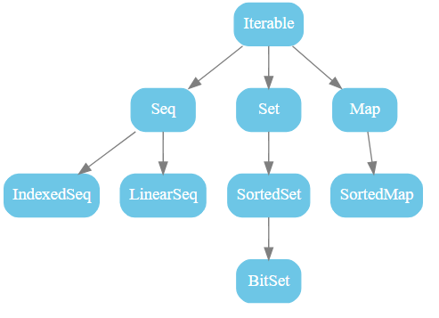
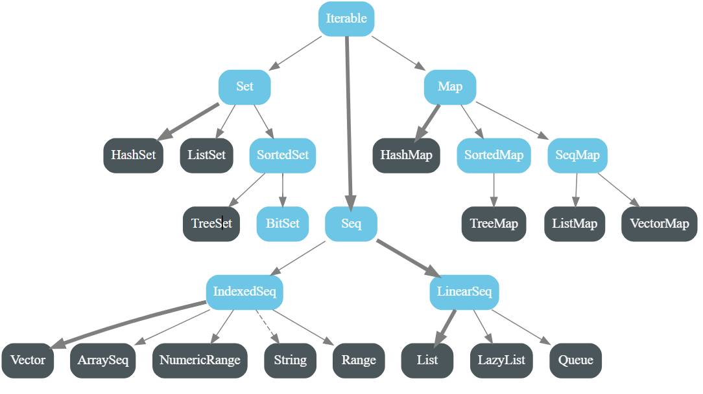
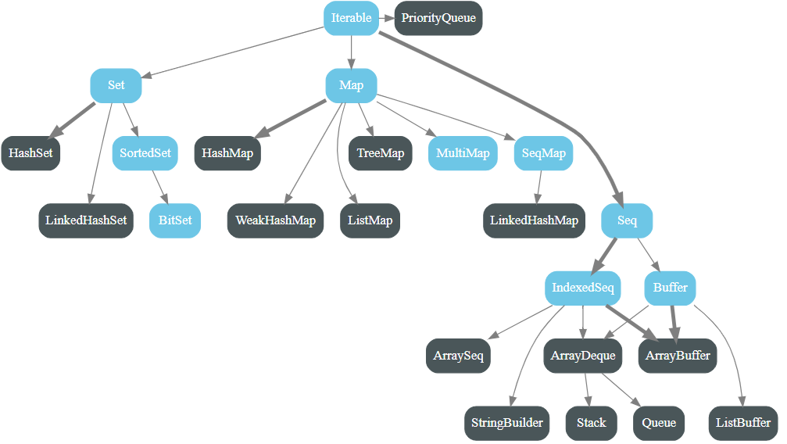
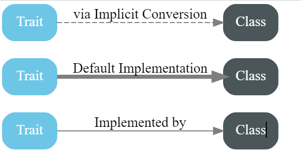

---

### MUTABLE AND IMMUTABLE COLLECTIONS

### Reference: <https://docs.scala-lang.org/overviews/collections-2.13/overview.html>

---

Scala collections systematically distinguish between mutable and immutable collections. A mutable collection can be updated, reduced or extended in place. This means you can change, add, or remove elements of a collection as a side effect. Immutable collections, by contrast, never change. You still have operations that simulate additions, removals, or updates, but those operations will in each case return a new collection and leave the old collection unchanged.

All collection classes are found in the package `scala.collection` or one of its sub-packages `mutable` and `immutable`. Most collection classes needed by client code exist in three variants, which are located in packages `scala.collection`, `scala.collection.immutable`, and `scala.collection.mutable`, respectively. Each variant has different characteristics with respect to mutability.

A collection in package `scala.collection.immutable` is guaranteed to be immutable for everyone. Such a collection will never change after it is created. Therefore, you can rely on the fact that accessing the same collection value repeatedly at different points in time will always yield a collection with the same elements.

A collection in package `scala.collection.mutable` is known to have some operations that change the collection in place. So dealing with a mutable collection means you need to understand which code changes which collection when.

A collection in package `scala.collection` can be either mutable or immutable. For instance, [collection.IndexedSeq[T]](https://www.scala-lang.org/api/2.13.14/scala/collection/IndexedSeq.html "Visit collection.IndexedSeq[T]") is a superclass of both [collection.immutable.IndexedSeq[T]](https://www.scala-lang.org/api/2.13.14/scala/collection/immutable/IndexedSeq.html "collection.immutable.IndexedSeq[T]") and [collection.mutable.IndexedSeq[T]](https://www.scala-lang.org/api/2.13.14/scala/collection/mutable/IndexedSeq.html "Visit collection.mutable.IndexedSeq[T]"). Generally, the root collections in package `scala.collection` support transformation operations affecting the whole collection, the immutable collections in package `scala.collection.immutable` typically add operations for adding or removing single values, and the mutable collections in package `scala.collection.mutable` typically add some side-effecting modification operations to the root interface.

Another difference between root collections and immutable collections is that clients of an immutable collection have a guarantee that nobody can mutate the collection, whereas clients of a root collection only promise not to change the collection themselves. Even though the static type of such a collection provides no operations for modifying the collection, it might still be possible that the run-time type is a mutable collection which can be changed by other clients.

By default, Scala always picks immutable collections. For instance, if you just write `Set` without any prefix or without having imported `Set` from somewhere, you get an immutable set, and if you write `Iterable` you get an immutable iterable collection, because these are the default bindings imported from the `scala` package. To get the mutable default versions, you need to write explicitly `collection.mutable.Set`, or `collection.mutable.Iterable`.

A useful convention if you want to use both mutable and immutable versions of collections is to import just the package `collection.mutable`.

```scala
import scala.collection.mutable
```

Then a word like `Set` without a prefix still refers to an immutable collection, whereas `mutable.Set` refers to the mutable counterpart.

The last package in the collection hierarchy is `scala.collection.generic`. This package contains building blocks for abstracting over concrete collections.

For convenience and backwards compatibility some important types have aliases in the `scala` package, so you can use them by their simple names without needing an import. An example is the `List` type, which can be accessed alternatively as

```scala
scala.collection.immutable.List // that's where it is defined 
scala.List 		        // via the alias in the scala package 
List 				// because scala._ 
                                // is always automatically imported	
```

Other types aliased are [Iterable](./iterable/ITERABLE.md "Visit Iterable"), [Seq](./seq/SEQ.md "Visit Seq"), [IndexedSeq]("Visit IndexedSeq"), [Iterator]("Visit Iterator"), [LazyList]("Visit LazyList"), [Vector]("Visit Vector"), [StringBuilder]("Visit StringBuilder"), and [Range]("Visit Range").

The following figure shows all collections in package `scala.collection`. These are all high-level abstract classes or traits, which generally have mutable as well as immutable implementations.



The following figure shows all collections in package `scala.collection.immutable`.



And the following figure shows all collections in package `scala.collection.mutable`.



Legend:



<h3 style="color: red;">An Overview of the Collections API</h3>

The most important collection classes are shown in the figures above. There is quite a bit of commonality shared by all these classes. For instance, every kind of collection can be created by the same uniform syntax, writing the collection class name followed by its elements:

```scala
Iterable("x", "y", "z") 
Map("x" -> 24, "y" -> 25, "z" -> 26) 
Set(Color.red, Color.green, Color.blue)  
SortedSet("hello", "world")  
Buffer(x, y, z)    
IndexedSeq(1.0, 2.0)      
LinearSeq(a, b, c)
```

The same principle also applies for specific collection implementations, such as:

```scala
List(1, 2, 3)
HashMap("x" -> 24, "y" -> 25, "z" -> 26)
```

All these collections get displayed with `toString` in the same way they are written above.

All collections support the API provided by `Iterable`, but specialize types wherever this makes sense. For instance the `map` method in class `Iterable` returns another `Iterable` as its result. But this result type is overridden in subclasses. For instance, calling `map` on a `List` yields again a `List`, calling it on a `Set` yields again a `Set` and so on.

```scala
scala> List(1, 2, 3) map (_ + 1) 
res0: List[Int] = List(2, 3, 4) 
scala> Set(1, 2, 3) map (_ * 2) 
res0: Set[Int] = Set(2, 4, 6)
```

This behavior which is implemented everywhere in the collections libraries is called the `uniform return type principle`.

Most of the classes in the collections hierarchy exist in three variants: root, mutable, and immutable. The only exception is the `Buffer` trait which only exists as a mutable collection.

In the following, we will review these classes one by one.

---


