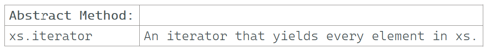

`
---

### xs.iterator

### Reference: <https://docs.scala-lang.org/overviews/collections-2.13/trait-iterable.html>

---
`

### `xs.iterator`

The `iterator` method in Scala collections returns an `Iterator` that yields every element in the collection `xs`. This allows for iteration over the collection without the need to access elements by index.



### Key Characteristics of Iterators

- **Lazy Evaluation**: Iterators do not compute their elements until they are accessed. This can save memory and computation time when dealing with large collections.
- **One-Time Use**: An iterator can only be traversed once. Once an element is accessed, it cannot be accessed again unless the iterator is recreated.
- **Traversal Operations**: Iterators support various traversal operations like `next()`, `hasNext`, and higher-order functions like `map`, `filter`, etc.

### Basic Example

```scala
val list = List(1, 2, 3, 4, 5)
val iterator = list.iterator

while (iterator.hasNext) {
  println(iterator.next())
}
// Output:
// 1
// 2
// 3
// 4
// 5
```

### Traversal Operations on Iterators

#### 1. Using `while` Loop

You can use a `while` loop to traverse the iterator.

```scala
val array = Array(1, 2, 3, 4, 5)
val iterator = array.iterator

while (iterator.hasNext) {
  println(iterator.next())
}
// Output:
// 1
// 2
// 3
// 4
// 5
```

#### 2. Using Higher-Order Functions

Iterators also support higher-order functions like `map`, `filter`, and `foreach`.

```scala
val list = List(1, 2, 3, 4, 5)
val iterator = list.iterator

// Map operation on iterator
val mappedIterator = iterator.map(_ * 2)

mappedIterator.foreach(println)
// Output:
// 2
// 4
// 6
// 8
// 10
```

### Advanced Usage and Nuances

#### Lazy Evaluation

Iterators are lazy, meaning they only compute the next element when it's needed. This is particularly useful for working with large or infinite collections.

```scala
val infiniteIterator = Iterator.from(1) // Infinite iterator starting from 1
val limited = infiniteIterator.take(5)  // Taking first 5 elements

limited.foreach(println)
// Output:
// 1
// 2
// 3
// 4
// 5
```

#### One-Time Use

An iterator can only be traversed once. After an element is accessed, it cannot be revisited.

```scala
val list = List(1, 2, 3)
val iterator = list.iterator

iterator.foreach(println)
// Output:
// 1
// 2
// 3

// Attempting to traverse again will not yield any elements
iterator.foreach(println)
// Output: (no output)
```

To re-traverse the collection, you need to create a new iterator.

```scala
val newIterator = list.iterator
newIterator.foreach(println)
// Output:
// 1
// 2
// 3
```

#### Combining Iterators with Other Collection Operations

You can combine iterators with other collection operations to achieve complex data transformations.

```scala
val list = List(1, 2, 3, 4, 5)
val iterator = list.iterator

val processedIterator = iterator
  .filter(_ % 2 == 0)
  .map(_ * 2)

processedIterator.foreach(println)
// Output:
// 4
// 8
```

#### Performance Considerations

- **Memory Efficiency**: Since iterators are lazy, they can be more memory-efficient than collections like `List` or `Array`, especially for large datasets.
- **Time Complexity**: Operations on iterators are generally O(1) for accessing the next element, but combining multiple operations (like `filter` and `map`) can introduce additional overhead.

### Summary

- **`xs.iterator`**: Returns an `Iterator` that yields every element in the collection `xs`.
- **Lazy Evaluation**: Iterators compute elements only when needed, making them memory efficient.
- **One-Time Use**: Iterators can only be traversed once. After that, a new iterator needs to be created for another traversal.
- **Traversal Operations**: Iterators support `while` loops and higher-order functions like `map`, `filter`, and `foreach`.
- **Combining Operations**: Iterators can be combined with other collection operations for complex transformations.

By understanding these characteristics and nuances, we can effectively use iterators in Scala to handle various data processing tasks efficiently.

---
