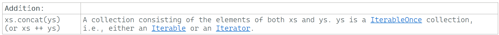

---

### Addition

### Reference: <https://docs.scala-lang.org/overviews/collections-2.13/trait-iterable.html>

---

In Scala, addition and concatenation operations allow us to combine collections. These operations can be performed using various methods provided by Scala's collection library.



### Addition (`:+`, `+:`, `++`)

1. **`:+`**: Appends a single element to the end of a collection.
2. **`+:`**: Prepends a single element to the beginning of a collection.
3. **`++`**: Concatenates two collections together.

### Examples

#### `:+` and `+:`

- `:+`: Appends an element to the end of the collection.
- `+:`: Prepends an element to the beginning of the collection.

```scala
val list = List(1, 2, 3)

// Append an element
val appended = list :+ 4
println(appended) // Output: List(1, 2, 3, 4)

// Prepend an element
val prepended = 0 +: list
println(prepended) // Output: List(0, 1, 2, 3)
```

#### `++`

- Concatenates two collections.

```scala
val list1 = List(1, 2, 3)
val list2 = List(4, 5, 6)

val concatenated = list1 ++ list2
println(concatenated) // Output: List(1, 2, 3, 4, 5, 6)
```

### `concat`

The `concat` method is another way to append all elements of an iterator or another collection to a collection. This method can be used with various collection types.

#### Example

```scala
val list1 = List(1, 2, 3)
val list2 = List(4, 5, 6)

// Using concat
val concatenated = list1.concat(list2)
println(concatenated) // Output: List(1, 2, 3, 4, 5, 6)
```

### Appending Elements from an Iterator

You can append all elements of an iterator to a collection using `++` or `concat`.

```scala
val list = List(1, 2, 3)
val iterator = Iterator(4, 5, 6)

// Using ++
val appendedWithIterator1 = list ++ iterator
println(appendedWithIterator1) // Output: List(1, 2, 3, 4, 5, 6)

// Using concat
val appendedWithIterator2 = list.concat(iterator)
println(appendedWithIterator2) // Output: List(1, 2, 3, 4, 5, 6)
```

### Summary

- **`:+`**: Appends a single element to the end of a collection.
- **`+:`**: Prepends a single element to the beginning of a collection.
- **`++`**: Concatenates two collections together.
- **`concat`**: Appends all elements of another collection or iterator to a collection.

These methods provide flexible ways to combine and manipulate collections in Scala.

---
