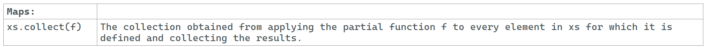

---

### Maps: collect

### Reference: <https://docs.scala-lang.org/overviews/collections-2.13/trait-iterable.html>

---

The `collect` method in Scala is a powerful and flexible tool for transforming and filtering collections based on partial functions. Here's an in-depth look at how `collect` works, along with examples to illustrate its use.



### `collect` Method

#### Definition

The `collect` method is used to apply a partial function to all elements in a collection for which the partial function is defined. It returns a new collection containing the results of the partial function.

```scala
def collect[B](pf: PartialFunction[A, B]): Traversable[B]
```

- **`A`**: The type of elements in the original collection.
- **`B`**: The type of elements in the resulting collection.
- **`pf`**: A partial function that defines both a transformation and a filter.

### Key Characteristics

1. **Transformation and Filtering**: `collect` allows you to both filter and transform elements in one step.
2. **Partial Function**: The partial function defines for which elements the function is applicable and how they should be transformed.

### Examples

#### Example 1: Filtering and Transforming

- **Scenario**: You have a list of integers and you want to filter out only even numbers and then double them.

```scala
val numbers = List(1, 2, 3, 4, 5, 6)
val evenDoubled = numbers.collect {
  case n if n % 2 == 0 => n * 2
}
println(evenDoubled) // Output: List(4, 8, 12)
```

- **Explanation**:
    - The partial function `case n if n % 2 == 0 => n * 2` filters out even numbers and doubles them.
    - `collect` applies this partial function, resulting in a list of doubled even numbers.

#### Example 2: Extracting Values from a Mixed List

- **Scenario**: You have a list containing elements of different types, and you want to extract only the string elements.

```scala
val mixedList: List[Any] = List(1, "hello", 2.5, "world", 42)
val strings = mixedList.collect {
  case s: String => s
}
println(strings) // Output: List(hello, world)
```

- **Explanation**:
    - The partial function `case s: String => s` extracts elements that are strings.
    - `collect` filters and transforms the list to contain only strings.

#### Example 3: Handling Optional Values

- **Scenario**: You have a list of optional integers, and you want to extract the values of the defined options.

```scala
val options = List(Some(1), None, Some(2), None, Some(3))
val values = options.collect {
  case Some(value) => value
}
println(values) // Output: List(1, 2, 3)
```

- **Explanation**:
    - The partial function `case Some(value) => value` extracts the values from the `Some` options.
    - `collect` filters out the `None` values and extracts the integers from the `Some` values.

### Use Cases for `collect`

1. **Complex Filtering and Transformation**:
    - Use `collect` when you need to filter elements based on a condition and simultaneously transform the selected elements.
    - Example: Extract and transform elements that meet certain criteria.

2. **Type Extraction**:
    - Use `collect` to extract elements of a specific type from a collection containing mixed types.
    - Example: Extracting only strings from a list of mixed types.

3. **Pattern Matching**:
    - Use `collect` to apply pattern matching for extracting and transforming elements based on patterns.
    - Example: Extracting and processing values from an `Option` or a collection of case classes.

### Advantages of Using `collect`

- **Conciseness**: Combines filtering and transformation in a single step.
- **Readability**: Expresses intent clearly through pattern matching and partial functions.
- **Safety**: Ensures that only elements for which the partial function is defined are processed.

### Summary

- **`collect`**: A powerful method for transforming and filtering collections using partial functions.
    - **Transformation and Filtering**: Combines both in one step.
    - **Partial Function**: Defines the conditions and transformations.

By understanding how to use `collect`, we can handle complex transformations and filtering in a concise and expressive manner.

---
