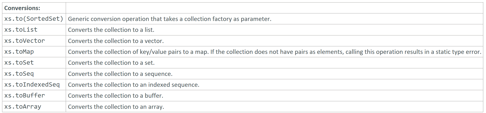

---

### Conversions

### Reference: <https://docs.scala-lang.org/overviews/collections-2.13/trait-iterable.html>

---

Let's go through examples for each of the conversion operations: `to`, `toList`, `toVector`, `toMap`, `toSet`, `toSeq`, `toIndexedSeq`, `toBuffer`, and `toArray`.



### 1. `to`

The `to` method converts a collection to a specific collection type using a factory.

```scala
import scala.collection.mutable

val list = List(1, 2, 3)
val arrayBuffer = list.to(mutable.ArrayBuffer)
println(arrayBuffer) // Output: ArrayBuffer(1, 2, 3)
```

### 2. `toList`

The `toList` method converts a collection to a `List`.

```scala
val vector = Vector(1, 2, 3)
val list = vector.toList
println(list) // Output: List(1, 2, 3)
```

### 3. `toVector`

The `toVector` method converts a collection to a `Vector`.

```scala
val list = List(1, 2, 3)
val vector = list.toVector
println(vector) // Output: Vector(1, 2, 3)
```

### 4. `toMap`

The `toMap` method converts a collection of key-value pairs to a `Map`.

```scala
val pairs = List((1, "one"), (2, "two"), (3, "three"))
val map = pairs.toMap
println(map) // Output: Map(1 -> one, 2 -> two, 3 -> three)
```

### 5. `toSet`

The `toSet` method converts a collection to a `Set`.

```scala
val list = List(1, 2, 2, 3, 3, 3)
val set = list.toSet
println(set) // Output: Set(1, 2, 3)
```

### 6. `toSeq`

The `toSeq` method converts a collection to a `Seq`.

```scala
val array = Array(1, 2, 3)
val seq = array.toSeq
println(seq) // Output: Seq(1, 2, 3)
```

### 7. `toIndexedSeq`

The `toIndexedSeq` method converts a collection to an `IndexedSeq`.

```scala
val list = List(1, 2, 3)
val indexedSeq = list.toIndexedSeq
println(indexedSeq) // Output: Vector(1, 2, 3)
```

### 8. `toBuffer`

The `toBuffer` method converts a collection to a mutable `Buffer`.

```scala
import scala.collection.mutable.Buffer

val list = List(1, 2, 3)
val buffer = list.toBuffer
println(buffer) // Output: ArrayBuffer(1, 2, 3)
```

### 9. `toArray`

The `toArray` method converts a collection to an `Array`.

```scala
val list = List(1, 2, 3)
val array = list.toArray
println(array.mkString(", ")) // Output: 1, 2, 3
```

### Summary

- **`to`**: Converts a collection to a specific type using a factory.
- **`toList`**: Converts to a `List`.
- **`toVector`**: Converts to a `Vector`.
- **`toMap`**: Converts to a `Map`.
- **`toSet`**: Converts to a `Set`.
- **`toSeq`**: Converts to a `Seq`.
- **`toIndexedSeq`**: Converts to an `IndexedSeq`.
- **`toBuffer`**: Converts to a mutable `Buffer`.
- **`toArray`**: Converts to an `Array`.

Each method is useful for converting collections into different types based on the requirements of your application.

---
