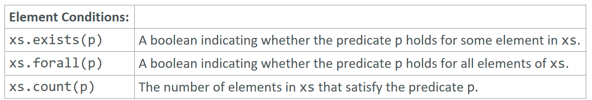

---

### Element Condition

### Reference: <https://docs.scala-lang.org/overviews/collections-2.13/trait-iterable.html>

---

Element Condition operations in Scala, such as `exists`, `forall`, and `count`, are used to evaluate elements of a collection against a given predicate. Let's explore each of these methods with explanations and examples.



### 1. `exists`

Checks if there is at least one element in the collection that satisfies the given predicate.

```scala
val list = List(1, 2, 3, 4, 5)

val hasEven = list.exists(_ % 2 == 0)
println(hasEven) // Output: true

val hasGreaterThanFive = list.exists(_ > 5)
println(hasGreaterThanFive) // Output: false
```

### 2. `forall`

Checks if all elements in the collection satisfy the given predicate.

```scala
val allPositive = list.forall(_ > 0)
println(allPositive) // Output: true

val allEven = list.forall(_ % 2 == 0)
println(allEven) // Output: false
```

### 3. `count`

Counts the number of elements in the collection that satisfy the given predicate.

```scala
val evenCount = list.count(_ % 2 == 0)
println(evenCount) // Output: 2

val greaterThanThreeCount = list.count(_ > 3)
println(greaterThanThreeCount) // Output: 2
```

### Examples and Explanations

#### `exists`

- **Usage**: Determines if there is at least one element that meets the predicate criteria.
- **Example**:

```scala
val list = List(1, 2, 3, 4, 5)

val hasEven = list.exists(_ % 2 == 0)
println(hasEven) // Output: true

val hasGreaterThanFive = list.exists(_ > 5)
println(hasGreaterThanFive) // Output: false
```

#### `forall`

- **Usage**: Determines if all elements in the collection meet the predicate criteria.
- **Example**:

```scala
val allPositive = list.forall(_ > 0)
println(allPositive) // Output: true

val allEven = list.forall(_ % 2 == 0)
println(allEven) // Output: false
```

#### `count`

- **Usage**: Counts the number of elements that meet the predicate criteria.
- **Example**:

```scala
val evenCount = list.count(_ % 2 == 0)
println(evenCount) // Output: 2

val greaterThanThreeCount = list.count(_ > 3)
println(greaterThanThreeCount) // Output: 2
```

### Summary

- **`exists(p)`**: Returns `true` if there is at least one element that satisfies the predicate `p`.
- **`forall(p)`**: Returns `true` if all elements satisfy the predicate `p`.
- **`count(p)`**: Returns the number of elements that satisfy the predicate `p`.

These element test operations are useful for checking conditions across a collection and counting elements that meet certain criteria. They can help make your code more expressive and concise.

---
