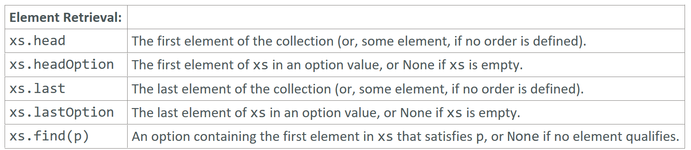

---

### Element Retrieval

### Reference: <https://docs.scala-lang.org/overviews/collections-2.13/trait-iterable.html>

---

Let's explore element retrieval operations in Scala: `head`, `last`, `headOption`, `lastOption`, and `find`. These operations help you retrieve specific elements from collections, but it's important to note that their behavior can vary depending on whether the collection is ordered or unordered.

### Element Retrieval Operations



1. **`head`**
2. **`last`**
3. **`headOption`**
4. **`lastOption`**
5. **`find`**

### 1. `head`

The `head` method returns the first element of a collection. If the collection is empty, it throws a `NoSuchElementException`.

```scala
val list = List(1, 2, 3)
println(list.head) // Output: 1

val emptyList = List()
println(emptyList.head) // Throws NoSuchElementException
```

### 2. `last`

The `last` method returns the last element of a collection. If the collection is empty, it throws a `NoSuchElementException`.

```scala
val list = List(1, 2, 3)
println(list.last) // Output: 3

val emptyList = List()
println(emptyList.last) // Throws NoSuchElementException
```

### 3. `headOption`

The `headOption` method returns an `Option` containing the first element of a collection if it exists, or `None` if the collection is empty. This is a safer alternative to `head`.

```scala
val list = List(1, 2, 3)
println(list.headOption) // Output: Some(1)

val emptyList = List()
println(emptyList.headOption) // Output: None
```

### 4. `lastOption`

The `lastOption` method returns an `Option` containing the last element of a collection if it exists, or `None` if the collection is empty. This is a safer alternative to `last`.

```scala
val list = List(1, 2, 3)
println(list.lastOption) // Output: Some(3)

val emptyList = List()
println(emptyList.lastOption) // Output: None
```

### 5. `find`

The `find` method returns the first element of a collection that matches a given predicate wrapped in an `Option`, or `None` if no such element exists.

```scala
val list = List(1, 2, 3, 4, 5)
println(list.find(_ > 3)) // Output: Some(4)
println(list.find(_ > 5)) // Output: None
```

### Ordered vs. Unordered Collections

- **Ordered Collections**: These collections maintain a consistent order of elements. Examples include `List`, `Vector`, `Array`, and `LinkedHashSet`.
    - **Example**: `List(1, 2, 3)` will always have 1 as `head` and 3 as `last`.

- **Unordered Collections**: These collections do not guarantee a consistent order of elements. Examples include `HashSet` and `HashMap`.
    - **Example**: `HashSet(1, 2, 3)` may have different "first" and "last" elements in different runs due to hash-based storage.

### Example with Ordered and Unordered Collections

#### Ordered Collection: List

```scala
val orderedList = List(1, 2, 3)
println(orderedList.head)        // Output: 1
println(orderedList.last)        // Output: 3
println(orderedList.headOption)  // Output: Some(1)
println(orderedList.lastOption)  // Output: Some(3)
println(orderedList.find(_ > 1)) // Output: Some(2)
```

#### Unordered Collection: HashSet

```scala
val unorderedSet = scala.collection.immutable.HashSet(1, 2, 3)
println(unorderedSet.head)        // Output may vary
println(unorderedSet.last)        // Output may vary
println(unorderedSet.headOption)  // Output may vary
println(unorderedSet.lastOption)  // Output may vary
println(unorderedSet.find(_ > 1)) // Output may vary
```

### Ensuring Ordered Collections

If ordering is essential for your use case (e.g., reproducible tests, debugging), prefer using ordered collections like `List`, `Vector`, or `LinkedHashSet`.

```scala
import scala.collection.mutable.LinkedHashSet

val linkedHashSet = LinkedHashSet(1, 2, 3)
println(linkedHashSet.head)        // Output: 1
println(linkedHashSet.last)        // Output: 3
println(linkedHashSet.headOption)  // Output: Some(1)
println(linkedHashSet.lastOption)  // Output: Some(3)
println(linkedHashSet.find(_ > 1)) // Output: Some(2)
```

### Summary

- **`head`**: First element (throws if empty).
- **`last`**: Last element (throws if empty).
- **`headOption`**: First element as `Option`.
- **`lastOption`**: Last element as `Option`.
- **`find`**: First element matching a predicate as `Option`.

Understanding the differences between ordered and unordered collections and using the appropriate methods can help you manage collections effectively and avoid potential pitfalls.

---

