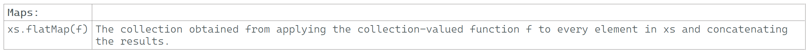

---

### Maps: flatMap

### Reference: <https://docs.scala-lang.org/overviews/collections-2.13/trait-iterable.html>

---

### Part 1: Core concepts and various usages of the `flatMap` function.

`flatMap` is another powerful higher-order function in Scala, particularly useful for handling nested structures and chaining operations that return collections or monads. Here's an in-depth look at `flatMap`, its usage, and various aspects you should know.



### What is `flatMap`?

`flatMap` is similar to `map`, but it allows you to apply a function that returns a collection (or another monad) and then flattens the result. This is particularly useful when dealing with nested collections or chaining operations that return options, futures, or other monads.

### Basic Syntax

```scala
collection.flatMap(function)
```

- `collection`: The collection or monad you are operating on.
- `function`: A function that returns a collection or monad for each element of the original collection.

### Example with Lists

```scala
val numbers = List(1, 2, 3)
val result = numbers.flatMap(n => List(n, n * 2))
println(result) // Output: List(1, 2, 2, 4, 3, 6)
```

### Explanation
1. **Original Collection**: `numbers` is a `List` containing the elements `1, 2, 3`.
2. **Function**: The function `n => List(n, n * 2)` returns a list for each element, containing the element itself and its double.
3. **Flattening**: `flatMap` applies the function to each element and flattens the result into a single list.

### Example with Options

`flatMap` is commonly used with `Option` to chain operations that may or may not return a value.

```scala
val someValue: Option[Int] = Some(3)
val noneValue: Option[Int] = None

val result1 = someValue.flatMap(x => Some(x * 2))
val result2 = noneValue.flatMap(x => Some(x * 2))

println(result1) // Output: Some(6)
println(result2) // Output: None
```

### Example with Futures

`flatMap` can be used to chain asynchronous operations with `Future`.

```scala
import scala.concurrent.Future
import scala.concurrent.ExecutionContext.Implicits.global

val future1: Future[Int] = Future(3)
val future2: Future[Int] = future1.flatMap(x => Future(x * 2))

future2.foreach(println) // Output: 6 (asynchronously)
```

### Using `flatMap` with `for` Comprehensions

`for` comprehensions in Scala are syntactic sugar for nested `flatMap` (and `map`) calls.

```scala
val numbers = List(1, 2, 3)
val result = for {
  n <- numbers
  m <- List(n, n * 2)
} yield m

println(result) // Output: List(1, 2, 2, 4, 3, 6)
```

### Example with `Try`

`flatMap` is useful for error handling with `Try`.

```scala
import scala.util.{Try, Success, Failure}

def parse(s: String): Try[Int] = Try(s.toInt)
val result = parse("123").flatMap(x => Try(x * 2))
println(result) // Output: Success(246)

val failedResult = parse("abc").flatMap(x => Try(x * 2))
println(failedResult) // Output: Failure(java.lang.NumberFormatException: For input string: "abc")
```

### Flattening Nested Collections

If you have a collection of collections, `flatMap` can flatten them into a single collection.

```scala
val nestedList = List(List(1, 2), List(3, 4), List(5, 6))
val flatList = nestedList.flatMap(identity)
println(flatList) // Output: List(1, 2, 3, 4, 5, 6)
```

### Monad Laws with `flatMap`

Understanding the monad laws can help ensure predictable behavior:

- **Left Identity**: `flatMap` with a function `f` applied to a monadic value `x` should be the same as applying `f` directly to `x`.

  ```scala
  val x = Some(5)
  def f(a: Int): Option[Int] = Some(a * 2)
  x.flatMap(f) == f(5) // Output: true
  ```

- **Right Identity**: `flatMap` with `Some` or another constructor should return the same monad.

  ```scala
  val x = Some(5)
  x.flatMap(Some(_)) == x // Output: true
  ```

- **Associativity**: Chaining multiple `flatMap` operations should be associative.

  ```scala
  val x = Some(5)
  def f(a: Int): Option[Int] = Some(a * 2)
  def g(a: Int): Option[Int] = Some(a + 3)
  x.flatMap(f).flatMap(g) == x.flatMap(a => f(a).flatMap(g)) // Output: true
  ```

### Performance Considerations

- **Avoiding Deep Nesting**: Excessive use of `flatMap` on deeply nested structures can lead to performance issues. Consider refactoring if possible.
- **Lazy Evaluation**: Using `flatMap` with lazy collections like `LazyList` can defer computations until necessary.

### Parallel Collections

`flatMap` can be used with parallel collections to improve performance, though be mindful of the overhead and ensure thread safety.

```scala
val numbers = (1 to 1000000).toList.par
val result = numbers.flatMap(n => List(n, n * 2))
println(result.take(10).toList) // Output: First 10 elements of the result
```

### Summary

- **Transforming Nested Structures**: `flatMap` is ideal for flattening nested collections.
- **Chaining Operations**: It allows for chaining operations that return monads (e.g., `Option`, `Future`).
- **Monad Laws**: Ensuring predictable behavior by following monad laws.
- **Lazy Evaluation**: Use with lazy collections to optimize performance.
- **Error Handling**: Handle errors gracefully with `Try`, `Option`, etc.

`flatMap` is an essential tool in Scala's functional programming toolkit, enabling powerful and expressive transformations of collections and monads.

---

### Part 2: Flattening Explained!

When we say that `flatMap` "flattens the result," we mean that it takes a collection of collections (or a monad containing another monad) and combines them into a single collection (or monad). This operation is crucial when you have nested structures and want to process them into a single, unified structure.

### Flattening Explained

Let's break down the concept of flattening with some concrete examples:

### Example with Lists

Imagine you have a list of lists and you want to create a single list containing all the elements:

```scala
val nestedList = List(List(1, 2), List(3, 4), List(5, 6))
val flatList = nestedList.flatMap(identity)
println(flatList) // Output: List(1, 2, 3, 4, 5, 6)
```

Here, `flatMap(identity)` applies the identity function (`identity` is a function that returns its argument) to each sublist, resulting in a list of lists. `flatMap` then flattens these sublists into a single list.

### Step-by-Step Breakdown:

1. **Original Nested List**: `List(List(1, 2), List(3, 4), List(5, 6))`
2. **Apply Function**: `flatMap(identity)` applies the function to each sublist.
3. **Flatten**: The nested lists are combined into a single list: `List(1, 2, 3, 4, 5, 6)`

### Example with Options

When working with `Option`, `flatMap` can combine `Some` values while handling `None` values appropriately:

```scala
val someValue: Option[Int] = Some(3)
val noneValue: Option[Int] = None

val result1 = someValue.flatMap(x => Some(x * 2))
val result2 = noneValue.flatMap(x => Some(x * 2))

println(result1) // Output: Some(6)
println(result2) // Output: None
```

Here, `flatMap` applies the function to the `Some` value, resulting in another `Some`, and combines them. If the original `Option` is `None`, the result is `None`.

### Example with Futures

For `Future`, `flatMap` allows chaining asynchronous operations, flattening nested futures into a single future:

```scala
import scala.concurrent.Future
import scala.concurrent.ExecutionContext.Implicits.global

val future1: Future[Int] = Future(3)
val future2: Future[Int] = future1.flatMap(x => Future(x * 2))

future2.foreach(println) // Output: 6 (asynchronously)
```

Here, `flatMap` applies the function to the result of the first future, creating another future, and flattens these into a single future.

### General Pattern

In general, `flatMap` can be thought of as:

1. **Applying a Function**: A function that returns a collection or monad for each element.
2. **Flattening**: Combining the resulting nested collections or monads into a single collection or monad.

### Why Use `flatMap`?

- **Simplifies Nested Structures**: Converts a collection of collections into a single collection, making it easier to work with.
- **Chains Operations**: Allows chaining operations that return monads (e.g., `Option`, `Future`), combining them into a single monad.
- **Enables `for` Comprehensions**: `flatMap` is used behind the scenes in `for` comprehensions to manage complex operations involving multiple monads.

### Visual Representation

Consider `flatMap` on a list of lists:

```scala
val nestedList = List(List(1, 2), List(3, 4), List(5, 6))
val flatList = nestedList.flatMap(identity)
```

**Before Flattening:**
```
[
  [1, 2],
  [3, 4],
  [5, 6]
]
```

**After Flattening:**
```
[1, 2, 3, 4, 5, 6]
```

### Conclusion

`flatMap` is a powerful tool in Scala for handling nested collections or monads. It simplifies operations by flattening the nested structures into a single, cohesive unit, making it easier to apply further transformations and operations. Understanding and leveraging `flatMap` effectively can significantly enhance your functional programming skills in Scala.

---

### Part 3: Advanced aspects, nuances, and best practices of `flatMap`.

While the basic concept of `flatMap` and its common use cases are essential to understand, there are several advanced aspects, nuances, and best practices that can deepen your understanding and improve your use of `flatMap` in Scala.

### Advanced Aspects of `flatMap`

#### 1. **Type Constraints**
`flatMap` often works with monads (like `Option`, `Future`, `List`). The type constraints ensure that the function you provide returns the same type of monad.

```scala
def example[A, B](opt: Option[A], f: A => Option[B]): Option[B] = opt.flatMap(f)
```

#### 2. **Composition with `map` and `filter`**
You can combine `flatMap` with other higher-order functions like `map` and `filter` to create complex pipelines.

```scala
val numbers = List(1, 2, 3, 4, 5)
val result = numbers
  .filter(_ % 2 == 0)   // Keep even numbers
  .flatMap(x => List(x, x * 2)) // Flatten and double the even numbers
  .map(_ + 1)           // Increment each number by 1
println(result) // Output: List(3, 5, 5, 9)
```

#### 3. **Using `flatMap` with Custom Monads**
You can define and use `flatMap` with your custom monads, following the monadic laws and implementing `flatMap` and `map` correctly.

```scala
case class Box[A](value: A) {
  def map[B](f: A => B): Box[B] = Box(f(value))
  def flatMap[B](f: A => Box[B]): Box[B] = f(value)
}

val box1 = Box(3)
val box2 = box1.flatMap(x => Box(x * 2))
println(box2) // Output: Box(6)
```

#### 4. **Working with More Complex Monads**
Libraries like Cats and Scalaz provide more complex monads and combinators, allowing for more sophisticated functional programming patterns.

```scala
import cats.Monad
import cats.implicits._

def combineOptions[A](opt1: Option[A], opt2: Option[A])(implicit M: Monad[Option]): Option[A] = {
  for {
    a <- opt1
    b <- opt2
  } yield (a, b)._1
}

println(combineOptions(Some(1), Some(2))) // Output: Some(1)
println(combineOptions(None, Some(2)))    // Output: None
```

#### 5. **Understanding Monad Transformers**
Monad transformers like `OptionT`, `EitherT`, and `FutureT` help manage nested monads, simplifying `flatMap` chains.

```scala
import cats.data.OptionT
import scala.concurrent.Future
import scala.concurrent.ExecutionContext.Implicits.global

val futureOpt1 = OptionT(Future.successful(Some(10)))
val futureOpt2 = OptionT(Future.successful(Some(5)))

val result = for {
  a <- futureOpt1
  b <- futureOpt2
} yield a + b

result.value.foreach(println) // Output: Some(15)
```

#### 6. **Handling Side Effects**
When using `flatMap`, particularly with `Future` or `IO`, handle side effects carefully to ensure proper sequencing and error handling.

```scala
import scala.concurrent.Future
import scala.concurrent.ExecutionContext.Implicits.global

val future1: Future[Int] = Future(3)
val future2: Future[Int] = future1.flatMap(x => Future(x * 2))

future2.foreach(println) // Output: 6 (asynchronously)
```

### Best Practices

1. **Keep Functions Pure**: Ensure the function you pass to `flatMap` is pure (without side effects) for predictability and testability.
2. **Avoid Deep Nesting**: Deeply nested `flatMap` chains can become hard to read and maintain. Refactor into smaller functions or use `for` comprehensions.
3. **Use Monad Transformers**: When dealing with nested monads, use monad transformers to simplify the code.
4. **Handle Errors Gracefully**: Always account for possible errors when using `flatMap` with `Option`, `Try`, `Future`, etc.
5. **Be Mindful of Performance**: `flatMap` can introduce overhead, especially with large collections or deeply nested structures. Profile and optimize as needed.

### Summary

- **Advanced Compositions**: Combining `flatMap` with other higher-order functions.
- **Custom Monads**: Creating and using `flatMap` with custom monads.
- **Complex Monads and Libraries**: Using libraries like Cats and Scalaz for more advanced patterns.
- **Monad Transformers**: Managing nested monads with monad transformers.
- **Handling Side Effects**: Carefully managing side effects in asynchronous operations.
- **Best Practices**: Writing clean, maintainable, and performant code with `flatMap`.

Understanding and mastering these advanced aspects and best practices will enable you to use `flatMap` effectively in a wide range of scenarios, making your Scala code more functional, expressive, and robust.

---

### Part 4: A few more advanced and nuanced considerations for `flatMap`?

While we have covered many aspects of `flatMap`, there are always more details and nuanced topics that could be explored. Here are a few more advanced and nuanced considerations:

### Additional Aspects of `flatMap`

1. **Interaction with Other Data Structures**:
  - `flatMap` is not limited to collections like `List` or monads like `Option`. It can also be applied to other data structures such as `Map`, `Stream`, and custom data types.

    ```scala
    val map = Map(1 -> "one", 2 -> "two", 3 -> "three")
    val flatMappedMap = map.flatMap { case (k, v) => Map(k -> v, (k + 10) -> (v + "0")) }
    println(flatMappedMap) // Output: Map(1 -> one, 11 -> one0, 2 -> two, 12 -> two0, 3 -> three, 13 -> three0)
    ```

2. **Lazy Evaluation and Infinite Collections**:
  - Using `flatMap` with lazy collections like `LazyList` can help in handling infinite sequences or large data sets efficiently.

    ```scala
    val lazyList = LazyList.from(1)
    val flatMappedLazyList = lazyList.flatMap(n => LazyList(n, n * 2))
    println(flatMappedLazyList.take(10).toList) // Output: List(1, 2, 2, 4, 3, 6, 4, 8, 5, 10)
    ```

3. **Interplay with Pattern Matching**:
  - `flatMap` can be combined with pattern matching to handle complex data transformations.

    ```scala
    val list = List(Some(1), None, Some(3))
    val result = list.flatMap {
      case Some(value) => Some(value * 2)
      case None => None
    }
    println(result) // Output: List(2, 6)
    ```

4. **Performance Optimization**:
  - Understanding the performance implications of using `flatMap`, especially in large data pipelines, can help optimize your code.

    ```scala
    val largeList = List.fill(1000000)(1)
    val result = largeList.flatMap(x => List(x, x + 1))
    println(result.take(5)) // Output: List(1, 2, 1, 2, 1)
    ```

5. **Monadic Contexts in Scalaz and Cats**:
  - In libraries like Scalaz and Cats, `flatMap` is often used in more complex monadic contexts, such as with `State`, `Reader`, or `Writer` monads.

    ```scala
    import cats.data.State

    val increment: State[Int, Int] = State(state => (state + 1, state))
    val result = increment.flatMap(x => State(state => (state + x, state * 2)))
    println(result.run(5).value) // Output: (11,12)
    ```

6. **Abstracting Over Monads**:
  - You can write functions that abstract over any monad by using the `Monad` type class from libraries like Cats.

    ```scala
    import cats.Monad
    import cats.implicits._

    def multiplyM[F[_]: Monad](x: F[Int], y: F[Int]): F[Int] = for {
      a <- x
      b <- y
    } yield a * b

    val result = multiplyM(Option(3), Option(4))
    println(result) // Output: Some(12)
    ```

7. **Implicit Conversions and Extensions**:
  - Leveraging implicit conversions and extension methods can make `flatMap` usage more seamless, especially with custom types.

    ```scala
    implicit class RichOption[A](opt: Option[A]) {
      def flatMapWithLogging[B](f: A => Option[B]): Option[B] = {
        println(s"FlatMapping: $opt")
        opt.flatMap(f)
      }
    }

    val someValue: Option[Int] = Some(3)
    val result = someValue.flatMapWithLogging(x => Some(x * 2))
    println(result) // Output: Some(6)
    ```

### Summary of Additional Aspects

- **Data Structures**: Use `flatMap` with various data structures like `Map`, `Stream`, etc.
- **Lazy Evaluation**: Handle infinite or large collections efficiently with lazy evaluation.
- **Pattern Matching**: Combine `flatMap` with pattern matching for complex transformations.
- **Performance**: Be mindful of performance, especially in large pipelines.
- **Advanced Monads**: Use `flatMap` in advanced monadic contexts like `State`, `Reader`, `Writer`.
- **Abstracting Monads**: Abstract over monads using type classes from libraries like Cats.
- **Implicit Conversions**: Enhance `flatMap` with implicit conversions and extension methods.

These additional aspects provide a more comprehensive understanding of `flatMap` and its potential in Scala. They open up more sophisticated ways to handle collections and monads, leading to cleaner, more maintainable, and more efficient code.

---
