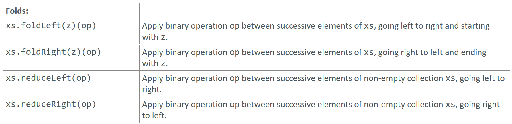

---

### Folds

### Reference: <https://docs.scala-lang.org/overviews/collections-2.13/trait-iterable.html>

---

Folds and reductions in Scala are operations that process collections by applying a binary operation to successive elements, either from the left or the right. Let's explore `foldLeft`, `foldRight`, `reduceLeft`, and `reduceRight` with detailed explanations and examples.



### 1. `foldLeft`

`foldLeft` processes the elements of a collection from the left to the right, applying a binary operation.

Syntax: `collection.foldLeft(initialValue)(binaryOperation)`

Example:

```scala
val list = List(1, 2, 3, 4, 5)

// Sum of elements
val sum = list.foldLeft(0)(_ + _)
println(sum) // Output: 15

// Concatenate elements
val concatenated = list.foldLeft("")((acc, elem) => acc + elem.toString)
println(concatenated) // Output: "12345"
```

### 2. `foldRight`

`foldRight` processes the elements of a collection from the right to the left, applying a binary operation.

Syntax: `collection.foldRight(initialValue)(binaryOperation)`

Example:

```scala
// Sum of elements
val sumRight = list.foldRight(0)(_ + _)
println(sumRight) // Output: 15

// Concatenate elements
val concatenatedRight = list.foldRight("")((elem, acc) => elem.toString + acc)
println(concatenatedRight) // Output: "54321"
```

### 3. `reduceLeft`

`reduceLeft` processes the elements of a collection from the left to the right, applying a binary operation. It does not require an initial value, as it uses the first element of the collection as the initial value.

Syntax: `collection.reduceLeft(binaryOperation)`

Example:

```scala
// Sum of elements
val sumReduceLeft = list.reduceLeft(_ + _)
println(sumReduceLeft) // Output: 15

// Maximum element
val maxElement = list.reduceLeft((x, y) => if (x > y) x else y)
println(maxElement) // Output: 5
```

### 4. `reduceRight`

`reduceRight` processes the elements of a collection from the right to the left, applying a binary operation. It does not require an initial value, as it uses the last element of the collection as the initial value.

Syntax: `collection.reduceRight(binaryOperation)`

Example:

```scala
// Sum of elements
val sumReduceRight = list.reduceRight(_ + _)
println(sumReduceRight) // Output: 15

// Maximum element
val maxElementRight = list.reduceRight((x, y) => if (x > y) x else y)
println(maxElementRight) // Output: 5
```

### Detailed Examples and Explanations

#### `foldLeft`

- **Usage**: Processes the collection from left to right with an initial value.
- **Example**:

```scala
val list = List(1, 2, 3, 4, 5)

// Sum of elements
val sum = list.foldLeft(0)(_ + _)
println(sum) // Output: 15

// Trace of computation:
val trace = list.foldLeft(List.empty[Int])((acc, elem) => acc :+ elem + acc.sum)
println(trace) // Output: List(1, 3, 6, 10, 15)
```

#### `foldRight`

- **Usage**: Processes the collection from right to left with an initial value.
- **Example**:

```scala
// Sum of elements
val sumRight = list.foldRight(0)(_ + _)
println(sumRight) // Output: 15

// Trace of computation:
val traceRight = list.foldRight(List.empty[Int])((elem, acc) => (elem + acc.sum) :: acc)
println(traceRight) // Output: List(15, 14, 12, 9, 5)
```

#### `reduceLeft`

- **Usage**: Reduces the collection from left to right without an initial value.
- **Example**:

```scala
// Sum of elements
val sumReduceLeft = list.reduceLeft(_ + _)
println(sumReduceLeft) // Output: 15

// Maximum element
val maxElement = list.reduceLeft((x, y) => if (x > y) x else y)
println(maxElement) // Output: 5
```

#### `reduceRight`

- **Usage**: Reduces the collection from right to left without an initial value.
- **Example**:

```scala
// Sum of elements
val sumReduceRight = list.reduceRight(_ + _)
println(sumReduceRight) // Output: 15

// Maximum element
val maxElementRight = list.reduceRight((x, y) => if (x > y) x else y)
println(maxElementRight) // Output: 5
```

### Summary

- **`foldLeft(initialValue)(operation)`**: Processes elements from left to right with an initial value.
- **`foldRight(initialValue)(operation)`**: Processes elements from right to left with an initial value.
- **`reduceLeft(operation)`**: Processes elements from left to right without an initial value.
- **`reduceRight(operation)`**: Processes elements from right to left without an initial value.

These operations are useful for aggregating data, performing calculations, and transforming collections in Scala. They provide a powerful way to express iterative algorithms in a functional programming style.

---

### 1. foldLeft(initialValue)(operation) vs reduceLeft(operation)
### 2. foldRight(initialValue)(operation) vs reduceRight(operation)
### Why has Scala provided above variations?

---

Understanding the differences between `foldLeft` and `reduceLeft`, as well as `foldRight` and `reduceRight`, is important for effectively using Scala's collection operations. Let's delve into each pair and explain why Scala provides both.

### 1. `foldLeft` vs `reduceLeft`

#### `foldLeft`

- **Signature**: `foldLeft[B](z: B)(op: (B, A) => B): B`
- **Initial Value**: Requires an initial value `z` of type `B`.
- **Operation**: Applies the binary operation `op` to the accumulator and each element of the collection, starting with the initial value.
- **Usage**: Use `foldLeft` when you need an initial value or when the result type is different from the element type.

Example:

```scala
val list = List(1, 2, 3, 4, 5)

// Sum with an initial value of 0
val sum = list.foldLeft(0)(_ + _)
println(sum) // Output: 15

// Product with an initial value of 1
val product = list.foldLeft(1)(_ * _)
println(product) // Output: 120

// Concatenate elements with an initial empty string
val concatenated = list.foldLeft("")(_ + _.toString)
println(concatenated) // Output: "12345"
```

#### `reduceLeft`

- **Signature**: `reduceLeft[B >: A](op: (A, A) => A): A`
- **Initial Value**: Does not require an initial value. The first element of the collection is used as the initial value.
- **Operation**: Applies the binary operation `op` to successive elements of the collection, starting with the first element.
- **Usage**: Use `reduceLeft` when the collection is non-empty, and you do not need a specific initial value or when the result type is the same as the element type.

Example:

```scala
// Sum without an initial value
val sumReduceLeft = list.reduceLeft(_ + _)
println(sumReduceLeft) // Output: 15

// Maximum element
val maxElement = list.reduceLeft((x, y) => if (x > y) x else y)
println(maxElement) // Output: 5
```

### 2. `foldRight` vs `reduceRight`

#### `foldRight`

- **Signature**: `foldRight[B](z: B)(op: (A, B) => B): B`
- **Initial Value**: Requires an initial value `z` of type `B`.
- **Operation**: Applies the binary operation `op` to each element and the accumulator, starting from the rightmost element.
- **Usage**: Use `foldRight` when you need an initial value or when the result type is different from the element type.

Example:

```scala
// Sum with an initial value of 0
val sumRight = list.foldRight(0)(_ + _)
println(sumRight) // Output: 15

// Concatenate elements with an initial empty string
val concatenatedRight = list.foldRight("")(_.toString + _)
println(concatenatedRight) // Output: "54321"
```

#### `reduceRight`

- **Signature**: `reduceRight[B >: A](op: (A, A) => A): A`
- **Initial Value**: Does not require an initial value. The last element of the collection is used as the initial value.
- **Operation**: Applies the binary operation `op` to successive elements of the collection, starting from the rightmost element.
- **Usage**: Use `reduceRight` when the collection is non-empty, and you do not need a specific initial value or when the result type is the same as the element type.

Example:

```scala
// Sum without an initial value
val sumReduceRight = list.reduceRight(_ + _)
println(sumReduceRight) // Output: 15

// Maximum element
val maxElementRight = list.reduceRight((x, y) => if (x > y) x else y)
println(maxElementRight) // Output: 5
```

### Why Scala Provides Both?

#### 1. Flexibility with Initial Values and Result Types

- **`foldLeft` and `foldRight`**: These methods are more flexible because they allow you to specify an initial value and can produce a result type different from the element type. This makes them suitable for a wide range of use cases, including when you need to aggregate or transform elements into a different type.

- **`reduceLeft` and `reduceRight`**: These methods are optimized for simplicity and performance when you do not need an initial value, and the result type is the same as the element type. They are useful for straightforward reductions like summing elements or finding a maximum.

#### 2. Direction of Processing

- **`foldLeft` and `reduceLeft`**: Process elements from the left to the right, which is useful for operations that depend on the left-to-right order.

- **`foldRight` and `reduceRight`**: Process elements from the right to the left, which is useful for operations that depend on the right-to-left order.

### Summary

- **Use `foldLeft`** when you need to specify an initial value or when the result type is different from the element type, and you need to process elements from left to right.
- **Use `reduceLeft`** when you do not need an initial value, the result type is the same as the element type, and you need to process elements from left to right.
- **Use `foldRight`** when you need to specify an initial value or when the result type is different from the element type, and you need to process elements from right to left.
- **Use `reduceRight`** when you do not need an initial value, the result type is the same as the element type, and you need to process elements from right to left.

These methods provide a balance between flexibility and performance, allowing you to choose the appropriate tool based on your specific requirements.

---

### What is meant by "when the result type is different from the element type"?

---

In Scala, the result type being different from the element type means that the type of value you obtain after processing the collection is not the same as the type of the elements within the collection. This often occurs when you use `foldLeft` or `foldRight` to transform or aggregate the elements into a different type.

Here's a detailed explanation with examples to illustrate this concept:

### Examples of Different Result Types

#### 1. Summing Integers to Get a Double

In this example, we sum a list of integers to get a result of type `Double`.

```scala
val intList = List(1, 2, 3, 4, 5)

// Using foldLeft to sum integers and get a Double result
val sum: Double = intList.foldLeft(0.0)(_ + _)
println(sum) // Output: 15.0
```

Here, `intList` contains elements of type `Int`, but the result of `foldLeft` is of type `Double`.

#### 2. Concatenating Integers to Form a String

In this example, we concatenate a list of integers to form a single `String`.

```scala
val intList = List(1, 2, 3, 4, 5)

// Using foldLeft to concatenate integers into a string
val concatenated: String = intList.foldLeft("")((acc, elem) => acc + elem.toString)
println(concatenated) // Output: "12345"
```

Here, `intList` contains elements of type `Int`, but the result of `foldLeft` is of type `String`.

#### 3. Creating a Map from a List of Tuples

In this example, we create a `Map` from a list of key-value tuples.

```scala
val tupleList = List(("a", 1), ("b", 2), ("c", 3))

// Using foldLeft to create a Map from a list of tuples
val resultMap: Map[String, Int] = tupleList.foldLeft(Map.empty[String, Int]) {
  (acc, elem) => acc + (elem._1 -> elem._2)
}
println(resultMap) // Output: Map(a -> 1, b -> 2, c -> 3)
```

Here, `tupleList` contains elements of type `(String, Int)`, but the result of `foldLeft` is of type `Map[String, Int]`.

### Why This Matters

The ability to produce a result of a different type is one of the key advantages of `foldLeft` and `foldRight`. It allows for a wide range of operations that go beyond simple reductions, enabling you to build complex data structures or perform transformations that aren't possible with methods like `reduceLeft` and `reduceRight`, which require the result type to be the same as the element type.

#### Comparisons with `reduceLeft` and `reduceRight`

- **`reduceLeft` and `reduceRight`**: These methods are used for aggregating elements where the result type must be the same as the element type. They are less flexible but can be more efficient for simple reductions.

```scala
val intList = List(1, 2, 3, 4, 5)

// Sum using reduceLeft
val sumReduce: Int = intList.reduceLeft(_ + _)
println(sumReduce) // Output: 15

// Concatenation (note this is only possible with elements that can be concatenated)
val stringList = List("a", "b", "c")
val concatenatedReduce: String = stringList.reduceLeft(_ + _)
println(concatenatedReduce) // Output: "abc"
```

### Summary

- **`foldLeft` and `foldRight`**: Flexible, can produce a result of a different type than the elements. Useful for a wide range of transformations and aggregations.
- **`reduceLeft` and `reduceRight`**: Less flexible, result type must be the same as the element type. Suitable for simple reductions where the operation inherently produces the same type as the elements.

Understanding these differences helps you choose the right tool for the job, whether you need the flexibility to transform your collection into a different type or simply aggregate elements of the same type efficiently.

---
