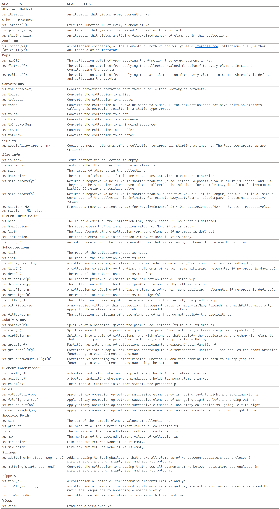

---

### Iterable

### Reference: <https://docs.scala-lang.org/overviews/collections-2.13/trait-iterable.html>

---

At the top of the collection hierarchy is trait `Iterable`. All methods in this trait are defined in terms of an abstract method, `iterator`, which yields the collection’s elements one by one.

```scala
def iterator: Iterator[A]
```

Collection classes that implement `Iterable` just need to define this method; all other methods can be inherited from `Iterable`.

`Iterable` also defines many concrete methods, which are all listed in the following table. These methods fall into the following categories:

- **[Addition](./ADDITION.md "Visit ADDITION.md")**, `concat`, which appends two collections together, or appends all elements of an iterator to a collection.


- **[Map](./MAP.md "Visit MAP.md")** operations `map`, `flatMap`, and `collect`, which produce a new collection by applying some function to collection elements.


- **[Conversions](./CONVERSIONS.md "Visit CONVERSIONS.md")** `to`, `toList`, `toVector`, `toMap`, `toSet`, `toSeq`, `toIndexedSeq`, `toBuffer`, `toArray` which turn an `Iterable` collection into something more specific. If the destination is a mutable collection(`to(collection.mutable.X)`, `toArray`, `toBuffer`), a new collection is created by copying the original elements. All these conversions return their receiver argument unchanged if the run-time type of the collection already matches the demanded collection type. For instance, applying `toList` to a list will yield the list itself. 


- **[Copying operations](./COPY_TO_ARRAY.md "Visit COPY_TO_ARRAY.md")** `copyToArray`. As its name implies, this copies collection elements to an array. 


- **[Size info](./SIZE_INFO.md "Visit SIZE_INFO.md")** operations `isEmpty`, `nonEmpty`, `size`, `knownSize`, `sizeIs`. The number of elements of a collections can require a traversal in some cases (e.g. List). In other cases the collection can have an infinite number of elements (e.g. `LazyList.from(1)`). 


- **[Element retrieval](./ELEMENT_RETRIEVAL.md "Visit ELEMENT_RETRIEVAL.md")** operations `head`, `last`, `headOption`, `lastOption`, and `find`. These select the first or last element of a collection, or else the first element matching a condition. Note, however, that not all collections have a well-defined meaning of what “first” and “last” means. For instance, a hash set might store elements according to their hash keys, which might change from run to run. In that case, the “first” element of a hash set could also be different for every run of a program. A collection is ordered if it always yields its elements in the same order. Most collections are ordered, but some (e.g. hash sets) are not– dropping the ordering gives a little bit of extra efficiency. Ordering is often essential to give reproducible tests and to help in debugging. That’s why Scala collections give ordered alternatives for all collection types. For instance, the ordered alternative for `HashSet` is `LinkedHashSet`. 


- **[Sub-collection retrieval operations](./SUBCOLLECTIONS.md "Visit SUBCOLLECTIONS.md")** `tail`, `init`, `slice`, `take`, `drop`, `takeWhile`, `dropWhile`, `filter`, `filterNot`, `withFilter`. These all return some sub-collection identified by an index range or some predicate. 


- **[Subdivision operations](./SUBDIVISION.md "Visit SUBDIVISION.md")** `splitAt`, `span`, `partition`, `partitionMap`, `groupBy`, `groupMap`, `groupMapReduce`, which split the elements of this collection into several sub-collections. 


- **[Element tests](./ELEMENT_CONDITION.md "Visit ELEMENT_CONDITION.md")** `exists`, `forall`, `count` which test collection elements with a given predicate. 


- **[Folds](./FOLDS.md "Visit FOLDS.md")** `foldLeft`, `foldRight`, `reduceLeft`, `reduceRight` which apply a binary operation to successive elements. 


- **[Specific folds](./SPECIFIC_FOLDS.md "Visit SPECIFIC_FOLDS.md")** `sum`, `product`, `min`, `max`, which work on collections of specific types (numeric or comparable). 


- **[String](./STRINGS.md "Visit STRINGS.md")** operations `mkString` and `addString` which give alternative ways of converting a collection to a string. 


- **[View](./VIEW.md "VIEW.md")** operation: A view is a collection that’s evaluated lazily. You’ll learn more about views in [later](https://docs.scala-lang.org/overviews/collections-2.13/views.html "Visit Views"). 


Two more methods exist in `Iterable` that return iterators: `grouped` and `sliding`. These iterators, however, do not return single elements but whole subsequences of elements of the original collection. The maximal size of these subsequences is given as an argument to these methods. The `grouped` method returns its elements in “chunked” increments, where sliding yields a `sliding` “window” over the elements. The difference between the two should become clear by looking at the following REPL interaction:

```scala
scala> val xs = List(1, 2, 3, 4, 5) 
xs: List[Int] = List(1, 2, 3, 4, 5) 
scala> val git = xs grouped 3 
git: Iterator[List[Int]] = non-empty iterator 
scala> git.next() 
res3: List[Int] = List(1, 2, 3) 
scala> git.next() 
res4: List[Int] = List(4, 5) 
scala> val sit = xs sliding 3 
sit: Iterator[List[Int]] = non-empty iterator 
scala> sit.next() 
res5: List[Int] = List(1, 2, 3) 
scala> sit.next() 
res6: List[Int] = List(2, 3, 4) 
scala> sit.next() 
res7: List[Int] = List(3, 4, 5)
```

### Operations in Class Iterable



In the inheritance hierarchy below `Iterable` you find three traits: [Seq](../seq/SEQ.md "Visit SEQ.md"), [Set](../set/SET.md "Visit SET.md"), and [Map](../map/MAP.md "Visit MAP.md"). Seq and Map implement the `PartialFunction` trait with its `apply` and `isDefinedAt` methods, each implemented differently. `Set` gets its `apply` method from `SetOps`.


For sequences, `apply` is positional indexing, where elements are always numbered from `0`. That is, `Seq(1, 2, 3)(1)` gives `2`. For sets, `apply` is a membership test. For instance, `Set('a', 'b', 'c')('b')` gives `true` whereas `Set()('a')` gives `false`. Finally, for maps, `apply` is a selection. For instance, `Map('a' -> 1, 'b' -> 10, 'c' -> 100)('b')` gives `10`.

In the following, we will explain each of the three kinds of collections in more detail.

---
