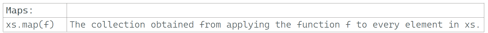

---

### Maps: map

### Reference: <https://docs.scala-lang.org/overviews/collections-2.13/trait-iterable.html>

---

### Part 1: Core concepts and various usages of the `map` function.

---

### Detailed Explanation of `map`



Let's delve deeper into how the `map` function works in Scala.

The `map` function is a higher-order function that takes another function as an argument and applies this function to each element in a collection. The result is a new collection containing the results of applying the function to each element of the original collection. The original collection remains unchanged.

### General Syntax
```scala
collection.map(function)
```

- `collection`: This is the collection (like a `List`, `Array`, `Set`, etc.) on which the `map` function is called.
- `function`: This is the function to be applied to each element of the collection. It takes one element as an input and returns a result.

### Example
Let's take a closer look at a simple example:

```scala
val numbers = List(1, 2, 3, 4, 5)
val squaredNumbers = numbers.map(n => n * 2)
println(squaredNumbers) // Output: List(2, 4, 6, 8, 10)
```

### Step-by-Step Breakdown
1. **Original Collection**: `numbers` is a `List` containing the elements `1, 2, 3, 4, 5`.
2. **Function**: The function provided to `map` is `n => n * 2`. This is a lambda function (anonymous function) that takes an integer `n` and returns `n * 2`.
3. **Application**: The `map` function applies this lambda function to each element of the `numbers` list:
   - For `1`, the function returns `1 * 2 = 2`.
   - For `2`, the function returns `2 * 2 = 4`.
   - For `3`, the function returns `3 * 2 = 6`.
   - For `4`, the function returns `4 * 2 = 8`.
   - For `5`, the function returns `5 * 2 = 10`.
4. **Result**: The result is a new list containing the results of the function applications: `List(2, 4, 6, 8, 10)`.

### More Complex Example
We can use the `map` function to apply more complex operations:

```scala
val words = List("apple", "banana", "cherry")
val wordLengths = words.map(word => word.length)
println(wordLengths) // Output: List(5, 6, 6)
```

### Step-by-Step Breakdown
1. **Original Collection**: `words` is a `List` containing the elements `"apple"`, `"banana"`, and `"cherry"`.
2. **Function**: The function provided to `map` is `word => word.length`. This lambda function takes a string `word` and returns its length.
3. **Application**: The `map` function applies this lambda function to each element of the `words` list:
   - For `"apple"`, the function returns `5`.
   - For `"banana"`, the function returns `6`.
   - For `"cherry"`, the function returns `6`.
4. **Result**: The result is a new list containing the lengths of the words: `List(5, 6, 6)`.

### Custom Function Example
You can also define a custom function and pass it to `map`:

```scala
def double(n: Int): Int = n * 2

val numbers = List(1, 2, 3, 4, 5)
val doubledNumbers = numbers.map(double)
println(doubledNumbers) // Output: List(2, 4, 6, 8, 10)
```

### Explanation
- Here, `double` is a named function that doubles its input.
- The `map` function applies `double` to each element of the `numbers` list, resulting in `List(2, 4, 6, 8, 10)`.

In summary, the `map` function is a powerful and versatile tool for transforming collections in Scala, allowing us to apply any function to each element and collect the results in a new collection.

---

### Part 2: additional details and advanced topics related to the `map` function.

---

Here are a few additional details and advanced topics related to the `map` function in Scala:

### `map` with Different Collection Types
The `map` function works with various collection types, not just `List`. For instance, you can use it with `Array`, `Set`, `Vector`, and more.

```scala
val array = Array(1, 2, 3, 4, 5)
val squaredArray = array.map(n => n * n)
println(squaredArray.mkString(", ")) // Output: 1, 4, 9, 16, 25

val set = Set(1, 2, 3)
val doubledSet = set.map(n => n * 2)
println(doubledSet) // Output: Set(2, 4, 6)
```

### `map` on Options and Either
The `map` function is also available for `Option` and `Either`, which are often used for handling optional values and error handling, respectively.

#### `Option`
```scala
val someValue: Option[Int] = Some(3)
val mappedValue = someValue.map(_ * 2)
println(mappedValue) // Output: Some(6)

val noneValue: Option[Int] = None
val mappedNone = noneValue.map(_ * 2)
println(mappedNone) // Output: None
```

#### `Either`
```scala
val rightValue: Either[String, Int] = Right(3)
val mappedRight = rightValue.map(_ * 2)
println(mappedRight) // Output: Right(6)

val leftValue: Either[String, Int] = Left("Error")
val mappedLeft = leftValue.map(_ * 2)
println(mappedLeft) // Output: Left(Error)
```

### Chaining `map` Calls
You can chain multiple `map` calls together to perform a series of transformations.

```scala
val numbers = List(1, 2, 3, 4, 5)
val processedNumbers = numbers
  .map(_ * 2)   // Step 1: Multiply by 2
  .map(_ + 1)   // Step 2: Add 1
  .map(_.toString) // Step 3: Convert to String
println(processedNumbers) // Output: List(3, 5, 7, 9, 11)
```

### Performance Considerations
- **Lazy Collections**: When working with lazy collections like `Stream` (now replaced by `LazyList` in Scala 2.13), transformations are not immediately evaluated but rather evaluated when the values are accessed.

  ```scala
  val lazyNumbers = LazyList(1, 2, 3, 4, 5)
  val mappedLazyNumbers = lazyNumbers.map(_ * 2)
  println(mappedLazyNumbers) // Output: LazyList(<not computed>)
  println(mappedLazyNumbers.toList) // Output: List(2, 4, 6, 8, 10)
  ```

- **View**: You can use a view to defer the application of `map` and other transformations, which can improve performance when dealing with large collections.

  ```scala
  val largeList = (1 to 1000000).toList
  val view = largeList.view.map(_ * 2).map(_ + 1)
  println(view.take(10).toList) // Output: List(3, 5, 7, 9, 11, 13, 15, 17, 19, 21)
  ```

### Parallel Collections
For performance gains on multi-core processors, Scala provides parallel collections. You can convert a collection to a parallel collection and then use `map` to process elements in parallel.

```scala
val numbers = (1 to 1000000).toList.par
val squaredNumbers = numbers.map(n => n * n)
println(squaredNumbers.take(10).toList) // Output: [first 10 elements of the result]
```

### Using `for` Comprehensions
In Scala, `for` comprehensions can be seen as syntactic sugar for `map` (and `flatMap`). Here’s an example using `for` comprehension:

```scala
val numbers = List(1, 2, 3, 4, 5)
val squaredNumbers = for (n <- numbers) yield n * n
println(squaredNumbers) // Output: List(1, 4, 9, 16, 25)
```

### Summary
- **Collection Types**: `map` works on various collections like `List`, `Array`, `Set`, etc.
- **Option and Either**: Use `map` to handle optional and error-prone values.
- **Chaining**: Chain multiple `map` calls for complex transformations.
- **Performance**: Consider lazy collections, views, and parallel collections for performance improvements.
- **For Comprehensions**: Utilize `for` comprehensions as a more readable alternative.

The `map` function is a powerful tool in Scala's functional programming arsenal, enabling you to transform collections in a clear and concise way.

---

### Part 3: Advanced and Nuanced Aspects of `map` function.

---

While the previous explanations covered the core concepts and various usages of the `map` function, here are a few more advanced and nuanced aspects you might find useful:

### Covariance and Contravariance
The `map` function works with collections that have certain variance annotations. In Scala, collections are generally covariant (`+A`), which means `List[Cat]` can be treated as `List[Animal]` if `Cat` is a subtype of `Animal`.

```scala
class Animal
class Cat extends Animal

val cats: List[Cat] = List(new Cat, new Cat)
val animals: List[Animal] = cats.map(cat => cat: Animal)
println(animals) // Output: List(Cat@<hashcode>, Cat@<hashcode>)
```

### Function Lifting
You can use `map` to "lift" a normal function to operate over collections.

```scala
def addOne(x: Int): Int = x + 1
val numbers = List(1, 2, 3)
val incrementedNumbers = numbers.map(addOne)
println(incrementedNumbers) // Output: List(2, 3, 4)
```

### Mapping with Index
If you need to apply a function to each element along with its index, you can use `zipWithIndex` before mapping.

```scala
val fruits = List("apple", "banana", "cherry")
val indexedFruits = fruits.zipWithIndex.map { case (fruit, index) => s"$index: $fruit" }
println(indexedFruits) // Output: List(0: apple, 1: banana, 2: cherry)
```

### Mapping Over Nested Collections
You can use `map` to transform elements within nested collections.

```scala
val nestedList = List(List(1, 2, 3), List(4, 5, 6))
val flattenedAndMapped = nestedList.map(_.map(_ * 2))
println(flattenedAndMapped) // Output: List(List(2, 4, 6), List(8, 10, 12))
```

### Type Inference and Lambdas
Scala’s type inference can often deduce the types in a lambda expression, making `map` usage concise.

```scala
val numbers = List(1, 2, 3, 4, 5)
val doubledNumbers = numbers.map(_ * 2)
println(doubledNumbers) // Output: List(2, 4, 6, 8, 10)
```

### Using `map` with Future
In asynchronous programming, you can use `map` to transform the result of a `Future`.

```scala
import scala.concurrent.Future
import scala.concurrent.ExecutionContext.Implicits.global

val futureNumber: Future[Int] = Future { 5 }
val futureResult = futureNumber.map(_ * 2)
futureResult.foreach(println) // Output: 10 (asynchronously)
```

### Parallel Collections and Map
Parallel collections can significantly speed up operations by distributing tasks across multiple threads. Be mindful of thread-safety and the overhead of parallelization.

```scala
val numbers = (1 to 1000000).toList.par
val squaredNumbers = numbers.map(n => n * n)
println(squaredNumbers.take(10).toList) // Output: First 10 squared numbers (order may vary)
```

### Monad Laws and `map`
Understanding the theoretical foundations, such as Monad laws, can provide deeper insights into the behavior of `map`.

- **Identity Law**: `m.map(identity) == m`
- **Composition Law**: `m.map(f).map(g) == m.map(x => g(f(x)))`

These laws ensure predictable behavior when chaining `map` operations.

### Specialized Collections
Certain specialized collections might have optimized `map` implementations.

- **BitSet**: Immutable set of non-negative integers.

  ```scala
  val bitSet = scala.collection.immutable.BitSet(1, 2, 3)
  val doubledBitSet = bitSet.map(_ * 2)
  println(doubledBitSet) // Output: BitSet(2, 4, 6)
  ```

- **Range**: Efficient sequence of evenly spaced integers.

  ```scala
  val range = 1 to 10
  val evenNumbers = range.map(_ * 2)
  println(evenNumbers) // Output: Range(2, 4, 6, 8, 10, 12, 14, 16, 18, 20)
  ```

### Collection-specific Transformations
Some collections might behave differently when using `map`.

- **Map (Dictionary)**: The `map` function on a `Map` collection transforms the values but retains the keys.

  ```scala
  val phoneBook = Map("Alice" -> 12345, "Bob" -> 67890)
  val hiddenNumbers = phoneBook.map { case (name, number) => (name, number.toString.replaceAll(".", "*")) }
  println(hiddenNumbers) // Output: Map(Alice -> *****, Bob -> *****)
  ```

### Conclusion
The `map` function in Scala is versatile and widely applicable across various contexts and collection types. It supports a range of use cases from simple transformations to complex manipulations involving nested collections, parallel processing, and asynchronous computations. Understanding its nuances and advanced features allows you to leverage its full potential in functional programming and beyond.


---

### Part 4: Advanced and Nuanced Aspects of `map` function.

---

While the previous explanations covered the core concepts and various usages of the `map` function, here are a few more advanced and nuanced aspects you might find useful:

### Covariance and Contravariance
The `map` function works with collections that have certain variance annotations. In Scala, collections are generally covariant (`+A`), which means `List[Cat]` can be treated as `List[Animal]` if `Cat` is a subtype of `Animal`.

```scala
class Animal
class Cat extends Animal

val cats: List[Cat] = List(new Cat, new Cat)
val animals: List[Animal] = cats.map(cat => cat: Animal)
println(animals) // Output: List(Cat@<hashcode>, Cat@<hashcode>)
```

### Function Lifting
You can use `map` to "lift" a normal function to operate over collections.

```scala
def addOne(x: Int): Int = x + 1
val numbers = List(1, 2, 3)
val incrementedNumbers = numbers.map(addOne)
println(incrementedNumbers) // Output: List(2, 3, 4)
```

### Mapping with Index
If you need to apply a function to each element along with its index, you can use `zipWithIndex` before mapping.

```scala
val fruits = List("apple", "banana", "cherry")
val indexedFruits = fruits.zipWithIndex.map { case (fruit, index) => s"$index: $fruit" }
println(indexedFruits) // Output: List(0: apple, 1: banana, 2: cherry)
```

### Mapping Over Nested Collections
You can use `map` to transform elements within nested collections.

```scala
val nestedList = List(List(1, 2, 3), List(4, 5, 6))
val flattenedAndMapped = nestedList.map(_.map(_ * 2))
println(flattenedAndMapped) // Output: List(List(2, 4, 6), List(8, 10, 12))
```

### Type Inference and Lambdas
Scala’s type inference can often deduce the types in a lambda expression, making `map` usage concise.

```scala
val numbers = List(1, 2, 3, 4, 5)
val doubledNumbers = numbers.map(_ * 2)
println(doubledNumbers) // Output: List(2, 4, 6, 8, 10)
```

### Using `map` with Future
In asynchronous programming, you can use `map` to transform the result of a `Future`.

```scala
import scala.concurrent.Future
import scala.concurrent.ExecutionContext.Implicits.global

val futureNumber: Future[Int] = Future { 5 }
val futureResult = futureNumber.map(_ * 2)
futureResult.foreach(println) // Output: 10 (asynchronously)
```

### Parallel Collections and Map
Parallel collections can significantly speed up operations by distributing tasks across multiple threads. Be mindful of thread-safety and the overhead of parallelization.

```scala
val numbers = (1 to 1000000).toList.par
val squaredNumbers = numbers.map(n => n * n)
println(squaredNumbers.take(10).toList) // Output: First 10 squared numbers (order may vary)
```

### Monad Laws and `map`
Understanding the theoretical foundations, such as Monad laws, can provide deeper insights into the behavior of `map`.

- **Identity Law**: `m.map(identity) == m`
- **Composition Law**: `m.map(f).map(g) == m.map(x => g(f(x)))`

These laws ensure predictable behavior when chaining `map` operations.

### Specialized Collections
Certain specialized collections might have optimized `map` implementations.

- **BitSet**: Immutable set of non-negative integers.

  ```scala
  val bitSet = scala.collection.immutable.BitSet(1, 2, 3)
  val doubledBitSet = bitSet.map(_ * 2)
  println(doubledBitSet) // Output: BitSet(2, 4, 6)
  ```

- **Range**: Efficient sequence of evenly spaced integers.

  ```scala
  val range = 1 to 10
  val evenNumbers = range.map(_ * 2)
  println(evenNumbers) // Output: Range(2, 4, 6, 8, 10, 12, 14, 16, 18, 20)
  ```

### Collection-specific Transformations
Some collections might behave differently when using `map`.

- **Map (Dictionary)**: The `map` function on a `Map` collection transforms the values but retains the keys.

  ```scala
  val phoneBook = Map("Alice" -> 12345, "Bob" -> 67890)
  val hiddenNumbers = phoneBook.map { case (name, number) => (name, number.toString.replaceAll(".", "*")) }
  println(hiddenNumbers) // Output: Map(Alice -> *****, Bob -> *****)
  ```

### Conclusion
The `map` function in Scala is versatile and widely applicable across various contexts and collection types. It supports a range of use cases from simple transformations to complex manipulations involving nested collections, parallel processing, and asynchronous computations. Understanding its nuances and advanced features allows us to leverage its full potential in functional programming and beyond.

---

### Part 5: Additional Advanced Topics

---

We have covered a broad range of topics and use cases for the `map` function in Scala. However, there are always more advanced and niche topics, optimizations, and best practices that can be explored. Here's a summary of what's been covered, along with a few additional points:

### Summary of Topics Covered

1. **Basic Usage**: Applying a function to each element in a collection.
2. **Different Collection Types**: Working with `List`, `Array`, `Set`, etc.
3. **Option and Either**: Handling optional and error-prone values.
4. **Chaining**: Combining multiple `map` calls.
5. **Performance Considerations**: Lazy collections, views, and parallel collections.
6. **For Comprehensions**: Using `for` comprehensions as an alternative.
7. **Covariance and Contravariance**: Working with different type hierarchies.
8. **Function Lifting**: Lifting normal functions to operate on collections.
9. **Mapping with Index**: Using `zipWithIndex` for indexed mapping.
10. **Nested Collections**: Mapping over nested collections.
11. **Type Inference and Lambdas**: Leveraging Scala’s type inference.
12. **Futures**: Using `map` with asynchronous computations.
13. **Monad Laws**: Understanding the theoretical foundations.
14. **Specialized Collections**: BitSet, Range, and collection-specific behaviors.
15. **Collection-specific Transformations**: Differences in `Map` and other collections.

### Additional Advanced Topics

1. **Error Handling with `Try`**:
   - `Try` is another monad used for error handling. You can use `map` to transform successful results.

   ```scala
   import scala.util.{Try, Success, Failure}
   
   val result: Try[Int] = Try(42 / 0)
   val mappedResult = result.map(_ * 2)
   println(mappedResult) // Output: Failure(java.lang.ArithmeticException: / by zero)
   ```

2. **Custom Collection Types**:
   - Creating custom collection types that support `map`.

   ```scala
   case class Box[A](value: A) {
     def map[B](f: A => B): Box[B] = Box(f(value))
   }
   
   val boxedInt = Box(42)
   val boxedString = boxedInt.map(_.toString)
   println(boxedString) // Output: Box(42)
   ```

3. **Optimizations with `map`**:
   - Implementing custom `map` methods for performance optimization in specific use cases, such as large datasets.

4. **Parallelism with Akka Streams**:
   - Using `map` in the context of Akka Streams for parallel data processing.

   ```scala
   import akka.actor.ActorSystem
   import akka.stream.ActorMaterializer
   import akka.stream.scaladsl.Source
   
   implicit val system = ActorSystem("QuickStart")
   implicit val materializer = ActorMaterializer()
   
   val source = Source(1 to 10)
   val result = source.map(_ * 2).runForeach(println)
   ```

5. **Lazy Evaluation with `view`**:
   - Understanding deeper nuances of lazy evaluation and avoiding unnecessary computations.

6. **Side Effects and Purity**:
   - Ensuring that the functions passed to `map` are pure and understanding the implications of side effects in functional programming.

7. **Working with Immutable Data**:
   - Leveraging `map` in the context of immutability to avoid unintended side effects and promote safer code practices.

8. **Combining `map` with Other Functions**:
   - Using `map` in combination with `filter`, `reduce`, `fold`, and other higher-order functions for more complex data transformations.

9. **Integrating with Other Libraries**:
   - Using `map` with other Scala libraries like Cats or Scalaz, which provide additional abstractions and utility functions for functional programming.

10. **Map on Different Monad Types**:
   - Applying `map` on monads other than `Option`, `Try`, and `Either`, such as custom monads in functional programming libraries.

### Conclusion

While we have covered a wide range of uses and considerations for the `map` function in Scala, there is always more to learn, especially as we dive deeper into advanced functional programming concepts, custom data structures, and specific performance optimizations.

---
