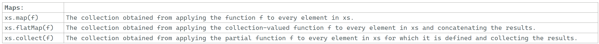

---

### Map Operations: map, flatMap, and collect

### Reference: <https://docs.scala-lang.org/overviews/collections-2.13/trait-iterable.html>

---

Map operations `map`, `flatMap`, and `collect`, which produce a new collection by applying some function to collection elements.

- **map:** Check [MAP.md](./MAP.md "Visit map")

- **flatMap:** Check [FLATMAP.md](./FLATMAP.md "Visit flatMap")

- **map vs flatMap:** Check [MAP_VS_FLATMAP.md](./MAP_VS_FLATMAP.md "Visit MAP_VS_FLATMAP.md")

- **collect:** Check [COLLECT.md](./COLLECT.md "Visit COLLECT.md")

---
