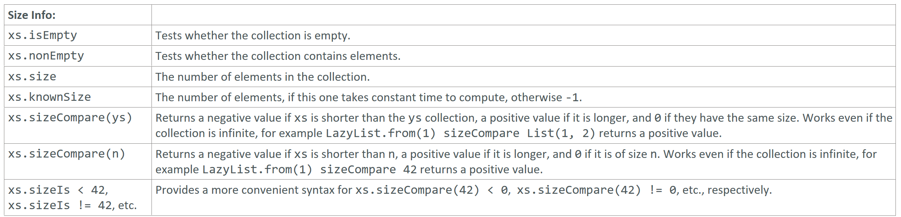

---

### Size Info

### Reference: <https://docs.scala-lang.org/overviews/collections-2.13/trait-iterable.html>

---

Let's go through the size info operations: `isEmpty`, `nonEmpty`, `size`, `knownSize`, and `sizeIs`. These operations provide information about the size or emptiness of a collection. Understanding these methods is crucial for efficient collection handling in Scala.



### 1. `isEmpty`

The `isEmpty` method checks if a collection has no elements.

```scala
val list = List(1, 2, 3)
val emptyList = List()

println(list.isEmpty)       // Output: false
println(emptyList.isEmpty)  // Output: true
```

### 2. `nonEmpty`

The `nonEmpty` method checks if a collection has one or more elements.

```scala
val list = List(1, 2, 3)
val emptyList = List()

println(list.nonEmpty)       // Output: true
println(emptyList.nonEmpty)  // Output: false
```

### 3. `size`

The `size` method returns the number of elements in a collection. For some collections (like `List`), this may require traversing the entire collection.

```scala
val list = List(1, 2, 3)

println(list.size)  // Output: 3
```

### 4. `knownSize`

The `knownSize` method returns the size of the collection if it can be determined in constant time, otherwise it returns -1. 
This is useful for optimizing performance in cases where the size is not readily available.

```scala
val list = List(1, 2, 3)
val lazyList = LazyList.from(1)

println(list.knownSize)    // Output: 3
println(lazyList.knownSize) // Output: -1
```

### 5. `sizeIs`

The `sizeIs` method provides a way to compare the size of a collection with a given value using various comparison operators. This can be more efficient than getting the size and then comparing it.

```scala
val list = List(1, 2, 3)

println(list.sizeIs > 2)    // Output: true
println(list.sizeIs <= 2)   // Output: false
```

### Examples and Explanations

#### `isEmpty` and `nonEmpty`
These methods are straightforward checks for whether a collection is empty or not. They are efficient and can be used without worrying about performance.

```scala
val set = Set(1, 2, 3)
println(set.isEmpty)    // Output: false
println(set.nonEmpty)   // Output: true
```

#### `size`
This method gives the exact number of elements in a collection. Be cautious with collections like `List`, where this may involve traversing the entire collection.

```scala
val vector = Vector(1, 2, 3, 4, 5)
println(vector.size)    // Output: 5
```

#### `knownSize`
Useful for collections where determining the size is not trivial or immediate. For example, a `LazyList` might have an unknown size because it's potentially infinite.

```scala
val finiteList = List(1, 2, 3)
val infiniteLazyList = LazyList.from(1)

println(finiteList.knownSize)        // Output: 3
println(infiniteLazyList.knownSize)  // Output: -1
```

#### `sizeIs`
This method allows for more efficient size comparisons, avoiding the need to calculate the size explicitly. It is useful in conditions where you only need to compare sizes rather than determine the exact number of elements.

```scala
val range = 1 to 100

println(range.sizeIs > 50)    // Output: true
println(range.sizeIs < 50)    // Output: false
println(range.sizeIs == 100)  // Output: true
```

### Infinite Collections

For collections like `LazyList`, where the size can be infinite or unknown:

```scala
val infiniteLazyList = LazyList.from(1)

println(infiniteLazyList.isEmpty)    // Output: false
println(infiniteLazyList.knownSize)  // Output: -1

// Avoid calling size on infinite collections, as it will result in an infinite loop.
```

### Summary

- **`isEmpty`**: Checks if the collection has no elements.
- **`nonEmpty`**: Checks if the collection has one or more elements.
- **`size`**: Returns the number of elements (might require traversal).
- **`knownSize`**: Returns the size if it can be determined quickly, otherwise -1.
- **`sizeIs`**: Compares the size of the collection with a given value efficiently.

These methods help manage collections efficiently by providing different ways to check and compare sizes, particularly useful for both finite and potentially infinite collections.

---
