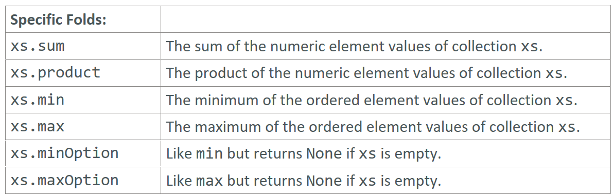

---

### Specific Folds

### Reference: <https://docs.scala-lang.org/overviews/collections-2.13/trait-iterable.html>

---

Scala provides specific folds that are tailored for common operations on collections of specific types, such as numeric or comparable types. These specific folds include `sum`, `product`, `min`, `max`, `minOption`, and `maxOption`. They are convenient and optimized for these common operations.



### Specific Folds

#### 1. `sum`

Calculates the sum of elements in a collection. Works on collections of numeric types.

Example:

```scala
val numbers = List(1, 2, 3, 4, 5)

// Sum of elements
val totalSum = numbers.sum
println(totalSum) // Output: 15
```

#### 2. `product`

Calculates the product of elements in a collection. Works on collections of numeric types.

Example:

```scala
val numbers = List(1, 2, 3, 4, 5)

// Product of elements
val totalProduct = numbers.product
println(totalProduct) // Output: 120
```

#### 3. `min`

Finds the minimum element in a collection. Works on collections of comparable types.

Example:

```scala
val numbers = List(1, 2, 3, 4, 5)

// Minimum element
val minValue = numbers.min
println(minValue) // Output: 1

val words = List("apple", "banana", "cherry")
val minWord = words.min
println(minWord) // Output: "apple"
```

#### 4. `max`

Finds the maximum element in a collection. Works on collections of comparable types.

Example:

```scala
val numbers = List(1, 2, 3, 4, 5)

// Maximum element
val maxValue = numbers.max
println(maxValue) // Output: 5

val words = List("apple", "banana", "cherry")
val maxWord = words.max
println(maxWord) // Output: "cherry"
```

#### 5. `minOption`

Finds the minimum element in a collection and returns it as an `Option`. Useful when the collection might be empty.

Example:

```scala
val numbers = List(1, 2, 3, 4, 5)
val emptyList = List[Int]()

// Minimum element
val minOptionValue = numbers.minOption
println(minOptionValue) // Output: Some(1)

val minOptionEmpty = emptyList.minOption
println(minOptionEmpty) // Output: None
```

#### 6. `maxOption`

Finds the maximum element in a collection and returns it as an `Option`. Useful when the collection might be empty.

Example:

```scala
val numbers = List(1, 2, 3, 4, 5)
val emptyList = List[Int]()

// Maximum element
val maxOptionValue = numbers.maxOption
println(maxOptionValue) // Output: Some(5)

val maxOptionEmpty = emptyList.maxOption
println(maxOptionEmpty) // Output: None
```

### Why Use Specific Folds?

- **Convenience**: These methods provide a concise and readable way to perform common operations.
- **Optimization**: They are optimized for their specific tasks, potentially offering better performance than general-purpose folds.
- **Safety**: Methods like `minOption` and `maxOption` handle empty collections safely by returning `Option` types, preventing potential runtime exceptions.

### Detailed Comparison with General Folds

#### `sum` vs `foldLeft`

```scala
val numbers = List(1, 2, 3, 4, 5)

// Using sum
val totalSum = numbers.sum

// Using foldLeft
val totalSumFold = numbers.foldLeft(0)(_ + _)

println(totalSum) // Output: 15
println(totalSumFold) // Output: 15
```

#### `product` vs `foldLeft`

```scala
val numbers = List(1, 2, 3, 4, 5)

// Using product
val totalProduct = numbers.product

// Using foldLeft
val totalProductFold = numbers.foldLeft(1)(_ * _)

println(totalProduct) // Output: 120
println(totalProductFold) // Output: 120
```

#### `min` vs `reduceLeft`

```scala
val numbers = List(1, 2, 3, 4, 5)

// Using min
val minValue = numbers.min

// Using reduceLeft
val minValueReduce = numbers.reduceLeft((x, y) => if (x < y) x else y)

println(minValue) // Output: 1
println(minValueReduce) // Output: 1
```

#### `max` vs `reduceLeft`

```scala
val numbers = List(1, 2, 3, 4, 5)

// Using max
val maxValue = numbers.max

// Using reduceLeft
val maxValueReduce = numbers.reduceLeft((x, y) => if (x > y) x else y)

println(maxValue) // Output: 5
println(maxValueReduce) // Output: 5
```

### Summary

- **`sum`**: Concisely sums elements of numeric collections.
- **`product`**: Concisely multiplies elements of numeric collections.
- **`min`**: Finds the minimum element in comparable collections.
- **`max`**: Finds the maximum element in comparable collections.
- **`minOption`**: Safely finds the minimum element, returning an `Option`.
- **`maxOption`**: Safely finds the maximum element, returning an `Option`.

These specific folds provide an efficient and readable way to perform common operations on collections, reducing the need for boilerplate code and ensuring safety and performance.

---
