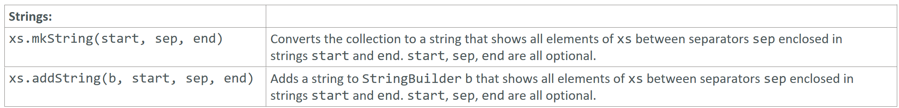

---

### Strings

### Reference: <https://docs.scala-lang.org/overviews/collections-2.13/trait-iterable.html>

---

In Scala, `mkString` and `addString` are two methods provided by the `TraversableOnce` trait for converting collections to strings. These methods give you different ways to concatenate the elements of a collection into a single string.



### 1. `mkString`

The `mkString` method creates a string by concatenating all elements of the collection. It provides several overloads to customize the resulting string.

#### `mkString()` - Without Delimiters

This version concatenates all elements without any delimiters.

Example:

```scala
val list = List(1, 2, 3, 4, 5)
val result = list.mkString
println(result) // Output: "12345"
```

#### `mkString(separator: String)` - With a Separator

This version concatenates all elements, separated by the specified string.

Example:

```scala
val list = List(1, 2, 3, 4, 5)
val result = list.mkString(", ")
println(result) // Output: "1, 2, 3, 4, 5"
```

#### `mkString(start: String, separator: String, end: String)` - With Start, Separator, and End

This version concatenates all elements, starting with the specified `start` string, separating elements with the specified `separator`, and ending with the specified `end` string.

Example:

```scala
val list = List(1, 2, 3, 4, 5)
val result = list.mkString("[", ", ", "]")
println(result) // Output: "[1, 2, 3, 4, 5]"
```

### 2. `addString`

The `addString` method appends the string representation of each element in the collection to a provided `StringBuilder`. It is useful when you want to build a string progressively or when working with an existing `StringBuilder`.

#### `addString(builder: StringBuilder)`

This version appends all elements to the provided `StringBuilder`.

Example:

```scala
val list = List(1, 2, 3, 4, 5)
val builder = new StringBuilder
list.addString(builder)
println(builder.toString) // Output: "12345"
```

#### `addString(builder: StringBuilder, separator: String)`

This version appends all elements to the provided `StringBuilder`, separated by the specified string.

Example:

```scala
val list = List(1, 2, 3, 4, 5)
val builder = new StringBuilder
list.addString(builder, ", ")
println(builder.toString) // Output: "1, 2, 3, 4, 5"
```

#### `addString(builder: StringBuilder, start: String, separator: String, end: String)`

This version appends all elements to the provided `StringBuilder`, starting with the specified `start` string, separating elements with the specified `separator`, and ending with the specified `end` string.

Example:

```scala
val list = List(1, 2, 3, 4, 5)
val builder = new StringBuilder
list.addString(builder, "[", ", ", "]")
println(builder.toString) // Output: "[1, 2, 3, 4, 5]"
```

### Complete Example of All Overloads

Here's a complete example that demonstrates all the overloads of `mkString` and `addString` together for comparison.

```scala
val list = List(1, 2, 3, 4, 5)

// mkString examples
val mkString1 = list.mkString
val mkString2 = list.mkString(", ")
val mkString3 = list.mkString("[", ", ", "]")

println(s"mkString(): $mkString1")                     // Output: "12345"
println(s"mkString(\", \"): $mkString2")               // Output: "1, 2, 3, 4, 5"
println(s"mkString(\"[\", \", \", \"]\"): $mkString3") // Output: "[1, 2, 3, 4, 5]"

// addString examples
val builder1 = new StringBuilder
list.addString(builder1)
println(s"addString(builder1): ${builder1.toString}")  // Output: "12345"

val builder2 = new StringBuilder
list.addString(builder2, ", ")
println(s"addString(builder2, \", \"): ${builder2.toString}")  // Output: "1, 2, 3, 4, 5"

val builder3 = new StringBuilder
list.addString(builder3, "[", ", ", "]")
println(s"addString(builder3, \"[\", \", \", \"]\"): ${builder3.toString}")  // Output: "[1, 2, 3, 4, 5]"
```

### Summary

- **`mkString()`**: Concatenates all elements without any delimiters.
- **`mkString(separator: String)`**: Concatenates all elements, separated by the specified string.
- **`mkString(start: String, separator: String, end: String)`**: Concatenates all elements, starting with the specified `start`, separating elements with the specified `separator`, and ending with the specified `end`.

- **`addString(builder: StringBuilder)`**: Appends all elements to the provided `StringBuilder`.
- **`addString(builder: StringBuilder, separator: String)`**: Appends all elements to the provided `StringBuilder`, separated by the specified string.
- **`addString(builder: StringBuilder, start: String, separator: String, end: String)`**: Appends all elements to the provided `StringBuilder`, starting with the specified `start`, separating elements with the specified `separator`, and ending with the specified `end`.

These methods provide flexibility and efficiency in converting collections to strings, depending on your specific needs.

Both methods are useful for converting collections to strings, with `mkString` being more straightforward for simple conversions and `addString` providing more flexibility when working with existing `StringBuilder` instances. 

---
