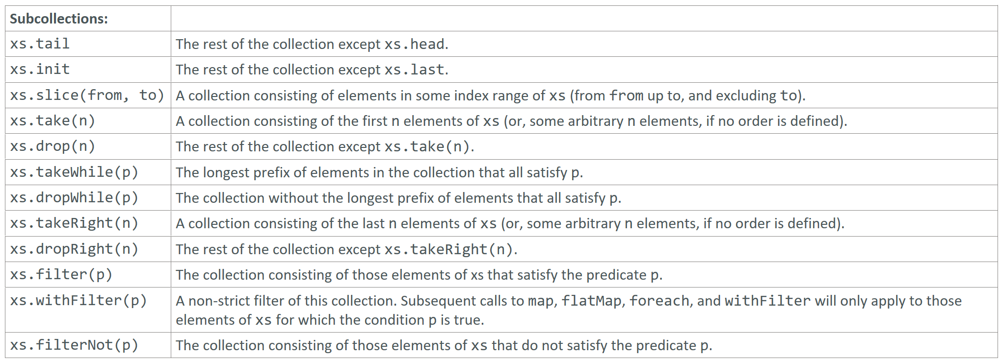

---

### Subcollections

### Reference: <https://docs.scala-lang.org/overviews/collections-2.13/trait-iterable.html>

---

Sub-collection retrieval operations in Scala allow you to obtain parts of a collection based on an index range or a predicate. Let's explore each of these methods with examples and explanations.



### 1. `tail`
Returns all elements except the first.

```scala
val list = List(1, 2, 3, 4)
println(list.tail) // Output: List(2, 3, 4)
```

### 2. `init`
Returns all elements except the last.

```scala
println(list.init) // Output: List(1, 2, 3)
```

### 3. `slice`
Returns a slice of the collection starting from index `from` (inclusive) and ending at index `until` (exclusive).

```scala
println(list.slice(1, 3)) // Output: List(2, 3)
```

### 4. `take`
Returns the first `n` elements of the collection.

```scala
println(list.take(2)) // Output: List(1, 2)
```

### 5. `drop`
Returns all elements except the first `n` elements.

```scala
println(list.drop(2)) // Output: List(3, 4)
```

### 6. `takeWhile`
Returns the longest prefix of elements that satisfy the given predicate.

```scala
println(list.takeWhile(_ < 3)) // Output: List(1, 2)
```

### 7. `dropWhile`
Drops the longest prefix of elements that satisfy the given predicate and returns the rest.

```scala
println(list.dropWhile(_ < 3)) // Output: List(3, 4)
```

### 8. `filter`
Returns all elements that satisfy the given predicate.

```scala
println(list.filter(_ % 2 == 0)) // Output: List(2, 4)
```

### 9. `filterNot`
Returns all elements that do not satisfy the given predicate.

```scala
println(list.filterNot(_ % 2 == 0)) // Output: List(1, 3)
```

### 10. `withFilter`
Creates a lazy filtered collection that applies the given predicate. This is more efficient when chaining multiple operations.

```scala
val filtered = list.withFilter(_ % 2 == 0)
println(filtered.map(_ * 2).toList) // Output: List(4, 8)
```

### Examples and Explanations

#### `tail` and `init`

- `tail` removes the first element and returns the rest.
- `init` removes the last element and returns the rest.

```scala
val list = List(1, 2, 3, 4)
println(list.tail) // Output: List(2, 3, 4)
println(list.init) // Output: List(1, 2, 3)
```

#### `slice`

- `slice(from, until)` returns a sub-collection starting from index `from` (inclusive) to `until` (exclusive).

```scala
println(list.slice(1, 3)) // Output: List(2, 3)
```

#### `take` and `drop`

- `take(n)` returns the first `n` elements.
- `drop(n)` returns all elements except the first `n`.

```scala
println(list.take(2)) // Output: List(1, 2)
println(list.drop(2)) // Output: List(3, 4)
```

#### `takeWhile` and `dropWhile`

- `takeWhile(predicate)` returns the longest prefix of elements that satisfy the predicate.
- `dropWhile(predicate)` removes the longest prefix of elements that satisfy the predicate and returns the rest.

```scala
println(list.takeWhile(_ < 3)) // Output: List(1, 2)
println(list.dropWhile(_ < 3)) // Output: List(3, 4)
```

#### `filter` and `filterNot`

- `filter(predicate)` returns all elements that satisfy the predicate.
- `filterNot(predicate)` returns all elements that do not satisfy the predicate.

```scala
println(list.filter(_ % 2 == 0)) // Output: List(2, 4)
println(list.filterNot(_ % 2 == 0)) // Output: List(1, 3)
```

#### `withFilter`

- `withFilter(predicate)` creates a lazy filtered collection. This is useful for chaining multiple operations without creating intermediate collections.

```scala
val filtered = list.withFilter(_ % 2 == 0)
println(filtered.map(_ * 2).toList) // Output: List(4, 8)
```

### Summary

- **`tail`**: All elements except the first.
- **`init`**: All elements except the last.
- **`slice(from, until)`**: Elements from index `from` to `until`.
- **`take(n)`**: First `n` elements.
- **`drop(n)`**: All elements except the first `n`.
- **`takeWhile(predicate)`**: Longest prefix satisfying the predicate.
- **`dropWhile(predicate)`**: All elements except the longest prefix satisfying the predicate.
- **`filter(predicate)`**: Elements satisfying the predicate.
- **`filterNot(predicate)`**: Elements not satisfying the predicate.
- **`withFilter(predicate)`**: Lazy filtered collection for efficient chaining.

These methods are powerful tools for extracting sub-collections based on index ranges or predicates. 

---
