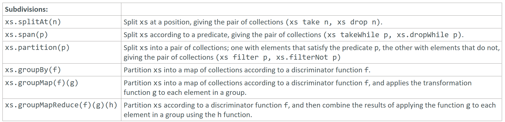

---

### Subdivision Operations

### Reference: <https://docs.scala-lang.org/overviews/collections-2.13/trait-iterable.html>

---

Subdivision operations in Scala allow you to split a collection into several sub-collections based on various criteria. Let's explore each of these methods with examples and explanations.



### 1. `splitAt`

Splits the collection into a pair of collections at a specified index.

```scala
val list = List(1, 2, 3, 4, 5)
val (firstPart, secondPart) = list.splitAt(3)
println(firstPart)  // Output: List(1, 2, 3)
println(secondPart) // Output: List(4, 5)
```

### 2. `span`

Splits the collection into a pair of collections; the first collection contains elements that satisfy the predicate, and the second contains the rest.

```scala
val (evenPrefix, rest) = list.span(_ % 2 == 0)
println(evenPrefix) // Output: List()
println(rest)       // Output: List(1, 2, 3, 4, 5)

val (smallNumbers, largeNumbers) = list.span(_ < 4)
println(smallNumbers) // Output: List(1, 2, 3)
println(largeNumbers) // Output: List(4, 5)
```

### 3. `partition`

Splits the collection into a pair of collections based on a predicate. The first collection contains elements that satisfy the predicate, and the second contains elements that do not.

```scala
val (evens, odds) = list.partition(_ % 2 == 0)
println(evens) // Output: List(2, 4)
println(odds)  // Output: List(1, 3, 5)
```

### 4. `partitionMap`

Partitions a collection into a pair of collections by applying either a `Left` or a `Right` projection function to each element.

```scala
import scala.util.Either

val numbers = List(1, 2, 3, 4, 5)

val (evens, odds) = numbers.partitionMap {
  case n if n % 2 == 0 => Right(n)
  case n               => Left(n)
}

println(evens) // Output: List(2, 4)
println(odds)  // Output: List(1, 3, 5)
```

### 5. `groupBy`

Groups elements based on a discriminator function, returning a `Map` where keys are the results of the discriminator function and values are the collections of elements that correspond to each key.

```scala
val groupByMod2 = list.groupBy(_ % 2)
println(groupByMod2) // Output: Map(1 -> List(1, 3, 5), 0 -> List(2, 4))
```

### 6. `groupMap`

Combines `groupBy` and `map` operations. It first groups elements based on a key and then applies a transformation function to the elements in each group.

```scala
val groupMapExample = list.groupMap(_ % 2)(_ * 2)
println(groupMapExample) // Output: Map(1 -> List(2, 6, 10), 0 -> List(4, 8))
```

### 7. `groupMapReduce`

Combines `groupBy` and `mapReduce` operations. It first groups elements based on a key, then applies a transformation function, and finally reduces the elements in each group using a binary operation.

```scala
val groupMapReduceExample = list.groupMapReduce(_ % 2)(_ * 2)(_ + _)
println(groupMapReduceExample) // Output: Map(1 -> 18, 0 -> 12)
```

### Examples and Explanations

#### `splitAt`

- **Usage**: Splits the collection at the specified index into two parts.
- **Example**:

```scala
val list = List(1, 2, 3, 4, 5)
val (firstPart, secondPart) = list.splitAt(3)
println(firstPart)  // Output: List(1, 2, 3)
println(secondPart) // Output: List(4, 5)
```

#### `span`

- **Usage**: Splits the collection into two parts: a prefix that satisfies the predicate and the rest.
- **Example**:

```scala
val (smallNumbers, largeNumbers) = list.span(_ < 4)
println(smallNumbers) // Output: List(1, 2, 3)
println(largeNumbers) // Output: List(4, 5)
```

#### `partition`

- **Usage**: Splits the collection into two parts based on a predicate.
- **Example**:

```scala
val (evens, odds) = list.partition(_ % 2 == 0)
println(evens) // Output: List(2, 4)
println(odds)  // Output: List(1, 3, 5)
```

#### `partitionMap`

- **Usage**: Splits the collection into two parts by applying either a `Left` or `Right` projection function to each element.
- **Example**:

```scala
val numbers = List(1, 2, 3, 4, 5)
val (evens, odds) = numbers.partitionMap {
  case n if n % 2 == 0 => Right(n)
  case n               => Left(n)
}
println(evens) // Output: List(2, 4)
println(odds)  // Output: List(1, 3, 5)
```

#### `groupBy`

- **Usage**: Groups elements based on a discriminator function.
- **Example**:

```scala
val groupByMod2 = list.groupBy(_ % 2)
println(groupByMod2) // Output: Map(1 -> List(1, 3, 5), 0 -> List(2, 4))
```

#### `groupMap`

- **Usage**: Groups elements based on a key and applies a transformation function to each group.
- **Example**:

```scala
val groupMapExample = list.groupMap(_ % 2)(_ * 2)
println(groupMapExample) // Output: Map(1 -> List(2, 6, 10), 0 -> List(4, 8))
```

#### `groupMapReduce`

- **Usage**: Groups elements, applies a transformation function, and reduces each group.
- **Example**:

```scala
val groupMapReduceExample = list.groupMapReduce(_ % 2)(_ * 2)(_ + _)
println(groupMapReduceExample) // Output: Map(1 -> 18, 0 -> 12)
```

### Summary

- **`splitAt(n)`**: Splits the collection at index `n`.
- **`span(p)`**: Splits the collection into a prefix that satisfies `p` and the rest.
- **`partition(p)`**: Splits the collection into elements that satisfy `p` and those that don't.
- **`partitionMap(f)`**: Splits the collection into `Left` and `Right` based on `f`.
- **`groupBy(k)`**: Groups elements by the key `k`.
- **`groupMap(k)(f)`**: Groups elements by the key `k` and applies function `f` to each group.
- **`groupMapReduce(k)(f)(g)`**: Groups elements by the key `k`, applies function `f`, and reduces each group using `g`.

These subdivision operations are powerful tools for breaking down and organizing collections based on various criteria, making data manipulation more efficient and expressive in Scala. 

---
