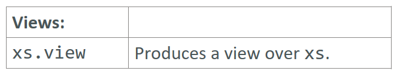

---

### View

### Reference: <https://docs.scala-lang.org/overviews/collections-2.13/trait-iterable.html>

---

In Scala, a view is a lazy version of a collection that delays the evaluation of operations until they are actually needed. This can be particularly useful when dealing with large collections or when you want to chain multiple operations together without creating intermediate collections.



### Characteristics of Views

- **Lazy Evaluation**: Operations on a view are not performed immediately. Instead, they are deferred until the result is required.
- **Efficiency**: Views can improve performance by avoiding unnecessary computations and memory allocations.
- **Transparency**: Views are designed to behave like regular collections, making them easy to use.

### Creating and Using Views

You can create a view from a collection using the `view` method. Once you have a view, you can perform various operations on it just like you would on a regular collection. The difference is that these operations are performed lazily.

### Example

Let's look at a detailed example to illustrate how views work.

#### Without View

Here is an example of performing multiple operations on a collection without using a view. Each operation creates a new intermediate collection:

```scala
val list = (1 to 1000000).toList

val result = list
  .map(_ * 2)        // Creates a new list of 2 million elements
  .filter(_ % 3 == 0) // Creates another new list of elements divisible by 3
  .take(10)          // Takes the first 10 elements

println(result) // Output: List(6, 12, 18, 24, 30, 36, 42, 48, 54, 60)
```

#### With View

Using a view to perform the same operations avoids creating intermediate collections:

```scala
val list = (1 to 1000000).toList

val result = list.view
  .map(_ * 2)         // Lazy map
  .filter(_ % 3 == 0) // Lazy filter
  .take(10)           // Lazy take
  .toList             // Forces evaluation

println(result) // Output: List(6, 12, 18, 24, 30, 36, 42, 48, 54, 60)
```

### Key Points

- **`.view` Method**: Converts a collection to a view.
- **Chaining Operations**: Operations like `map`, `filter`, and `take` are performed lazily on views.
- **Forcing Evaluation**: Use `.toList`, `.toArray`, or similar methods to convert the view back to a strict collection, forcing the evaluation of the operations.

### Operations on Views

Views support a wide range of operations, including:

- **Transformation**: `map`, `flatMap`, `collect`, etc.
- **Filtering**: `filter`, `filterNot`, `takeWhile`, `dropWhile`, etc.
- **Subcollection**: `slice`, `take`, `drop`, etc.
- **Combining**: `zip`, `zipWithIndex`, etc.

#### Example with Different Operations

```scala
val list = (1 to 100).toList

val view = list.view
  .map(_ + 1)          // Increment each element by 1
  .filter(_ % 2 == 0)  // Keep only even elements
  .take(5)             // Take the first 5 elements

println(view)         // Output: SeqView(<not computed>)

val result = view.toList // Forces evaluation
println(result)       // Output: List(2, 4, 6, 8, 10)
```

### Benefits and Use Cases

- **Performance**: Improved performance by avoiding intermediate collections.
- **Memory Efficiency**: Reduced memory footprint by not creating unnecessary temporary collections.
- **Expressiveness**: Ability to express complex transformations and operations in a concise manner.

### Summary

- **Views**: A way to perform lazy evaluations on collections.
- **Efficiency**: Helps in optimizing performance and memory usage.
- **Transparency**: Easy to use as they behave like regular collections.

By using views, you can chain multiple operations together in a lazy manner, which can lead to significant performance improvements when dealing with large collections or expensive operations.

---

### Delve deep into the internal details of how views improve performance by avoiding intermediate collections and reducing memory footprint through the elimination of unnecessary temporary collections.

---

Views in Scala are designed to provide a mechanism for lazy evaluation of collections, which can lead to significant performance improvements, especially when dealing with large collections or complex operations. Here's an in-depth look at how views achieve these improvements by avoiding intermediate collections and reducing memory footprint:

### Lazy Evaluation

Lazy evaluation means that operations on collections are not performed until their results are needed. In contrast to strict collections, where each transformation (like `map`, `filter`, etc.) immediately creates a new collection, views defer these transformations.

#### Example: Lazy vs. Strict Evaluation

Consider the following operations on a list:

1. Strict Evaluation:
    ```scala
    val list = (1 to 1000000).toList
    val result = list.map(_ * 2).filter(_ % 3 == 0).take(10)
    ```

    - `map(_ * 2)` creates an intermediate list of 1,000,000 elements.
    - `filter(_ % 3 == 0)` creates another intermediate list, possibly of fewer elements.
    - `take(10)` creates the final list of 10 elements.

2. Lazy Evaluation with Views:
    ```scala
    val list = (1 to 1000000).toList
    val view = list.view.map(_ * 2).filter(_ % 3 == 0).take(10)
    val result = view.toList
    ```

    - `view` creates a view on the list, deferring all transformations.
    - `map(_ * 2)`, `filter(_ % 3 == 0)`, and `take(10)` are applied lazily.
    - `toList` forces evaluation, but only the necessary elements are computed.

### How Views Avoid Intermediate Collections

Views avoid creating intermediate collections by maintaining a reference to the original collection and a series of transformation steps. When the final result is requested (e.g., by converting the view back to a list), the transformations are applied in a single pass.

#### Internal Mechanics

1. **Representation**:
    - A view is represented by an underlying collection and a series of transformations.
    - Each transformation is stored as a function to be applied later.

2. **Transformation Storage**:
    - When you call `map`, `filter`, or similar methods on a view, a new view is created that wraps the original view along with the new transformation.
    - No elements are actually processed until the view is materialized (e.g., by calling `toList`).

3. **Materialization**:
    - When you convert a view back to a strict collection, the transformations are applied in sequence.
    - Each element is processed through the entire chain of transformations before moving to the next element, minimizing memory usage.

#### Example of Transformation Storage and Materialization

```scala
val list = (1 to 1000000).toList
val view = list.view.map(_ * 2).filter(_ % 3 == 0).take(10)

// Internally, `view` holds a reference to `list` and a chain of transformations.
val result = view.toList // Forces evaluation
```

During materialization, the view processes elements one by one:
1. Start with the first element of `list`.
2. Apply `map(_ * 2)`.
3. Apply `filter(_ % 3 == 0)`.
4. If the element passes the filter, include it in the result.
5. Continue until 10 elements are included in the result.

### Performance Benefits

1. **Avoidance of Intermediate Collections**:
    - Intermediate collections consume both time and memory.
    - Views eliminate the need for these temporary collections, reducing the overhead.

2. **Reduced Memory Footprint**:
    - Since elements are processed one at a time, only the elements needed for the final result are kept in memory.
    - This can lead to significant memory savings, especially for large collections.

3. **Improved Performance**:
    - By eliminating the creation of intermediate collections, views reduce the number of allocations and the garbage collection overhead.
    - Lazy evaluation means that only necessary elements are processed, leading to faster execution for many operations.

### Practical Considerations

- **Use Cases**:
    - Views are particularly beneficial for large collections or when chaining multiple operations.
    - They are also useful for infinite collections or streams where you only need a finite subset of elements.

- **Caveats**:
    - Views introduce some overhead due to the deferred computations, which might not be ideal for very small collections or performance-critical tight loops.
    - It's essential to understand when the view is materialized to avoid unexpected performance costs.

### Summary

Views in Scala enhance performance and reduce memory usage by:
- Deferring computations until necessary.
- Avoiding the creation of intermediate collections.
- Processing elements lazily and only as needed.

By leveraging views, you can write more efficient and concise code, especially when dealing with large datasets or complex transformation pipelines.

---

### Explain the following Caveats:
### Views introduce some overhead due to the deferred computations, which might not be ideal for very small collections or performance-critical tight loops. It's essential to understand when the view is materialized to avoid unexpected performance costs.

---

When using views in Scala, it’s crucial to be aware of certain caveats to ensure you leverage their benefits without encountering performance pitfalls. Here are some important caveats to consider:

### Caveats of Using Views

1. **Overhead of Deferred Computations**:
    - **Description**: Views introduce an additional layer of abstraction to defer computations. This can result in a slight overhead due to the need to store and manage the sequence of operations.
    - **Impact**: For very small collections or in performance-critical tight loops, this overhead might outweigh the benefits of lazy evaluation.
    - **Example**:
        ```scala
        val smallList = List(1, 2, 3)
        val smallView = smallList.view.map(_ + 1).filter(_ % 2 == 0)
        val result = smallView.toList
        ```
      For such small collections, the overhead of managing the view might be unnecessary.

2. **Materialization**:
    - **Description**: Views delay the computation until the result is explicitly requested (materialized). Understanding when and how materialization happens is crucial to avoid unexpected performance costs.
    - **Impact**: If a view is repeatedly materialized within a loop or function, the deferred computations will be re-evaluated each time, potentially leading to performance degradation.
    - **Example**:
        ```scala
        val list = (1 to 1000000).toList
        val view = list.view.map(_ * 2).filter(_ % 3 == 0)

        // Inefficient use of views in a loop
        for (_ <- 1 to 10) {
          val result = view.take(10).toList
          println(result)
        }
        ```
      Here, `view.take(10).toList` re-evaluates the transformations in each iteration of the loop, which can be costly.

### Practical Tips to Avoid Pitfalls

1. **Avoid Overuse for Small Collections**:
    - For very small collections, the overhead of using views might not be justified. Regular collections might perform better due to the lack of deferred computation overhead.

2. **Be Mindful of Materialization Points**:
    - Understand when your view will be materialized. Avoid repeatedly materializing the same view in performance-critical code paths.

3. **Combine Views and Strict Collections Appropriately**:
    - Use views to defer expensive transformations, but convert to strict collections (`toList`, `toArray`, etc.) when you need to perform repeated access to the data.

4. **Profile and Benchmark**:
    - Profile your application to understand the performance impact of using views. Benchmark critical sections of your code to decide whether views are beneficial.

### Example Illustrating Materialization Caveat

Let's consider an example where we can optimize the use of views by avoiding repeated materialization:

#### Inefficient Use of Views:

```scala
val list = (1 to 1000000).toList
val view = list.view.map(_ * 2).filter(_ % 3 == 0)

def printFirstTenTimes(n: Int): Unit = {
  for (_ <- 1 to n) {
    val result = view.take(10).toList // Materializes the view in each iteration
    println(result)
  }
}

printFirstTenTimes(10)
```

#### Optimized Use of Views:

```scala
val list = (1 to 1000000).toList
val view = list.view.map(_ * 2).filter(_ % 3 == 0)

def printFirstTenTimes(n: Int): Unit = {
  val result = view.take(10).toList // Materialize the view once
  for (_ <- 1 to n) {
    println(result)
  }
}

printFirstTenTimes(10)
```

### Summary

- **Overhead of Deferred Computations**: Views introduce overhead due to the need to manage and store deferred computations, which can be non-trivial for very small collections or tight loops.
- **Materialization**: Understanding when a view is materialized is essential to avoid re-evaluating computations unnecessarily, which can lead to performance degradation.
- **Best Practices**: Use views judiciously, especially for large collections or complex operations. Be mindful of materialization points and consider converting views to strict collections when necessary.

By being aware of these caveats and following best practices, you can effectively utilize views in Scala to achieve better performance and efficiency without falling into common traps.

---
