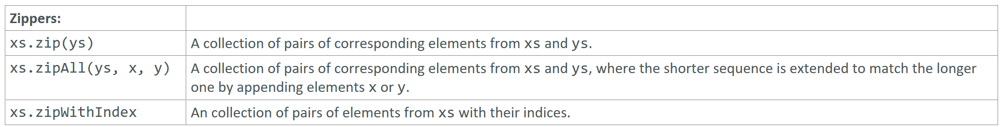

---

### Zippers

### Reference: <https://docs.scala-lang.org/overviews/collections-2.13/trait-iterable.html>

---

In Scala, the `zip`, `zipAll`, and `zipWithIndex` methods are used to combine collections in various ways. Let's look at each of these methods in detail with examples.



### 1. `zip`

The `zip` method pairs corresponding elements from two collections into a new collection of tuples.

#### Example:

```scala
val xs = List(1, 2, 3)
val ys = List("a", "b", "c")

val zipped = xs.zip(ys)
println(zipped) // Output: List((1,"a"), (2,"b"), (3,"c"))
```

### 2. `zipAll`

The `zipAll` method pairs corresponding elements from two collections. If the collections are of different lengths, the shorter collection is extended to match the longer one by appending specified elements.

#### Example:

```scala
val xs = List(1, 2, 3)
val ys = List("a", "b")

val zippedAll = xs.zipAll(ys, -1, "z")
println(zippedAll) // Output: List((1,"a"), (2,"b"), (3,"z"))
```

In this example, since `ys` is shorter than `xs`, it is extended with the element `"z"` to match the length of `xs`.

### 3. `zipWithIndex`

The `zipWithIndex` method pairs each element of a collection with its index.

#### Example:

```scala
val xs = List("a", "b", "c")

val zippedWithIndex = xs.zipWithIndex
println(zippedWithIndex) // Output: List(("a",0), ("b",1), ("c",2))
```

### Use Cases

1. **Combining Related Data**: Use `zip` to combine two collections of related data into pairs.
2. **Handling Collections of Different Lengths**: Use `zipAll` to combine collections of different lengths, specifying default values for missing elements.
3. **Indexing Elements**: Use `zipWithIndex` to pair elements with their indices, which is useful for tracking the position of each element in a collection.

### Detailed Examples

#### `zip`

Combining two lists of different data types:

```scala
val numbers = List(1, 2, 3)
val words = List("one", "two", "three")

val zipped = numbers.zip(words)
println(zipped) // Output: List((1,"one"), (2,"two"), (3,"three"))
```

#### `zipAll`

Handling lists of different lengths:

```scala
val numbers = List(1, 2, 3)
val words = List("one")

val zippedAll = numbers.zipAll(words, -1, "unknown")
println(zippedAll) // Output: List((1,"one"), (2,"unknown"), (3,"unknown"))
```

#### `zipWithIndex`

Pairing elements with their indices:

```scala
val fruits = List("apple", "banana", "cherry")

val zippedWithIndex = fruits.zipWithIndex
println(zippedWithIndex) // Output: List(("apple",0), ("banana",1), ("cherry",2))
```

### Summary

- **`zip`**: Combines two collections element-wise into a collection of pairs. Useful when both collections are of the same length.
- **`zipAll`**: Combines two collections element-wise into a collection of pairs, extending the shorter collection with specified default values. Useful when handling collections of different lengths.
- **`zipWithIndex`**: Pairs each element of a collection with its index. Useful for tracking element positions within a collection.

These methods enhance the ability to manipulate and combine collections in a concise and functional way, which is a powerful feature of Scala's collection library.

---
