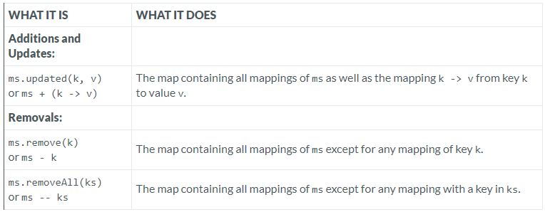

---

### Immutable Map

### Reference: https://docs.scala-lang.org/overviews/collections-2.13/maps.html

---


### Scala `immutable.Map` Operations

In Scala, `immutable.Map` is a key-value data structure where once a map is created, it cannot be altered. However, you can perform operations that return new maps with the desired modifications.

Below, we'll explore key operations in `immutable.Map`, along with examples, considerations, performance comparisons, and additional insights.

###  Operations in Class immutable.Map



### Additions and Updates

#### `ms.updated(k, v)` or `ms + (k -> v)`
- **What It Does**: Returns a new map that contains all mappings from the original map (`ms`), plus a new mapping `k -> v`. If the key `k` already exists, the value `v` will replace the existing value associated with `k`.
- **Example**:
    ```scala
    val ms = Map("a" -> 1, "b" -> 2)
    val updatedMap = ms.updated("c", 3)  // Map("a" -> 1, "b" -> 2, "c" -> 3)
    val anotherUpdatedMap = ms + ("b" -> 5)  // Map("a" -> 1, "b" -> 5)
    ```
- **Use Case**:
    - **Adding Entries**: Use `+` or `updated` to add new key-value pairs to a map.
    - **Updating Entries**: Use the same operations to update the value of an existing key, ensuring immutability while working with maps.

- **Considerations**:
    - **Immutability**: Since Scala's `Map` is immutable, these operations do not modify the original map but instead return a new one with the desired changes.
    - **Performance**: Operations like `updated` or `+` are generally efficient, but they involve creating a new map, which might have performance implications in scenarios involving large maps or frequent updates.

### Removals

#### `ms.remove(k)` or `ms - k`
- **What It Does**: Returns a new map that contains all mappings from the original map (`ms`), except for the mapping with key `k`.
- **Example**:
    ```scala
    val ms = Map("a" -> 1, "b" -> 2, "c" -> 3)
    val removedKeyMap = ms.remove("b")  // Map("a" -> 1, "c" -> 3)
    val anotherRemovedKeyMap = ms - "c"  // Map("a" -> 1, "b" -> 2)
    ```
- **Use Case**:
    - **Removing a Single Entry**: Use `-` or `remove` when you need to remove a specific key-value pair from the map.

- **Considerations**:
    - **Immutability**: Similar to additions and updates, removals do not alter the original map but return a new one without the specified key(s).
    - **Performance**: Removal operations are typically efficient but can become costly if done frequently on large maps, as each operation involves creating a new map.

#### `ms.removeAll(ks)` or `ms -- ks`
- **What It Does**: Returns a new map containing all mappings from the original map (`ms`), except for any mappings where the key is in the collection `ks`.
- **Example**:
    ```scala
    val ms = Map("a" -> 1, "b" -> 2, "c" -> 3)
    val removedKeysMap = ms.removeAll(Set("a", "c"))  // Map("b" -> 2)
    val anotherRemovedKeysMap = ms -- Set("b", "c")  // Map("a" -> 1)
    ```
- **Use Case**:
    - **Batch Removal**: Use `--` or `removeAll` when you need to remove multiple entries from the map at once.

- **Considerations**:
    - **Immutability**: As with single-key removals, these operations return a new map with the specified keys removed.
    - **Performance**: Removing multiple keys at once can be more efficient than removing them individually in a loop, but each removal still involves creating a new map.

### Advanced Considerations and Performance Comparison

- **Structural Sharing**: Immutable maps in Scala often use structural sharing, meaning that new maps created from old ones share most of their underlying data structures. This makes operations like `updated`, `+`, `-`, and `--` more memory-efficient than they might be otherwise, especially when modifications are minimal.

- **Efficiency for Small Maps**: Immutable maps are highly optimized for small sizes (e.g., up to 4 elements). For larger maps, the efficiency may decrease as the need to recreate the map with each operation grows.

- **Hash-Map Based Implementations**: Many operations on `immutable.Map` are backed by hash-map based implementations, giving them average-case time complexity of O(1) for lookups and O(log n) for updates/removals.

- **Alternative Implementations**:
    - **TreeMap**: If you need an immutable map that maintains sorted order by keys, you can use `TreeMap`. However, this comes with different performance characteristics, such as O(log n) for lookups and updates.

- **Memory Usage**: Immutable maps, due to their persistent data structures, can have higher memory usage compared to mutable maps, especially in scenarios with frequent updates.

### Additional Considerations

- **Concurrency**: Immutable maps are inherently thread-safe, making them suitable for use in concurrent programming without the need for additional synchronization.

- **Serialization**: When working with distributed systems, ensure that your chosen `Map` implementation supports serialization if necessary.

- **Key Types**: The efficiency of hash-based maps depends significantly on the efficiency of the hash code implementation for the key type. For custom key types, ensure you override `hashCode` and `equals` appropriately.

- **Custom Implementations**: In advanced use cases, consider implementing your own version of `Map` if the standard implementations do not meet performance or functionality needs, though this is rarely necessary.

### Conclusion

Immutable maps in Scala offer a powerful, efficient, and thread-safe way to manage key-value pairs with the assurance that your data will not be inadvertently modified. Understanding the nuances of operations like `updated`, `+`, `-`, and `--` can help you use them effectively, balancing performance and safety based on your application's needs. Whether you're adding, updating, or removing entries, immutable maps allow for clear, functional programming practices with the added benefit of structural sharing to optimize memory and performance.

---

### In-Depth Explanation of `ms.removeAll(ks)` or `ms -- ks` in Scala

#### What It Does
The `removeAll` method (or its symbolic alias `--`) is an operation on Scala's immutable `Map` that removes multiple key-value pairs from the map at once. It takes a collection of keys (`ks`) and returns a new map with all the mappings corresponding to those keys removed.

- **Syntax**:
    - `ms.removeAll(ks)`
    - `ms -- ks`

  Both of these expressions result in a new map with the keys in `ks` removed.

- **Example**:
    ```scala
    val ms = Map("a" -> 1, "b" -> 2, "c" -> 3)
    val keysToRemove = Set("a", "c")
    val updatedMap = ms.removeAll(keysToRemove)
    // updatedMap: Map("b" -> 2)
    ```

  Alternatively:
    ```scala
    val updatedMap = ms -- keysToRemove
    // updatedMap: Map("b" -> 2)
    ```

#### Performance Considerations

##### **Efficiency vs. Iterative Removal**
- **Batch Removal**: Removing multiple keys in a single operation (`removeAll` or `--`) is generally more efficient than removing each key individually in a loop. This is because the operation can be optimized internally to minimize the overhead of creating intermediate maps.

- **Iterative Removal Example**:
    ```scala
    var map = Map("a" -> 1, "b" -> 2, "c" -> 3, "d" -> 4)
    val keysToRemove = Set("a", "c")
    
    for (key <- keysToRemove) {
      map = map - key
    }
    // map: Map("b" -> 2, "d" -> 4)
    ```

  Here, each iteration creates a new map with one key removed, leading to unnecessary overhead and intermediate map creations.

- **Single Operation Example**:
    ```scala
    val updatedMap = ms -- keysToRemove
    // updatedMap: Map("b" -> 2, "d" -> 4)
    ```

  The `removeAll` or `--` operation efficiently removes all specified keys in a single step, producing the final map without the overhead of multiple intermediate maps.

##### **Immutable Nature and Structural Sharing**
- **Immutable Map Overhead**: Every time you perform an operation on an immutable map, a new map is created. However, Scala’s immutable collections are designed with structural sharing in mind, meaning the new map reuses much of the old map’s structure. This helps to mitigate the overhead of creating a new map for every operation.

- **Structural Sharing**: In the context of `removeAll`, if you remove multiple keys, the operation can be optimized to reduce the number of nodes that need to be copied or modified, especially if those keys are close to each other in the underlying data structure.

##### **Underlying Implementation**
- **Hash-Map Based**: Most Scala `immutable.Map` implementations are based on a hash-map-like structure. The complexity of lookups and updates (including removals) is typically O(log n) or O(1) in the average case, depending on the map's size and the specifics of the implementation.

- **Effect of Map Size**: As the size of the map grows, the overhead of creating new maps during removals increases. However, the impact of this overhead is minimized by the efficient use of structural sharing.

#### Practical Considerations

- **Large Maps**: If you frequently need to remove many keys from large maps, consider the performance implications. Using `removeAll` or `--` is preferred over individual removals in such cases.

- **Memory Usage**: Even though immutable maps optimize for structural sharing, removing many keys can lead to increased memory usage temporarily, as intermediate maps may exist during the operation.

- **Functional Programming**: Using `removeAll` or `--` aligns well with functional programming principles, promoting immutability and avoiding side effects, which are important in multi-threaded or distributed environments.

### Conclusion
In summary, `ms.removeAll(ks)` or `ms -- ks` in Scala is a powerful and efficient way to remove multiple key-value pairs from an immutable map in a single operation. This approach is more efficient than iterative removals due to the internal optimizations and structural sharing that minimize the performance and memory overhead of creating new maps. Understanding these details can help you make better decisions when working with immutable collections, especially in performance-sensitive applications.

---

### Serialization in Picture

**Serialization** is like turning a book into a series of words that can be stored in a file or sent over the internet, and then being able to recreate the original book from those words later.

When you work with maps (a collection of key-value pairs) in programming, you might want to send them from one computer to another, especially if you're working with distributed systems where different parts of a program run on different computers. Serialization is the process of converting that map into a format that can be easily stored or transmitted, like a series of bytes. Later, this series of bytes can be deserialized, or turned back into the original map.

However, not all types of maps in programming are automatically ready to be serialized. This means you need to ensure that the map you're using can be converted into a series of bytes and then reconstructed correctly on the other end.

### In-Depth Explanation

#### What is Serialization?

Serialization is the process of converting an object (like a map) into a format that can be easily stored or transmitted, such as a byte stream. Deserialization is the reverse process, where the byte stream is converted back into the original object.

In distributed systems, where components of a system run on different machines, serialization is crucial because it allows data structures to be sent across network boundaries. For example, if you have a map of user data on one server and you need to send this map to another server, you would serialize the map, send it over the network, and then deserialize it on the receiving server.

#### Why Serialization Matters for Maps

Maps are a fundamental data structure in many applications, and when you work with distributed systems, you often need to share these maps across different components or services. For instance, you might have a map storing user preferences that needs to be shared between a web server and a recommendation engine.

However, not all map implementations are automatically serializable. Some might contain elements or structures that do not support serialization, or they might use an internal representation that is difficult to serialize. This is why it’s important to ensure that the map implementation you choose can be serialized and deserialized without issues.

#### Practical Example

Consider a distributed system where user data is stored in a map. You might need to send this map from one server to another for processing:

```scala
import scala.collection.immutable.Map

val userData: Map[String, String] = Map("user1" -> "data1", "user2" -> "data2")

// Serialize the map (convert it to a byte stream)
val byteStream = serialize(userData)

// Send the byte stream over the network...

// On the receiving end, deserialize the byte stream back into a map
val receivedUserData: Map[String, String] = deserialize(byteStream)
```

In this example, both the `serialize` and `deserialize` methods need to correctly handle the specific map implementation used. If the map contains complex objects, each object must also be serializable.

#### Considerations When Using Serialization

1. **Map Implementation**: Not all map implementations in Scala are serializable by default. For instance, some custom or optimized maps might not implement the `Serializable` interface. You need to choose a map implementation that explicitly supports serialization if you plan to use it in a distributed context.

2. **Serialization Format**: The format in which you serialize the map matters. Common formats include:
    - **Java Serialization**: Standard in Java and Scala, but can be slow and produce large serialized objects.
    - **JSON**: Human-readable and widely used, but not always the most efficient in terms of size.
    - **Protocol Buffers or Avro**: More efficient formats that are commonly used in high-performance distributed systems.

3. **Performance Overhead**: Serialization and deserialization add overhead. Complex maps with many entries or large objects can take time to serialize, and the resulting byte stream can be large. This can affect the performance of your system, especially if the data needs to be sent frequently across the network.

4. **Consistency and Compatibility**: When sending serialized data between different systems or versions of a system, you need to ensure that the deserialization process is compatible. Changes in the structure of the map or the data it contains can lead to deserialization errors if not properly handled.

#### Advanced Considerations

- **Custom Serialization**: In some cases, you might need to implement custom serialization logic for your maps, especially if they contain non-standard or complex objects. This involves overriding the default serialization methods to control exactly how your map is serialized and deserialized.

- **Immutable vs. Mutable Maps**: Immutable maps are often easier to serialize because their contents don’t change, reducing the risk of inconsistencies. Mutable maps, on the other hand, might require more careful handling to ensure that the map is not modified during serialization or after it has been deserialized in a way that could lead to data corruption.

- **Security**: Serialized objects can be a vector for security vulnerabilities, especially if they come from untrusted sources. Deserializing data from an untrusted source can expose your application to attacks like deserialization exploits. It’s crucial to validate or sanitize data before deserialization and to use secure serialization frameworks when dealing with sensitive information.

### Conclusion

Serialization is a key concept in distributed systems, allowing data structures like maps to be shared between different parts of a system. When using maps in Scala, especially in a distributed context, it’s important to choose a map implementation that supports serialization and to be mindful of the performance and security implications of the serialization process. Understanding these considerations ensures that your application can efficiently and safely share data across different components.

---

### Custom Map Implementations

Sometimes, the built-in map data structures provided by programming languages like Scala might not be fast enough or may not have exactly the features you need for a specific task. In such cases, you might consider building your own version of a map (a custom map). However, this is something only advanced programmers do because it's quite complex and the standard maps usually work well for most situations.

### In-Depth Explanation

#### Why Consider a Custom Map Implementation?

The standard map implementations in Scala, such as `HashMap` or `TreeMap`, are designed to be general-purpose. They balance between different factors like speed, memory usage, and ease of use. However, in some advanced scenarios, you might find that these implementations don't quite fit your needs. This could be due to:

1. **Performance Requirements**: You might need a map that performs better under specific conditions, such as extremely large datasets, very frequent updates, or access patterns that aren't efficiently handled by standard maps.

2. **Special Functionality**: You might need a map with behavior that standard maps don't support. For example, you could need a map that automatically expires entries after a certain time (a time-based cache) or a map that maintains extra metadata with each entry.

3. **Space Efficiency**: If memory usage is a critical concern, you might want a map implementation that optimizes for space, perhaps by compressing keys and values in a specific way or by using a very compact data structure.

#### Example Scenarios for Custom Implementation

1. **Custom Hash Function**: If you know that your keys have a particular distribution or structure, you might implement a custom hash function that optimizes for faster lookups or less collision. The standard `HashMap` uses a general-purpose hash function, but a custom one might significantly improve performance in your specific case.

2. **Persistent Data Structures**: If you need a map that supports versioning or rollback (like in some databases), you might implement a custom persistent map. This would allow you to keep track of historical versions of the map without duplicating data.

3. **Concurrent Access**: If your application requires very high concurrency with many threads reading from and writing to the map simultaneously, you might implement a map with custom locking strategies or use a lock-free data structure to avoid contention.

#### How to Implement a Custom Map

Implementing a custom map involves understanding the key operations of a map—like `get`, `put`, `remove`, and iterating over entries—and designing a data structure that supports these efficiently according to your specific needs.

1. **Interface Implementation**: In Scala, you would typically start by extending the `Map` trait and implementing its methods. Here's a very basic skeleton:

    ```scala
    class CustomMap[K, V] extends scala.collection.mutable.Map[K, V] {
      private val internalData = new Array  // Example internal storage

      override def get(key: K): Option[V] = {
        // Implement custom logic to find the value associated with key
        // Return None if the key is not found
      }

      override def iterator: Iterator[(K, V)] = {
        // Implement iterator for traversing the map
      }

      override def addOne(kv: (K, V)): CustomMap.this.type = {
        // Implement custom logic to add an element to the map
        this
      }

      override def subtractOne(key: K): CustomMap.this.type = {
        // Implement custom logic to remove an element from the map
        this
      }
    }
    ```

2. **Custom Data Structures**: You might decide to use or implement specific data structures like a Trie, Skip List, or a custom balanced tree to store your map entries, depending on the access patterns and performance characteristics you need.

3. **Optimization for Specific Use Cases**: Your map implementation might include optimizations that are not generally applicable, such as caching recent lookups, storing frequently accessed entries in a faster access layer, or using specific memory alignment techniques for speed.

#### Considerations and Risks

- **Complexity**: Writing a custom map is complex and prone to errors, especially when dealing with concurrent modifications or maintaining performance across different operations (like balancing read vs. write efficiency).

- **Maintenance**: Custom implementations need to be thoroughly tested and maintained. This includes handling edge cases, ensuring thread safety (if applicable), and maintaining compatibility with other parts of your system.

- **Standard Solutions**: In most cases, standard libraries or slight modifications of them (e.g., wrapping a standard map with additional logic) are sufficient and much safer than writing a custom implementation from scratch. Only consider this route if you have a very clear understanding of your requirements and are sure that existing solutions are inadequate.

### Conclusion

Custom map implementations can offer significant benefits in niche scenarios where performance or functionality demands are specific and critical. However, they come with increased complexity and risk. For most applications, leveraging the built-in data structures or using available libraries that extend these structures is the preferred approach. Custom implementations should be reserved for cases where the standard solutions fall short and the benefits clearly outweigh the development and maintenance costs.

---

### Map Performance Tips

Optimizing the performance of `Map` data structures in Scala (or any language) can significantly impact the efficiency of your application, especially when working with large datasets or performance-critical code. Here are some key performance tips:

### 1. **Choose the Right Map Implementation**

- **HashMap**: Ideal for general-purpose use due to average O(1) time complexity for insertions, deletions, and lookups. However, performance can degrade with a high number of hash collisions.
- **TreeMap** (or `SortedMap`): Maintains order of keys, which is useful for range queries or when you need sorted data. However, it has a higher time complexity of O(log n) for insertions, deletions, and lookups.
- **ListMap**: Suitable for very small maps where you need constant-time lookups and insertion order preservation. It’s inefficient for larger datasets as it has O(n) time complexity for lookups.
- **BitSet**: Useful for sets of integers with a limited range. It's highly space-efficient and supports fast set operations like union and intersection.

**Tip**: Use `HashMap` by default unless you have a specific need for sorted keys or you know that the map will remain small.

### 2. **Consider Immutable vs. Mutable Maps**

- **Immutable Maps**: Provide thread safety and are generally easier to reason about. However, they create a new map with each modification, which can be costly for frequent updates.
- **Mutable Maps**: Allow in-place updates and are more efficient when frequent changes are needed. However, they are not thread-safe and can introduce bugs if shared across threads without proper synchronization.

**Tip**: Use immutable maps for simpler, safer code. Opt for mutable maps in performance-critical sections where frequent updates occur.

### 3. **Understand Memory Allocation and GC Impact**

- **Large Maps**: Be cautious with very large maps. They can lead to high memory usage and frequent garbage collection (GC), which can affect performance. Consider splitting large maps into smaller chunks if possible.
- **Custom Hash Functions**: If you're using a `HashMap` with complex keys, ensure the `hashCode` method is optimized. Poorly implemented hash functions can lead to uneven distribution and more frequent collisions.

**Tip**: Profile your application to understand its memory usage and optimize hash functions for custom key types.

### 4. **Batch Operations vs. Individual Updates**

- **Batch Updates**: When adding or removing multiple entries at once, use batch operations (e.g., `++`, `--`, `updated`, `removeAll`) instead of looping through individual updates. Batch operations are often more efficient as they can be optimized internally.

**Tip**: Use `Map ++ otherMap` to add multiple entries from another map or `Map -- keysSet` to remove multiple keys efficiently.

### 5. **Leverage Views for Lazy Transformations**

- **Map Views**: Use `map.view` to perform transformations (e.g., filtering, mapping) lazily. This can improve performance by avoiding the creation of intermediate collections.

**Tip**: Use `map.view.filterKeys` or `map.view.mapValues` to delay computations until they are actually needed, reducing unnecessary overhead.

### 6. **Avoid Unnecessary Lookups**

- **Contains Check**: Avoid unnecessary lookups in maps by first checking if the key exists using `contains`. This prevents costly operations like creating default values or handling exceptions.
- **Memoization**: If you perform frequent lookups for the same keys, consider caching the results to avoid redundant computations.

**Tip**: Use `map.getOrElse(key, default)` to safely retrieve values without risking exceptions.

### 7. **Concurrency Considerations**

- **Concurrent Maps**: If you need to share maps between threads, consider using concurrent implementations like `TrieMap`, which provide better performance in multi-threaded environments compared to synchronized maps.

**Tip**: Use `TrieMap` for thread-safe concurrent access with better scalability compared to standard mutable maps.

### 8. **Profile and Benchmark**

- **Profiling**: Always profile your application to identify bottlenecks. Tools like VisualVM or YourKit can help you understand where time is being spent and where memory is being allocated.
- **Benchmarking**: Use benchmarking tools like JMH (Java Microbenchmark Harness) to measure the performance impact of different map operations in a controlled environment.

**Tip**: Regularly profile and benchmark your code, especially after significant changes, to ensure that performance remains optimal.

### 9. **Consider Specialized Maps**

- **Specialized Implementations**: For specific use cases, consider using or implementing specialized maps (e.g., LRU cache, time-based cache) that are optimized for particular access patterns or constraints.

**Tip**: Explore libraries like Caffeine for highly optimized caching solutions or implement your own specialized map if necessary.

### 10. **Use Parallel Collections**

- **Parallel Processing**: For large maps where operations can be parallelized (e.g., bulk processing of entries), consider using parallel collections to take advantage of multiple cores.

**Tip**: Convert a map to a parallel collection using `map.par` and then apply operations in parallel, but be mindful of the overhead associated with parallelism.

By understanding and applying these performance tips, you can ensure that your use of `Map` in Scala is both efficient and suited to your application’s specific needs.

---

### Resources:

---
