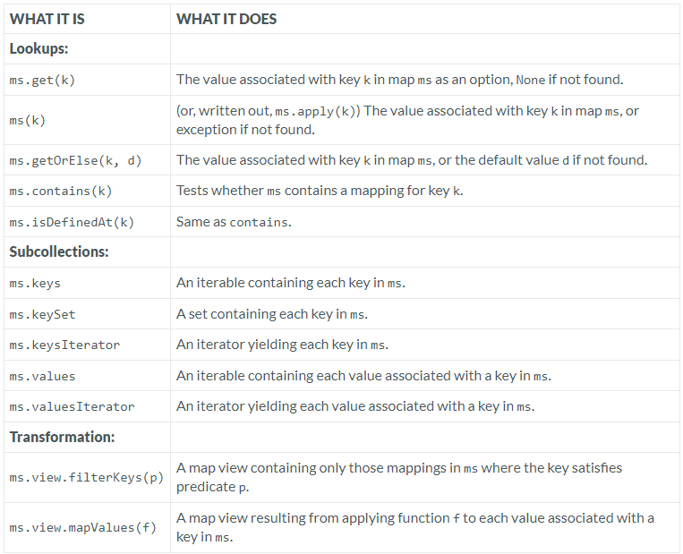

---

### Map

### Reference: https://docs.scala-lang.org/overviews/collections-2.13/maps.html

---

### Scala Map Trait: Operations in Class `Map`

The `Map` trait in Scala represents a collection of key-value pairs where each key is unique. The operations available on `Map` allow for querying, transforming, and modifying these collections.

### Operations in Class Map



Below is an explanation of each operation with examples, considerations, and performance comparisons.

### Lookups

#### `ms.get(k)`
- **What It Does**: Returns an `Option` containing the value associated with key `k`, or `None` if the key is not found.
- **Example**:
    ```scala
    val ms = Map("a" -> 1, "b" -> 2)
    val result = ms.get("a")  // Some(1)
    val resultNotFound = ms.get("c")  // None
    ```
- **Use Case**: Useful when you want to handle the case where a key might not be present without throwing an exception.

#### `ms(k)` (or `ms.apply(k)`)
- **What It Does**: Retrieves the value associated with key `k`, or throws a `NoSuchElementException` if the key is not found.
- **Example**:
    ```scala
    val ms = Map("a" -> 1, "b" -> 2)
    val value = ms("a")  // 1
    val valueNotFound = ms("c")  // Throws NoSuchElementException
    ```
- **Use Case**: Use this when you're sure the key exists in the map. It's less safe but more direct than `get`.

#### `ms.getOrElse(k, d)`
- **What It Does**: Returns the value associated with key `k`, or the default value `d` if the key is not found.
- **Example**:
    ```scala
    val ms = Map("a" -> 1, "b" -> 2)
    val result = ms.getOrElse("a", 0)  // 1
    val resultNotFound = ms.getOrElse("c", 0)  // 0
    ```
- **Use Case**: Useful when you want to provide a fallback value in case the key is absent.

#### `ms.contains(k)`
- **What It Does**: Checks if the map contains a mapping for the key `k`.
- **Example**:
    ```scala
    val ms = Map("a" -> 1, "b" -> 2)
    val containsKey = ms.contains("a")  // true
    val doesNotContainKey = ms.contains("c")  // false
    ```
- **Use Case**: Commonly used to verify the presence of a key before attempting to access it.

#### `ms.isDefinedAt(k)`
- **What It Does**: Equivalent to `contains(k)`, checks if a key `k` is defined in the map.
- **Example**:
    ```scala
    val ms = Map("a" -> 1, "b" -> 2)
    val isDefined = ms.isDefinedAt("a")  // true
    val isNotDefined = ms.isDefinedAt("c")  // false
    ```
- **Use Case**: This method is useful when working with partial functions where `isDefinedAt` is a standard method.

### Subcollections

#### `ms.keys`
- **What It Does**: Returns an `Iterable` containing all the keys in the map.
- **Example**:
    ```scala
    val ms = Map("a" -> 1, "b" -> 2)
    val keys = ms.keys  // Iterable("a", "b")
    ```
- **Use Case**: Use when you need to iterate over all keys without caring about their corresponding values.

#### `ms.keySet`
- **What It Does**: Returns a `Set` containing all the keys in the map.
- **Example**:
    ```scala
    val ms = Map("a" -> 1, "b" -> 2)
    val keySet = ms.keySet  // Set("a", "b")
    ```
- **Use Case**: Useful when you need a collection of unique keys that support set operations.

#### `ms.keysIterator`
- **What It Does**: Returns an `Iterator` over all keys in the map.
- **Example**:
    ```scala
    val ms = Map("a" -> 1, "b" -> 2)
    val keyIterator = ms.keysIterator
    while (keyIterator.hasNext) {
      println(keyIterator.next())
    }
    ```
- **Use Case**: Ideal for situations where you want to traverse the keys efficiently without loading them all into memory at once.

#### `ms.values`
- **What It Does**: Returns an `Iterable` containing all the values in the map.
- **Example**:
    ```scala
    val ms = Map("a" -> 1, "b" -> 2)
    val values = ms.values  // Iterable(1, 2)
    ```
- **Use Case**: Use when you need to process or aggregate the values in the map.

#### `ms.valuesIterator`
- **What It Does**: Returns an `Iterator` over all values in the map.
- **Example**:
    ```scala
    val ms = Map("a" -> 1, "b" -> 2)
    val valueIterator = ms.valuesIterator
    while (valueIterator.hasNext) {
      println(valueIterator.next())
    }
    ```
- **Use Case**: Like `keysIterator`, this is useful for memory-efficient traversal.

### Transformation

#### `ms.view.filterKeys(p)`
- **What It Does**: Returns a view of the map where only the keys that satisfy predicate `p` are included.
- **Example**:
    ```scala
    val ms = Map("a" -> 1, "b" -> 2, "c" -> 3)
    val filteredView = ms.view.filterKeys(_ > "a")
    println(filteredView.toMap)  // Map("b" -> 2, "c" -> 3)
    ```
- **Use Case**: Efficient way to filter map entries by key without creating a new map immediately.

#### `ms.view.mapValues(f)`
- **What It Does**: Returns a view of the map where a function `f` is applied to each value.
- **Example**:
    ```scala
    val ms = Map("a" -> 1, "b" -> 2)
    val mappedView = ms.view.mapValues(_ * 10)
    println(mappedView.toMap)  // Map("a" -> 10, "b" -> 20)
    ```
- **Use Case**: Useful for lazy transformation of values in the map.

### Additions and Updates

#### `+`, `++`, `updated`
- **What It Does**:
    - `+`: Adds a single key-value pair to the map, returning a new map.
    - `++`: Adds multiple key-value pairs to the map, returning a new map.
    - `updated`: Equivalent to `+`, adds or updates a key-value pair.
- **Example**:
    ```scala
    val ms = Map("a" -> 1)
    val updatedMap = ms + ("b" -> 2)  // Map("a" -> 1, "b" -> 2)
    val mergedMap = ms ++ Map("b" -> 2, "c" -> 3)  // Map("a" -> 1, "b" -> 2, "c" -> 3)
    val anotherUpdatedMap = ms.updated("a", 10)  // Map("a" -> 10)
    ```
- **Use Case**: These operations are crucial for creating new maps with additional or updated entries, especially in immutable contexts.

### Removals

#### `-`, `--`
- **What It Does**:
    - `-`: Removes a single key from the map, returning a new map.
    - `--`: Removes multiple keys from the map, returning a new map.
- **Example**:
    ```scala
    val ms = Map("a" -> 1, "b" -> 2, "c" -> 3)
    val removedKeyMap = ms - "b"  // Map("a" -> 1, "c" -> 3)
    val removedKeysMap = ms -- List("b", "c")  // Map("a" -> 1)
    ```
- **Use Case**: These operations are used when you want to remove entries from a map, typically to create a new, reduced map.

### Considerations and Nuances When Using "Map Operations"

- **Immutability vs. Mutability**: In immutable maps, operations like `+`, `++`, `-`, and `--` return new instances of the map, leaving the original unchanged. In mutable maps, similar operations modify the map in place, which can have performance benefits but requires careful handling to avoid side effects.

- **Performance**:
    - **Lookup**: The average time complexity for `contains` and `get` in a hash-based map is O(1).
    - **Insertion/Removal**: In immutable maps, operations that modify the map often involve creating a new map, which can be more expensive than modifying a mutable map in place.
    - **Memory**: Immutable maps are often more memory-efficient for small collections, as they can share structure with other instances. Mutable maps might consume more memory due to the overhead of managing mutability.

- **Lazy Views**: Using `view` operations like `filterKeys` and `mapValues` provides a lazy, non-str

ict collection that doesn't evaluate until necessary. This can be more efficient for large collections or when only a subset of the results is required.

### Additional Considerations

- **Custom Key Ordering**: Scala’s `Map` trait allows for custom key ordering, particularly in `SortedMap` implementations like `TreeMap`. This is useful when you need keys to be ordered based on criteria other than natural ordering.

- **Handling `Option`**: When working with `get`, `getOrElse`, and similar methods, consider how `Option` is handled, especially in cases where `None` should trigger specific behavior.

- **Concurrency**: For multi-threaded applications, consider using concurrent map implementations like `TrieMap` for mutable maps, which provide thread-safe operations.

- **Serialization**: If you're working with distributed systems or need to serialize maps, ensure that your chosen `Map` implementation is serializable, especially when using custom classes as keys or values.

### Summary

The `Map` trait in Scala is a versatile and powerful tool for managing key-value pairs. Understanding the various operations and their nuances allows you to choose the right method for your needs, whether it’s for querying, transforming, or modifying the map. With considerations for performance, mutability, and specific use cases, Scala’s `Map` operations offer both efficiency and flexibility in handling collections.

---

### Resources:

---
