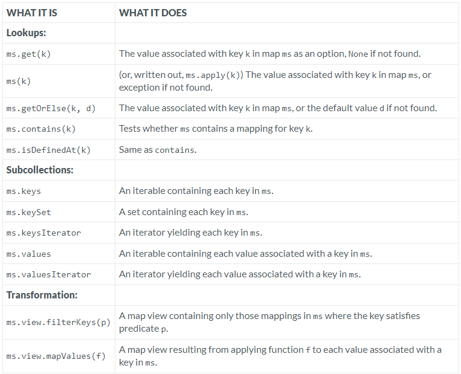
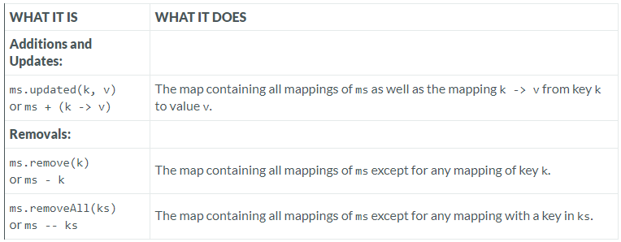
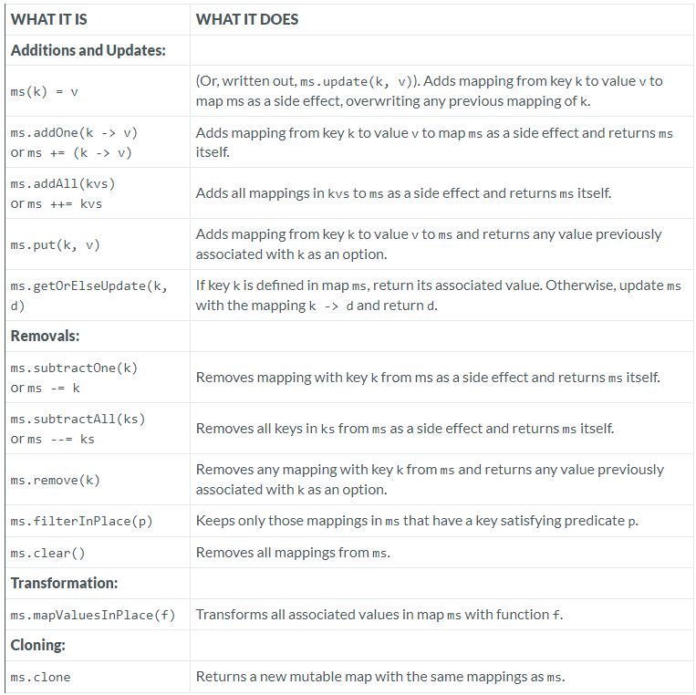

---

### Maps

### Reference: https://docs.scala-lang.org/overviews/collections-2.13/maps.html

---

**[Operations in Class Map](./MAP.md "Visit MAP.md")**

A [Map](https://www.scala-lang.org/api/current/scala/collection/Map.html "Visit Map") is an [Iterable](https://www.scala-lang.org/api/current/scala/collection/Iterable.html "Visit Iterable") consisting of pairs of keys and values (also named mappings or associations). Scala’s [Predef](https://www.scala-lang.org/api/current/scala/Predef$.html "Visit Predef") object offers an implicit conversion that lets you write `key -> value` as an alternate syntax for the pair `(key, value)`.

For instance `Map("x" -> 24, "y" -> 25, "z" -> 26)` means exactly the same as `Map(("x", 24), ("y", 25), ("z", 26))`, but reads better.

The fundamental operations on maps are similar to those on sets. They are summarized in the following table and fall into the following categories:

• **Lookup** operations `apply`, `get`, `getOrElse`, `contains`, and `isDefinedAt`. These turn maps into partial functions from keys to values. The fundamental lookup method for a map is: `def get(key): Option[Value]`. The operation `m.get(key)` tests whether the map contains an association for the given `key`. If so, it returns the associated value in a `Some`. If no key is defined in the map, `get` returns `None`. Maps also define an `apply` method that returns the value associated with a given key directly, without wrapping it in an Option. If the key is not defined in the map, an exception is raised.

• **Additions and updates** `+`, `++`, `updated`, which let you add new bindings to a map or change existing bindings.

• **Removals** `-`, `--`, which remove bindings from a map.

• **Subcollection producers** `keys`, `keySet`, `keysIterator`, `values`, `valuesIterator`, which return a map’s keys and values separately in various forms.

• **Transformations** `filterKeys` and `mapValues`, which produce a new map by filtering and transforming bindings of an existing map.



---

**[Operations in Class immutable.Map](./IMMUTABLE_MAP.md "Visit IMMUATBLE_MAP.md")**

Immutable maps support in addition operations to add and remove mappings by returning new Maps, as summarized in the following table.



---

**[Operations in Class mutable.Map](./MUTABLE_MAP.md "Visit MUTABLE_MAP.md")**

Mutable maps support in addition the operations summarized in the following table.



The addition and removal operations for maps mirror those for sets. A mutable map `m` is usually updated in place, using the two variants `m(key) = value` or `m += (key -> value)`. There is also the variant `m.put(key, value)`, which returns an `Option` value that contains the value previously associated with `key`, or `None` if the `key` did not exist in the map before.

The `getOrElseUpdate` is useful for accessing maps that act as caches. Say you have an expensive computation triggered by invoking a function `f`:

```scala

scala> def f(x: String): String =
         println("taking my time."); Thread.sleep(100)
         x.reverse
def f(x: String): String

```

Assume further that `f` has no side-effects, so invoking it again with the same argument will always yield the same result. In that case you could save time by storing previously computed bindings of argument and results of `f` in a map and only computing the result of `f` if a result of an argument was not found there. One could say the map is a cache for the computations of the function `f`.

```scala

scala> val cache = collection.mutable.Map[String, String]()
cache: scala.collection.mutable.Map[String,String] = Map()

```

You can now create a more efficient caching version of the `f` function:

```scala

scala> def cachedF(s: String): String = cache.getOrElseUpdate(s, f(s))
cachedF: (s: String)String
scala> cachedF("abc")
taking my time.
res3: String = cba
scala> cachedF("abc")
res4: String = cba

```

Note that the second argument to `getOrElseUpdate` is by-name, so the computation of `f("abc")` above is only performed if `getOrElseUpdate` requires the value of its second argument, which is precisely if its first argument is not found in the `cache` map. You could also have implemented `cachedF` directly, using just basic map operations, but it would take more code to do so:

```scala

• Scala 2 and 3
def cachedF(arg: String): String = cache.get(arg) match
  case Some(result) => result
  case None =>
    val result = f(x)
    cache(arg) = result
    result

```

---

### Resources:

---
