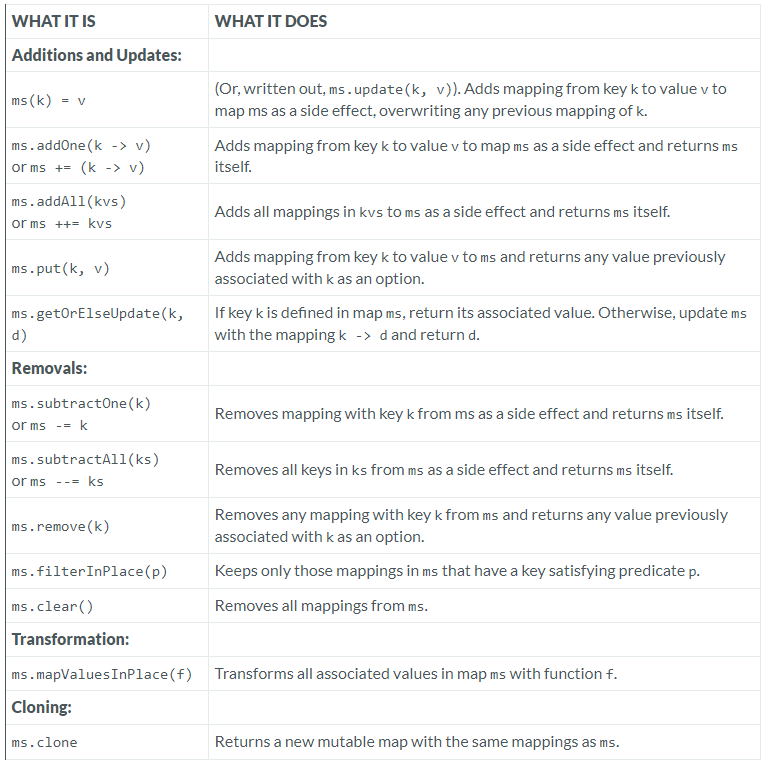

---

### Mutable Map

### Reference: https://docs.scala-lang.org/overviews/collections-2.13/maps.html

---

### Scala Mutable Map Operations: In-Depth Explanation

The `mutable.Map` trait in Scala allows you to create maps that can be modified in place. These maps are particularly useful when you need to frequently update, add, or remove key-value pairs.

### Operations in Class mutable.Map



Below is an in-depth explanation of each operation with real-world examples, considerations, performance comparisons, and additional nuances.

### Additions and Updates

1. **`ms(k) = v` or `ms.update(k, v)`**

   **What It Does**: Adds or updates the mapping from key `k` to value `v` in the map `ms`. If `k` already exists in the map, its value is overwritten.

   **Real-World Example**:
   ```scala
   val ms = scala.collection.mutable.Map("apple" -> 3, "banana" -> 5)
   ms("apple") = 4 // Updates the value associated with "apple" to 4
   ms("cherry") = 7 // Adds a new key-value pair ("cherry" -> 7)
   ```

   **Use Cases**: Useful for scenarios where you want to update an existing value or add a new key-value pair.

   **Performance**: O(1) for hash-based maps like `mutable.HashMap`.

2. **`ms.addOne(k -> v)` or `ms += (k -> v)`**

   **What It Does**: Adds the key-value pair `(k -> v)` to the map `ms` and returns the map itself.

   **Real-World Example**:
   ```scala
   val ms = scala.collection.mutable.Map("apple" -> 3)
   ms += ("banana" -> 5) // Adds "banana" -> 5 and returns the map
   ```

   **Use Cases**: Chainable addition operations in scenarios where you want to add multiple elements and continue working with the map.

   **Performance**: O(1) for hash-based maps.

3. **`ms.addAll(kvs)` or `ms ++= kvs`**

   **What It Does**: Adds all key-value pairs from the collection `kvs` to the map `ms` and returns the map itself.

   **Real-World Example**:
   ```scala
   val ms = scala.collection.mutable.Map("apple" -> 3)
   ms ++= Map("banana" -> 5, "cherry" -> 7) // Adds multiple key-value pairs
   ```

   **Use Cases**: Efficient for bulk updates to a map.

   **Performance**: O(n) where n is the number of elements in `kvs`.

4. **`ms.put(k, v)`**

   **What It Does**: Adds or updates the mapping from key `k` to value `v` in the map `ms`, and returns an `Option` containing the previous value associated with `k`, if it existed.

   **Real-World Example**:
   ```scala
   val ms = scala.collection.mutable.Map("apple" -> 3)
   val previous = ms.put("apple", 4) // Updates "apple" -> 4, previous is Some(3)
   ```

   **Use Cases**: When you need to know the previous value associated with a key during an update.

   **Performance**: O(1) for hash-based maps.

5. **`ms.getOrElseUpdate(k, d)`**

   **What It Does**: If key `k` exists in map `ms`, returns its associated value. Otherwise, updates the map with the mapping `k -> d` and returns `d`.

   **Real-World Example**:
   ```scala
   val ms = scala.collection.mutable.Map("apple" -> 3)
   val value = ms.getOrElseUpdate("banana", 5) // Adds "banana" -> 5 and returns 5
   ```

   **Use Cases**: Useful for implementing caches or memoization.

   **Performance**: O(1) for hash-based maps.

### Removals

1. **`ms.subtractOne(k)` or `ms -= k`**

   **What It Does**: Removes the mapping with key `k` from the map `ms` as a side effect and returns the map itself.

   **Real-World Example**:
   ```scala
   val ms = scala.collection.mutable.Map("apple" -> 3, "banana" -> 5)
   ms -= "banana" // Removes "banana" from the map
   ```

   **Use Cases**: When you need to remove a specific key-value pair from a map.

   **Performance**: O(1) for hash-based maps.

2. **`ms.subtractAll(ks)` or `ms --= ks`**

   **What It Does**: Removes all keys in the collection `ks` from the map `ms` and returns the map itself.

   **Real-World Example**:
   ```scala
   val ms = scala.collection.mutable.Map("apple" -> 3, "banana" -> 5, "cherry" -> 7)
   ms --= Set("apple", "cherry") // Removes "apple" and "cherry"
   ```

   **Use Cases**: Efficiently remove multiple keys at once.

   **Performance**: O(n) where n is the number of keys in `ks`.

3. **`ms.remove(k)`**

   **What It Does**: Removes the mapping with key `k` from the map `ms` and returns an `Option` containing the value that was associated with `k`, if it existed.

   **Real-World Example**:
   ```scala
   val ms = scala.collection.mutable.Map("apple" -> 3)
   val value = ms.remove("apple") // Removes "apple" and returns Some(3)
   ```

   **Use Cases**: When you need to remove a key and possibly act on the value that was removed.

   **Performance**: O(1) for hash-based maps.

4. **`ms.filterInPlace(p)`**

   **What It Does**: Filters the map `ms` in place, keeping only those mappings where the key-value pair satisfies the predicate `p`.

   **Real-World Example**:
   ```scala
   val ms = scala.collection.mutable.Map("apple" -> 3, "banana" -> 5, "cherry" -> 7)
   ms.filterInPlace { case (k, v) => v > 4 } // Keeps "banana" and "cherry"
   ```

   **Use Cases**: In-place filtering of a map based on a condition.

   **Performance**: O(n) where n is the number of elements in the map.

5. **`ms.clear()`**

   **What It Does**: Removes all mappings from the map `ms`.

   **Real-World Example**:
   ```scala
   val ms = scala.collection.mutable.Map("apple" -> 3, "banana" -> 5)
   ms.clear() // Empties the map
   ```

   **Use Cases**: Resetting a map to be empty.

   **Performance**: O(1), but it depends on the underlying implementation.

### Transformation

1. **`ms.mapValuesInPlace(f)`**

   **What It Does**: Transforms all associated values in the map `ms` by applying the function `f`.

   **Real-World Example**:
   ```scala
   val ms = scala.collection.mutable.Map("apple" -> 3, "banana" -> 5)
   ms.mapValuesInPlace(_ * 2) // Doubles all values: "apple" -> 6, "banana" -> 10
   ```

   **Use Cases**: Efficient in-place transformation of all values in a map.

   **Performance**: O(n) where n is the number of elements in the map.

### Cloning

1. **`ms.clone`**

   **What It Does**: Returns a new mutable map with the same mappings as `ms`.

   **Real-World Example**:
   ```scala
   val ms = scala.collection.mutable.Map("apple" -> 3, "banana" -> 5)
   val msClone = ms.clone // Creates a new map with the same key-value pairs
   ```

   **Use Cases**: Useful when you need a copy of a map that can be modified independently of the original.

   **Performance**: O(n) where n is the number of elements in the map.

### Considerations and Nuances When Using Mutable Map Operations

- **Thread Safety**: Mutable maps are not thread-safe by default. If used in a multi-threaded environment, consider using concurrent maps like `TrieMap`.

- **Performance**: Mutable maps generally offer better performance for frequent updates compared to immutable maps since they do not create new maps on each update.

- **Memory Overhead**: Mutable maps may have more memory overhead due to internal structures required for efficient updates, such as hash tables.

### Additional Considerations

- **Custom Implementations**: For specialized use cases, you might need to implement your own map to optimize for specific access patterns or memory usage, but this is rare.

- **Serialization**: Ensure that the map implementation you choose supports serialization if working with distributed systems.

### Advanced Knowledge about Mutable Map Operations

- **Lazy Views**: Scala supports lazy views (`map.view`) which can be useful for transforming maps without creating intermediate collections. These views are particularly useful for large datasets where you want to avoid the overhead of materializing transformations.

- **Custom Hashing**: If you're using complex keys in a `HashMap`, consider customizing the `hashCode` and `equals` methods to avoid hash collisions

and ensure performance stability.

By understanding these operations and considerations, you can effectively use mutable maps in Scala to build efficient, performance-optimized applications.

---

### Explanation of `getOrElseUpdate` for Caching in Scala

**In Layman's Terms**:
The `getOrElseUpdate` method in Scala is particularly useful when you're using a map to store computed values that you might need to look up multiple times. Imagine you have a function that takes a long time to compute a value. Instead of computing the value every time it's needed, you can store the result in a map (like a box that remembers the answer) the first time you calculate it. The next time you need that value, you can just look it up in the map instead of recalculating it. This approach is called caching, and `getOrElseUpdate` makes it easy.

### Detailed Explanation

**What `getOrElseUpdate` Does**:
The `getOrElseUpdate` method in Scala is used to retrieve the value associated with a specific key from a mutable map. If the key does not exist in the map, the method will compute a default value (provided as a parameter), store this key-value pair in the map, and then return the value. This operation is atomic, meaning it will only compute the default value once even if multiple threads try to access the same key simultaneously.

**Real-World Example**:

Imagine you're working on an application that needs to process a large amount of data. Some of these processes are computationally expensive, so you don't want to redo them every time the same input is encountered. Here's how you can use `getOrElseUpdate` to implement a cache.

```scala
import scala.collection.mutable

// A function that simulates a computationally expensive operation
def expensiveComputation(x: Int): Int = {
  println(s"Computing result for $x")
  x * x // Let's say the computation is squaring the number
}

// Create a mutable map to act as a cache
val cache = mutable.Map[Int, Int]()

// Use getOrElseUpdate to fetch the result from the cache or compute it if not present
def getCachedResult(x: Int): Int = {
  cache.getOrElseUpdate(x, expensiveComputation(x))
}

// Example usage
val result1 = getCachedResult(5) // Computes and caches the result for 5
val result2 = getCachedResult(5) // Fetches the result from cache, no computation
val result3 = getCachedResult(10) // Computes and caches the result for 10
```

**Output**:
```
Computing result for 5
Computing result for 10
```

- When `getCachedResult(5)` is called the first time, `expensiveComputation(5)` is executed, and the result is cached in `cache`.
- On the second call to `getCachedResult(5)`, the method retrieves the cached result without re-computing it.
- For a new input, like `10`, the method computes and caches the new result.

### Use Cases

- **Memoization**: `getOrElseUpdate` is commonly used in memoization, where you store the results of expensive function calls and reuse them when the same inputs occur again.
- **Caching API Responses**: If your application makes frequent calls to an external API with the same parameters, caching the results can significantly reduce the number of API calls.
- **Dynamic Programming**: In algorithms like dynamic programming, where subproblems are solved and their results are reused, `getOrElseUpdate` can store solutions to subproblems.

### Considerations and Nuances

- **Thread Safety**: If used in a concurrent environment, you should be cautious since `mutable.Map` is not thread-safe. For a thread-safe alternative, you might use `TrieMap` or wrap the operation in a synchronization block.

- **Memory Usage**: While caching can improve performance, it also increases memory usage. If the cache grows too large, it might cause memory issues. Consider using a cache eviction strategy if the dataset is very large.

- **Lazy Evaluation**: The computation of the default value is lazy; it only happens if the key is not already present in the map.

### Performance Comparison

- **Without Caching**: Recomputing values every time can lead to significant performance overhead, especially if the operation is computationally intensive.
- **With Caching**: `getOrElseUpdate` optimizes by ensuring each expensive computation is performed only once per unique input, significantly improving performance.

### Additional Considerations

- **Custom Default Values**: The default value can be any computation, not just a constant. This makes `getOrElseUpdate` highly versatile.

- **Alternatives**: For immutable maps, there's no direct equivalent to `getOrElseUpdate`, as the map cannot be updated in place. In such cases, you would need to create a new map with the updated value.

By understanding and using `getOrElseUpdate`, you can efficiently manage scenarios where certain values need to be computed and reused, significantly enhancing the performance of your Scala applications.

---

### Explanation of Memory Overhead in Mutable Maps

#### Layman's Terms:
Imagine organizing a group of objects in a room. If these objects were just thrown into the room randomly, finding a specific item would be slow. To speed things up, you might decide to use shelves, boxes, and labels. This setup makes it easier and quicker to find what you need but takes up more space in the room. Similarly, mutable maps in programming use extra structures (like the shelves and labels) to organize data, which helps in quickly updating and retrieving information but also takes up more memory.

### Detailed Explanation:

**What is Memory Overhead?**
Memory overhead refers to the additional memory used by data structures over and above the actual data stored. In the context of mutable maps, this overhead is largely due to the structures and mechanisms needed to maintain efficiency in operations like insertions, deletions, and lookups.

**Why Mutable Maps Have Higher Memory Overhead:**
1. **Hash Tables**:
    - **Structure**: Mutable maps, particularly those based on hash tables like `mutable.HashMap`, use arrays of buckets to store key-value pairs. Each bucket can hold one or more entries.
    - **Load Factor and Resizing**: To maintain efficient access times, hash tables need to manage their "load factor" – the ratio of the number of stored entries to the number of buckets. When the load factor exceeds a certain threshold, the hash table increases its size (usually doubling the number of buckets). This resizing involves creating a new, larger array and rehashing all existing keys to new locations, which temporarily increases memory usage significantly.
    - **Empty Buckets**: Not all buckets are filled; some are left empty to reduce collision and maintain quick lookup times. These empty buckets still consume space.

2. **Tree-Based Maps**:
    - **Nodes**: Maps like `mutable.TreeMap` use tree structures (often red-black trees) where each entry is stored in a node. These nodes contain not only the key and value but also metadata for balancing the tree and links to parent and child nodes.
    - **Overhead Per Entry**: Each node’s overhead includes pointers (references to other nodes) and balance-factor information, which are necessary for the tree’s maintenance operations but do not store actual user data.

3. **Entry Objects**:
    - **Wrapper Objects**: In both hash tables and tree-based maps, each key-value pair is often wrapped in an entry object. These objects have overheads like any other object in Scala (or Java), including metadata used by the JVM for object management and type information.

**Real-World Example and Use Case**:
Imagine a web application that uses a mutable map to store session information for users. Each session has a unique ID (key) and associated user data (value). Using a `mutable.HashMap` allows for quick session lookups and updates as users interact with the application. However, because of the memory overhead described above, the actual memory used can be much higher than just the memory needed to store the raw session IDs and data.

### Considerations and Performance Implications:

- **Memory vs. Performance Trade-off**: The additional memory used by mutable maps is a trade-off for achieving higher performance in operations. Faster access times often justify the extra memory cost, especially in performance-critical applications.
- **Capacity Planning**: Understanding the memory overhead can help in capacity planning for applications, particularly those deployed in environments with limited memory resources.
- **Garbage Collection Impact**: Higher memory usage can lead to more frequent garbage collections in JVM-based applications, potentially impacting performance. Efficient use and timely clearing of maps can mitigate this issue.
- **Optimization Techniques**:
    - **Initial Capacity**: When possible, specify an initial capacity for a mutable map to minimize costly resizing operations.
    - **Load Factor Management**: Adjusting the load factor can help balance between time efficiency and memory usage.
    - **Using Compact Structures**: For certain use cases, specialized or compact data structures (like Java’s `Int2ObjectOpenHashMap` from fastutil or Scala's `AnyRefMap`) might offer lower overhead alternatives to standard `HashMap`.

### Conclusion:
While mutable maps provide flexibility and high performance for operations involving frequent updates and lookups, they come with higher memory overhead due to the internal structures required to maintain efficiency. Understanding these costs is crucial when designing systems, especially in memory-constrained environments, to ensure that the benefits of quick operations outweigh the memory footprint.

---

### Understanding Garbage Collection and Its Impact on Scala Mutable Maps

Garbage collection (GC) plays a crucial role in managing memory in JVM-based applications, including those written in Scala. The interaction between garbage collection and mutable maps can significantly affect application performance and memory usage. Here's a detailed breakdown of how this works:

#### What is Garbage Collection?

Garbage collection is the process by which the JVM automatically identifies and frees memory that is no longer in use by an application. This process helps in managing memory efficiently and prevents memory leaks. However, garbage collection also has overhead and can impact application performance, especially if it happens frequently or takes a long time.

#### Garbage Collection in the Context of Mutable Maps

1. **Object Lifespan and Reachability**:
    - Mutable maps store their entries as objects. Each entry in a mutable map (often implemented as a key-value pair object) occupies memory.
    - The garbage collector tracks objects that are reachable—i.e., objects that can be accessed directly or indirectly through references from other live objects. When a key-value pair in a mutable map is no longer needed and is not referenced by any part of your program, it becomes eligible for garbage collection.

2. **Impact of Mutable Maps on Garbage Collection**:
    - **Memory Consumption**: Mutable maps, especially those that grow large, consume a significant amount of memory. This consumption is not just due to the data stored but also the overhead of the data structure (e.g., extra fields in nodes for managing hash buckets or tree balancing).
    - **Allocation and Deallocation**: Frequent additions and removals in mutable maps lead to frequent allocation and deallocation of small objects (entry objects). This can increase the workload on the garbage collector, leading to more frequent GC cycles.
    - **Fragmentation**: As entries are added and removed, memory can become fragmented. This fragmentation might prompt the garbage collector to compact memory, a process that can be CPU-intensive and affect performance.

3. **Generational Garbage Collection and Mutable Maps**:
    - Most JVMs use a generational garbage collection strategy, where memory is divided into generations (young, old, and sometimes perm or metaspace). New objects are allocated in the young generation and later moved to the older generation if they survive enough garbage collection cycles.
    - **Young Generation**: Rapid additions and deletions in mutable maps lead to many entries being allocated in the young generation. Since objects in the young generation are garbage-collected more frequently (minor GCs), mutable maps with high turnover can lead to frequent minor GCs.
    - **Old Generation**: If a mutable map or its entries live for a long time, they are promoted to the old generation. Once in the old generation, objects are less frequently collected, but collecting the old generation (major GC) is much more disruptive and time-consuming than collecting the young generation.

#### Real-World Example:
Imagine an online store where each user session is tracked with a mutable map storing user activity. As users visit different parts of the store, entries are added to and removed from the map:

- **Frequent Updates**: Each user action updates the map, causing frequent allocations of new objects.
- **Session End**: When a user session ends, the entire session map might become unreachable if it's not referenced elsewhere.
- **Garbage Collection**: The JVM needs to frequently clean up these old user sessions. If sessions end quickly but often, this leads to many short-lived objects in the young generation, causing frequent minor GCs.

#### Performance Optimization Tips:

- **Tune GC Settings**: Adjust JVM garbage collection settings to optimize for the expected usage patterns of your maps. For example, increasing the size of the young generation could reduce the frequency of minor GCs if your application creates a lot of short-lived objects.
- **Use Appropriate Map Sizes**: Initialize maps with appropriate sizes to minimize unnecessary resizes and memory allocation.
- **Memory-Efficient Data Structures**: Consider using more memory-efficient data structures or specialized map implementations that reduce overhead or manage memory better.
- **Weak/Soft References**: For caches or other optional data, consider using weak or soft references in your maps, which allow the garbage collector to reclaim memory more aggressively.

#### Conclusion:

Understanding how mutable maps interact with the JVM's garbage collection system is crucial for optimizing memory usage and performance in Scala applications. By carefully managing map usage and tuning garbage collection, developers can minimize negative impacts and ensure smoother application performance.

---

### Weak and Soft references in Scala maps

Certainly! Understanding weak and soft references in the context of Scala, particularly when using maps, is crucial for managing memory more effectively, especially in applications where cache-like behavior is desired. Here's a breakdown of what weak and soft references are, how they're used in Scala maps, and their practical applications.

### What are Weak and Soft References?

In Java and Scala, which runs on the JVM, references to objects can be strong, weak, or soft, impacting how the garbage collector treats these objects:

1. **Strong References**:
    - This is the default type of reference. If an object has a strong reference, it cannot be garbage collected. As long as there's a strong reference to an object, it remains in memory.

2. **Weak References**:
    - An object with only weak references can be garbage collected at any time the garbage collector sees fit, typically the next time the garbage collector runs. Weak references allow for more aggressive garbage collection. In Scala, you can use `scala.ref.WeakReference` to hold weak references.

3. **Soft References**:
    - Soft references are similar to weak references, but softer. The garbage collector is less aggressive in collecting objects with soft references. Objects with soft references are only reclaimed if the JVM needs memory urgently. This makes soft references suitable for implementing memory-sensitive caches. Scala provides `scala.ref.SoftReference` for this purpose.

### Using Weak and Soft References in Scala Maps

When implementing caches or managing large datasets that do not need to be permanently in memory, using weak or soft references in maps can prevent memory leaks and manage memory usage more efficiently.

#### Weak References with Maps

- **Use Case**: You want to cache objects but do not want the cache to prevent these objects from being garbage collected when memory is low.
- **Implementation**:
  ```scala
  import scala.collection.mutable
  import scala.ref.WeakReference

  val cache = mutable.WeakHashMap[Int, WeakReference[SomeLargeObject]]()
  cache += (1 -> WeakReference(new SomeLargeObject("Data for key 1")))
  ```

  Here, `WeakHashMap` keys are referenced weakly, which means entries in the map will be removed by the garbage collector when there are no other strong references to the keys. Values are also wrapped in `WeakReference`, ensuring they are also eligible for garbage collection.

#### Soft References with Maps

- **Use Case**: Implementing a cache where stored objects should stay in memory as long as possible but can be discarded under memory pressure.
- **Implementation**:
  ```scala
  import scala.collection.mutable
  import scala.ref.SoftReference

  val softCache = mutable.Map[Int, SoftReference[SomeLargeObject]]()
  softCache += (1 -> SoftReference(new SomeLargeObject("Data for key 1")))
  ```

  In this example, using `SoftReference` for the values ensures that the JVM will clear these objects only if it really needs to free up memory, making it suitable for a cache that adjusts to the JVM's memory needs.

### Practical Considerations

1. **Memory Management**: While weak and soft references can help manage memory, they should be used judiciously. Over-reliance on them can lead to performance issues if the garbage collector becomes too aggressive in reclaiming objects, causing frequent re-creation of objects.

2. **Garbage Collection Behavior**: The behavior of garbage collectors concerning weak and soft references can vary based on the JVM implementation and the parameters with which the JVM is started. This variability can affect the predictability of how memory is managed.

3. **Application Performance**: Using weak or soft references can impact application performance. Objects may need to be recreated frequently if they are garbage collected too aggressively, potentially leading to performance penalties.

### Advanced Knowledge

- **Custom Cache Implementations**: For advanced use cases, consider combining weak/soft references with other caching strategies, like least-recently-used (LRU) eviction policies, to create more sophisticated caching mechanisms.

- **Monitoring and Tuning**: Monitor the memory usage and garbage collection metrics in your application to tune the use of weak and soft references. Adjust JVM settings if necessary to optimize the performance and memory footprint of your application.

By using weak and soft references appropriately in Scala maps, developers can create flexible and efficient caching mechanisms that improve application performance while managing memory usage effectively.

---

### Resources:

---
