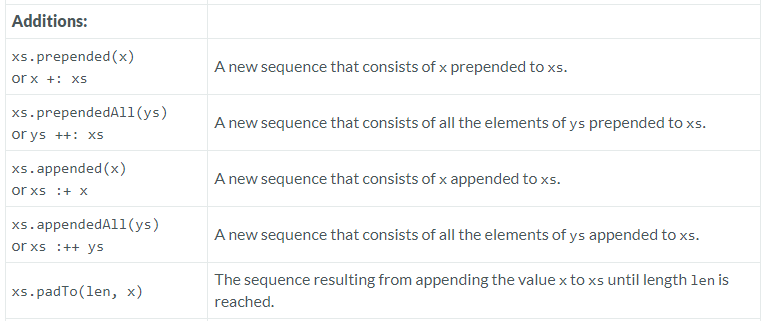

---

### Additions

### Reference: <https://docs.scala-lang.org/overviews/collections-2.13/seqs.html>

---

In Scala, the `Seq` trait provides several methods for adding elements either at the beginning or the end of a sequence. These operations are essential for constructing new sequences based on existing ones, often in a functional programming style where immutability of data structures is a key concept. 

Here's a breakdown of each method:



### 1. `prepended`

- **Functionality**: Adds a single element to the beginning of the sequence, returning a new sequence.
- **Usage**:
  ```scala
  val seq = Seq(2, 3, 5)
  val newSeq = 1 +: seq  // Using the symbolic alias
  val newSeqMethod = seq.prepended(1)
  println(newSeq)        // Output: List(1, 2, 3, 5)
  println(newSeqMethod)  // Output: List(1, 2, 3, 5)
  ```

### 2. `prependedAll`

- **Functionality**: Adds all elements of a given collection to the beginning of the sequence, returning a new sequence.
- **Usage**:
  ```scala
  val initialSeq = Seq(4, 5)
  val toPrepend = Seq(1, 2, 3)
  val result = initialSeq.prependedAll(toPrepend)
  println(result)  // Output: List(1, 2, 3, 4, 5)
  ```

### 3. `appended`

- **Functionality**: Adds a single element to the end of the sequence, returning a new sequence.
- **Usage**:
  ```scala
  val seq = Seq(1, 2, 3)
  val newSeq = seq :+ 4  // Using the symbolic alias
  val newSeqMethod = seq.appended(4)
  println(newSeq)        // Output: List(1, 2, 3, 4)
  println(newSeqMethod)  // Output: List(1, 2, 3, 4)
  ```

### 4. `appendedAll`

- **Functionality**: Adds all elements of a given collection to the end of the sequence, returning a new sequence.
- **Usage**:
  ```scala
  val initialSeq = Seq(1, 2, 3)
  val toAppend = Seq(4, 5)
  val result = initialSeq.appendedAll(toAppend)
  println(result)  // Output: List(1, 2, 3, 4, 5)
  ```

### 5. `padTo`

- **Functionality**: Increases the length of the sequence to a specified length by appending a given element as many times as needed. If the sequence is already longer than the specified length, it returns the sequence unchanged.
- **Usage**:
  ```scala
  val seq = Seq(1, 2, 3)
  val padded = seq.padTo(6, 0)
  println(padded)  // Output: List(1, 2, 3, 0, 0, 0)
  ```

### Practical Examples

Let's use these methods in practical examples to demonstrate their utility:

```scala
val fruits = Seq("apple", "banana")
val moreFruits = Seq("cherry", "date")

// Prepended and PrependedAll
val allFruits = moreFruits.prependedAll(fruits)
println(allFruits) // Output: List(apple, banana, cherry, date)

// Appended and AppendedAll
val finalFruits = fruits.appended("orange").appendedAll(Seq("grape", "melon"))
println(finalFruits) // Output: List(apple, banana, orange, grape, melon)

// PadTo
val extendedList = Seq(1, 2).padTo(5, 3)
println(extendedList) // Output: List(1, 2, 3, 3, 3)
```

### Summary

These addition operations (`prepended`, `prependedAll`, `appended`, `appendedAll`, `padTo`) enable efficient and expressive sequence manipulations in Scala. They are crucial for situations where we need to construct new sequences from existing ones while adhering to functional programming principles that favor immutability.

### Resources:

---
