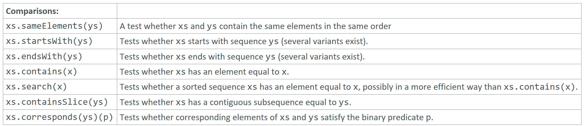

---

### Comparisons

### Reference: <https://docs.scala-lang.org/overviews/collections-2.13/seqs.html>

---

The Scala `Seq` trait includes a variety of comparison operations that facilitate checking relationships between two sequences or searching for specific elements within a sequence. These operations are crucial for tasks ranging from data validation to complex algorithmic processing. Let's delve into these operations, providing real-world examples, discussing performance implications, and highlighting additional considerations.



### Comparison Operations Overview

### 1. `sameElements`

**Usage**: Checks if two sequences contain the same elements in the same order.

**Example**:
```scala
val seq1 = Seq(1, 2, 3)
val seq2 = Seq(1, 2, 3)
val seq3 = Seq(3, 2, 1)

println(seq1.sameElements(seq2)) // Output: true
println(seq1.sameElements(seq3)) // Output: false
```

**Real-World Use Case**: Verifying if two lists of transactions or events recorded by different systems are identical.

### 2. `startsWith`

**Usage**: Determines whether the sequence starts with the specified sub-sequence.

**Example**:
```scala
val numbers = Seq(1, 2, 3, 4, 5)
val start = Seq(1, 2)

println(numbers.startsWith(start)) // Output: true
```

**Real-World Use Case**: Checking if a data stream starts with a certain header or a predefined sequence, useful in parsing tasks.

### 3. `endsWith`

**Usage**: Checks if the sequence ends with the specified sub-sequence.

**Example**:
```scala
val data = Seq('a', 'b', 'c', 'd', 'e')
val end = Seq('d', 'e')

println(data.endsWith(end)) // Output: true
```

**Real-World Use Case**: Ensuring that a file or input stream ends with a specific footer or terminator sequence.

### 4. `contains`

**Usage**: Returns `true` if the sequence contains a specified element.

**Example**:
```scala
val features = Seq("login", "logout", "profile", "settings")

println(features.contains("profile")) // Output: true
```

**Real-World Use Case**: Checking if a feature is enabled or if a user has a specific permission.

### 5. `containsSlice`

**Usage**: Checks if the sequence contains a specific sub-sequence.

**Example**:
```scala
val script = Seq(1, 2, 3, 4, 5, 1, 2)
val pattern = Seq(1, 2)

println(script.containsSlice(pattern)) // Output: true
```

**Real-World Use Case**: Searching for a pattern or a command in a sequence of user commands or script steps.

### 6. `corresponds`

**Usage**: Checks if two sequences correspond element-wise according to a provided predicate function.

**Example**:
```scala
val a = Seq(1, 2, 3)
val b = Seq(2, 3, 4)

println(a.corresponds(b)(_ + 1 == _)) // Output: true
```

**Real-World Use Case**: Comparing data sets to ensure they meet a relative condition, such as validating that one set of measurements is consistently higher than another by a fixed amount.

### 7. `search`

**Usage**: Performs a search for an element in the sequence, optimized for sorted collections.

**Example**:
```scala
import scala.collection.Searching._

val sortedNumbers = Seq(1, 3, 5, 7, 9)
val searchResult = sortedNumbers.search(5) // Requires sorted sequence for binary search

println(searchResult) // Output: Found(2)
```

**Real-World Use Case**: Finding a specific entry in a sorted list of customer IDs or product codes.

### Real-World Examples and Use Cases

- **Data Validation**: Use `startsWith` and `endsWith` to validate inputs such as file formats or protocol frames.
- **Feature Toggling**: Employ `contains` to check if a set of enabled feature flags contains a specific feature.
- **Data Synchronization**: Use `sameElements` to verify that two data sets from different sources remain synchronized.
- **Pattern Matching**: Utilize `containsSlice` to detect specific sequences or patterns in text or data streams.

### Considerations and Nuances

- **Efficiency**: The efficiency of these operations can vary based on the underlying collection type. For example, `contains` in a `List` involves linear search, while in indexed sequences like `Vector`, it can be more efficient.
- **Correctness**: When using `corresponds`, ensure that the predicate accurately reflects the intended comparison logic.
- **Immutable vs. Mutable Sequences**: Operations on immutable sequences are generally safer in concurrent environments but may perform differently compared to mutable sequences.

### Performance Comparison

- **`sameElements` vs. `corresponds`**: `sameElements` performs a simple equality check and is generally faster, while `corresponds` is more flexible but may involve more complex comparisons.
- **`contains` vs. `containsSlice`**: `contains` is typically faster as it searches for a single element, whereas `containsSlice` must find an entire sub-sequence.

### Additional Considerations

- **Algorithmic Complexity**: Understanding the complexity of these operations is crucial for performance-critical applications. For example, `contains` can be O(n) in the worst case for sequences, while `search` can be O(log n) in sorted sequences.
- **Usage in High-Performance Scenarios**: For high-performance or real-time systems, consider the impact of these operations on execution time, especially in tight loops or high-frequency calls.
- **Semantic Differences**: Be aware of the semantic differences and limitations of each method, especially in edge cases like empty sequences or sequences with duplicate elements.

### Summary

Comparison operations in Scala's `Seq` trait provide powerful tools for querying and comparing sequences. By understanding their implications, performance characteristics, and correct use cases, developers can effectively employ these tools to implement robust, efficient, and correct applications. The choice of operation and its implementation should align with the specific requirements and constraints of the application domain.

### Resources:

---
