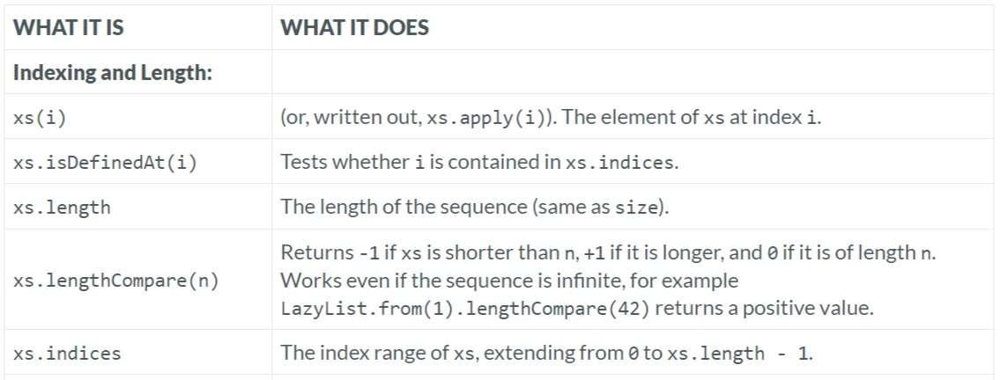

---

### Indexing and Length

### Reference: <https://docs.scala-lang.org/overviews/collections-2.13/seqs.html>

---

The `Seq` trait in Scala is a powerful and flexible abstraction for working with ordered collections where elements are indexed sequentially. As we have noted, `Seq` is a subtrait of `Iterable`, providing additional operations and properties specific to sequences.

Let's dive into the specifics of the indexing and length operations provided by the `Seq` trait, clarifying their usage and implications.



### Indexing and Length Operations

#### 1. `apply`
- **Functionality**: The `apply` method allows for indexing into a sequence, retrieving the element at a specified index.
- **Usage**:
  ```scala
  val seq = Seq(10, 20, 30, 40)
  println(seq(2)) // Output: 30
  ```
- **Details**: Accessing an element via `apply` is typically O(1) for indexed sequences like `ArraySeq` but can be O(n) for linear sequences like `List`.

#### 2. `isDefinedAt`
- **Functionality**: Checks if the sequence defines a value at a specified index, effectively ensuring that the index is within valid bounds.
- **Usage**:
  ```scala
  println(seq.isDefinedAt(3)) // Output: true
  println(seq.isDefinedAt(4)) // Output: false
  ```
- **Details**: This method makes `Seq` extend `PartialFunction[Int, T]`, where the function is defined for indices from 0 to `length - 1`.

#### 3. `length` / `size`
- **Functionality**: Returns the number of elements in the sequence.
- **Usage**:
  ```scala
  println(seq.length) // Output: 4
  println(seq.size)  // Output: 4
  ```
- **Details**: The `length` and `size` methods are effectively the same; `size` is defined in `Iterable`, and `length` is an alias in `Seq` for consistency with other sequence-like APIs (like arrays).

#### 4. `indices`
- **Functionality**: Provides a range of valid indices for the sequence.
- **Usage**:
  ```scala
  println(seq.indices) // Output: Range 0 until 4
  ```
- **Details**: Useful for iterating over the indices of a sequence without risk of index out-of-bounds errors.

#### 5. `lengthCompare`
- **Functionality**: Compares the length of the sequence against a given integer or the size of another `Iterable`.
- **Usage**:
  ```scala
  val otherSeq = Seq(1, 2, 3, 4, 5)
  println(seq.lengthCompare(3))        // Output: 1 (seq is longer)
  println(seq.lengthCompare(5))        // Output: -1 (seq is shorter)
  println(seq.lengthCompare(otherSeq)) // Output: -1 (seq is shorter)
  ```
- **Details**: This method is especially useful for efficiently comparing lengths without needing to traverse entire collections, particularly valuable for infinite sequences where direct length measurement is not feasible.

### Practical Implications and Use Cases

- **Safety and Efficiency**: Using methods like `isDefinedAt` before calling `apply` can prevent runtime exceptions due to index out of range errors. This is crucial in robust application development.
- **Performance Considerations**: Knowing the complexity of the `apply` operation for different `Seq` implementations helps in optimizing performance, especially in loops or recursive functions.
- **Flexibility in Comparisons**: The `lengthCompare` method offers a way to handle comparisons gracefully, especially when dealing with potentially large or infinite sequences.

### Advanced Considerations

- **`Seq` as `PartialFunction`**: Since `Seq` extends `PartialFunction`, it can be used in scenarios where a function from indices to elements is expected.
- **Operations on Indices**: Using `indices` along with higher-order functions like `map` and `filter` allows for complex operations based on element positions.

### Example: Using `Seq` with Higher-Order Functions

```scala
val indexedElements = seq.indices.filter(_ % 2 == 0).map(seq)
println(indexedElements) // Output: List(10, 30)
```

This example showcases using `indices` to filter and map even indices, illustrating how to leverage `Seq`'s properties to perform sophisticated data manipulations.

### Summary

Understanding and utilizing the `Seq` trait and its associated operations can greatly enhance our ability to work effectively with sequences in Scala. Whether for data manipulation, safety checks, or performance optimizations, these methods provide a robust toolkit for working with ordered collections.


### Resources:

---
