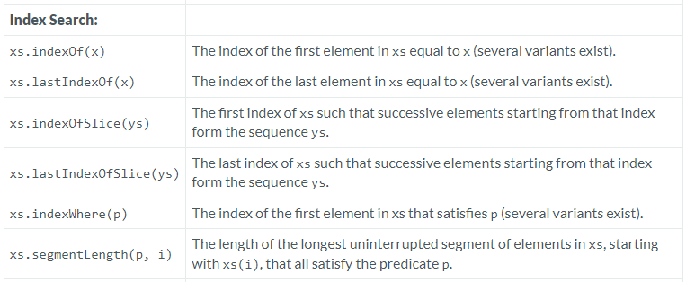

---

### Index Search

### Reference: <https://docs.scala-lang.org/overviews/collections-2.13/seqs.html>

---

The Scala `Seq` trait offers a comprehensive set of index search operations that allow us to locate elements or subsequences within a sequence based on various criteria. These methods are invaluable for querying and data manipulation tasks within sequences.



Let's delve into each of these methods, explaining their functionalities and providing examples.

### 1. `indexOf`

- **Functionality**: Returns the index of the first occurrence of a specified element in the sequence. If the element is not found, it returns `-1`.
- **Usage**:
  ```scala
  val seq = Seq('a', 'b', 'c', 'd', 'b', 'c')
  println(seq.indexOf('b')) // Output: 1
  ```

### 2. `lastIndexOf`

- **Functionality**: Returns the index of the last occurrence of a specified element in the sequence. If the element is not found, it returns `-1`.
- **Usage**:
  ```scala
  println(seq.lastIndexOf('b')) // Output: 4
  ```

### 3. `indexOfSlice`

- **Functionality**: Returns the index of the first occurrence of a specified subsequence within the sequence.
- **Usage**:
  ```scala
  val slice = Seq('b', 'c')
  println(seq.indexOfSlice(slice)) // Output: 1
  ```

### 4. `lastIndexOfSlice`

- **Functionality**: Returns the index of the last occurrence of a specified subsequence within the sequence.
- **Usage**:
  ```scala
  println(seq.lastIndexOfSlice(slice)) // Output: 4
  ```

### 5. `indexWhere`

- **Functionality**: Returns the index of the first element satisfying a given predicate. If no elements satisfy the predicate, it returns `-1`.
- **Usage**:
  ```scala
  println(seq.indexWhere(_ > 'b')) // Output: 2 (character 'c')
  ```

### 6. `lastIndexWhere`

- **Functionality**: Returns the index of the last element satisfying a given predicate. If no elements satisfy the predicate, it returns `-1`.
- **Usage**:
  ```scala
  println(seq.lastIndexWhere(_ > 'b')) // Output: 5 (character 'c')
  ```

### 7. `segmentLength`

- **Functionality**: Counts the length of a segment in the sequence starting from a given index that satisfies a predicate.
- **Usage**:
  ```scala
  println(seq.segmentLength(_ < 'd', 0)) // Output: 3
  ```

### Examples and Use Cases

Here are more detailed examples demonstrating how these methods can be used effectively:

```scala
val seq = Seq(2, 3, 5, 7, 11, 13, 17, 19, 23, 5, 7)

// Find the index of the first prime number greater than 10
println(seq.indexWhere(_ > 10)) // Output: 4 (value 11)

// Find the last index where the element is an odd prime less than 20
println(seq.lastIndexWhere(x => x % 2 != 0 && x < 20)) // Output: 7 (value 19)

// Find the first occurrence of a sub-sequence
val subSeq = Seq(5, 7)
println(seq.indexOfSlice(subSeq)) // Output: 2

// Find the last occurrence of a sub-sequence
println(seq.lastIndexOfSlice(subSeq)) // Output: 9

// Determine the length of a continuous segment of primes less than 20 starting from the beginning
println(seq.segmentLength(_ < 20, 0)) // Output: 8
```

### Summary

- The methods `indexOf`, `lastIndexOf`, `indexOfSlice`, `lastIndexOfSlice`, `indexWhere`, `lastIndexWhere`, and `segmentLength` provide powerful tools for searching within sequences based on specific conditions or subsequences.
- These methods enhance the ability to perform conditional queries and analyze subsequences within Scala collections, making them highly useful for a wide range of programming tasks involving data manipulation and analysis.

Understanding these methods can significantly improve our proficiency in handling sequences in Scala, enabling us to write more efficient and readable code for complex data processing tasks.

### Resources

---
