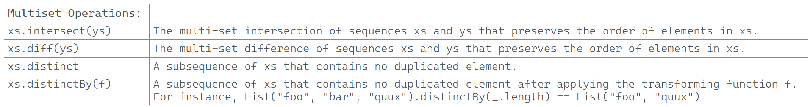

---

### Multiset Operations

### Reference: <https://docs.scala-lang.org/overviews/collections-2.13/seqs.html>

---

The Scala `Seq` trait includes various multiset operations that allow for performing set-like operations on sequences. These operations are useful for handling collections where the manipulation of elements based on their uniqueness or their presence in multiple collections is required.



### Multiset Operations Overview

1. **`intersect`**:
    - **Functionality**: Returns a new sequence containing all elements that are common to both sequences, preserving the order of the first sequence.
    - **Example**:
      ```scala
      val seq1 = Seq(1, 2, 3, 4, 5)
      val seq2 = Seq(3, 4, 5, 6, 7)
      val intersection = seq1.intersect(seq2)
      println(intersection)  // Output: List(3, 4, 5)
      ```

2. **`diff`**:
    - **Functionality**: Computes the difference between two sequences, returning a sequence containing all the elements of the first sequence that are not present in the second.
    - **Example**:
      ```scala
      val difference = seq1.diff(seq2)
      println(difference)  // Output: List(1, 2)
      ```

3. **`distinct`**:
    - **Functionality**: Removes duplicate elements from a sequence, returning a new sequence where each element appears only once.
    - **Example**:
      ```scala
      val duplicates = Seq(1, 2, 2, 3, 3, 3, 4)
      val unique = duplicates.distinct
      println(unique)  // Output: List(1, 2, 3, 4)
      ```

4. **`distinctBy`** (Scala 2.13+):
    - **Functionality**: Removes duplicates based on a specific function, which determines how to identify the uniqueness of elements.
    - **Example**:
      ```scala
      case class Person(name: String, age: Int)
      val people = Seq(Person("Alice", 30), Person("Alice", 25), Person("Bob", 30))
      val distinctPeople = people.distinctBy(_.name)
      println(distinctPeople)  // Output: List(Person(Alice, 30), Person(Bob, 30))
      ```

### Real-World Use Cases and Code Snippets

- **Data Deduplication**:
    - Using `distinct` or `distinctBy` to remove duplicate entries from data imports or processing pipelines, ensuring uniqueness in datasets.


- **Permission and Role Management**:
    - Using `intersect` to find common permissions between two roles or user groups.


- **Feature Difference Analysis**:
    - Using `diff` to identify features present in one version of a product but absent in another, aiding in feature flag management and rollout strategies.

### Considerations and Nuances

- **Order Preservation**:
    - `intersect` and `distinct` maintain the order of elements based on the first sequence, which can be crucial for applications where order impacts functionality or user experience.


- **Performance**:
    - All these operations are computationally intensive, particularly on large sequences, as they might involve multiple traversals of the sequences.

### Performance Comparison

- **`distinct` vs `distinctBy`**:
    - `distinct` is generally faster for simple uniqueness checks but less flexible.
    - `distinctBy` offers more control (e.g., uniqueness based on specific attributes) but may incur additional overhead due to the computation involved in the distinct function.


- **`intersect` vs `diff`**:
    - Both methods can be expensive, especially for long sequences, as they typically require O(n*m) time complexity, where n and m are the lengths of the sequences.

### Additional Considerations

- **Memory Usage**:
    - Particularly with `distinct` and `distinctBy`, significant additional memory can be used if the original sequence is large, as these operations potentially involve storing large temporary data structures.


- **Mutability**:
    - While these methods return new sequences and do not modify the original sequences, it’s important to consider the mutability of the elements themselves when working within a functional programming paradigm.


- **Equality and Hashing**:
    - These methods depend on proper implementations of `equals` and `hashCode` methods for custom types (as in `Person` in the `distinctBy` example). Ensure these methods are correctly implemented to avoid incorrect behavior.

These multiset operations in Scala's `Seq` trait provide powerful tools for managing collections, facilitating complex data manipulation tasks while maintaining a functional approach. Understanding their behavior and performance implications is crucial for efficient application development.

---

### The concept of "preserving the order of the first sequence" in operations like `intersect` and `diff`

---

The concept of "preserving the order of the first sequence" in operations like `intersect` and `diff` is critical in understanding how these functions behave and why they are designed this way in Scala's `Seq` trait. Let's delve deeper into each operation, focusing on how they maintain the order and the practical implications of this behavior.

### `intersect`

When you use the `intersect` method on sequences, the resulting sequence not only filters out elements that are not present in both sequences but also maintains the order of elements as they appear in the first sequence (`xs`).

#### Example of `intersect`

Consider two sequences:

```scala
val xs = Seq(4, 2, 1, 2, 3, 4)
val ys = Seq(1, 4, 2, 2)
```

Calling `intersect` like `xs.intersect(ys)` results in:

```scala
val result = xs.intersect(ys)
println(result)  // Output: Seq(4, 2, 1, 2)
```

#### Explanation:

1. **Matching Elements**: The method identifies all elements that appear in both `xs` and `ys`.


2. **Ordering and Duplicates**: Elements in the resulting sequence appear in the order they first occur in `xs`. If an element appears multiple times in both `xs` and `ys`, it appears in `result` as many times as it appears in `xs` but no more than the count in `ys`. Here, the order `4, 2, 1, 2` follows how these elements appear in `xs`.


3. **Preservation of Order**: This means if element 'a' appears before 'b' in `xs` and both are in `ys`, 'a' will also appear before 'b' in the resulting sequence.

### `diff`

The `diff` method returns a sequence containing all elements of the first sequence (`xs`) except those that appear in the second sequence (`ys`), maintaining the order in which these elements appear in `xs`.

#### Example of `diff`

Using the same sequences from the previous example:

```scala
val result = xs.diff(ys)
println(result)  // Output: Seq(3, 4)
```

#### Explanation:

1. **Removing Elements**: The method subtracts elements in `ys` from `xs`. For each occurrence of an element in `ys`, one matching element is removed from `xs`.


2. **Preservation of Order**: The remaining elements in the result are in the same order as in `xs`. This is critical when the sequence represents a series of operations, events, or other ordered data where the order impacts the meaning or subsequent processing.


3. **Handling of Duplicates**: Duplicates are handled by removing elements from `xs` one for each occurrence in `ys`. Here, `4` and `2` are subtracted because they appear more or equal times in `ys`.

### Practical Implications

Preserving the order of the first sequence has significant implications:

- **Data Integrity**: For sequences that represent time-series data or ordered transactions, maintaining order ensures data integrity.


- **Ease of Understanding**: When data retains its original order, it is easier for developers and users to understand the transformations and predict the effects of these operations.


- **Algorithmic Reliability**: Algorithms that depend on the order of elements can reliably use `intersect` and `diff` without additional steps to re-order elements, simplifying implementation and reducing potential for bugs.

### Summary

Understanding "preserving the order of the first sequence" helps in effectively using `intersect` and `diff` methods in Scala. It ensures that while the content of sequences may be filtered or reduced, the sequential integrity — crucial for many applications like financial transactions, event logging, or user activity tracking — remains intact.

### Resources:

---
