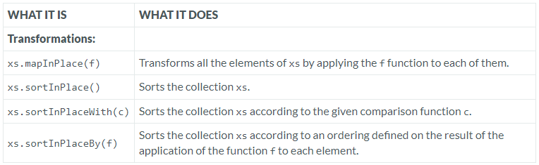

---

### Mutable Index Sequence

### Reference: <https://docs.scala-lang.org/overviews/collections-2.13/seqs.html>

---

The Scala `mutable.IndexedSeq` class provides in-place transformation operations, allowing developers to modify the sequence directly rather than returning a new sequence. This capability is crucial for performance-critical applications where minimizing memory usage and improving execution speed are essential. Let's dive into the specific operations and explore their use cases, performance considerations, and some advanced nuances.



### Operations Overview

#### 1. `mapInPlace(f)`
- **What It Does**: Applies a function `f` to each element of the sequence, replacing each element with the result of the function.
- **Code Snippet**:
  ```scala
  import scala.collection.mutable

  val numbers = mutable.ArrayBuffer(1, 2, 3, 4, 5)
  numbers.mapInPlace(_ * 2)
  println(numbers)  // Output: ArrayBuffer(2, 4, 6, 8, 10)
  ```

#### 2. `sortInPlace()`
- **What It Does**: Sorts the sequence in-place using the natural ordering of its elements.
- **Code Snippet**:
  ```scala
  val nums = mutable.ArrayBuffer(5, 3, 1, 4, 2)
  nums.sortInPlace()
  println(nums)  // Output: ArrayBuffer(1, 2, 3, 4, 5)
  ```

#### 3. `sortInPlaceWith(c)`
- **What It Does**: Sorts the sequence in-place according to a specified comparison function `c`.
- **Code Snippet**:
  ```scala
  nums.sortInPlaceWith((x, y) => y - x)
  println(nums)  // Output: ArrayBuffer(5, 4, 3, 2, 1)
  ```

#### 4. `sortInPlaceBy(f)`
- **What It Does**: Sorts the sequence in-place according to the ordering defined on the result of applying function `f` to each element.
- **Code Snippet**:
  ```scala
  val words = mutable.ArrayBuffer("banana", "apple", "cherry")
  words.sortInPlaceBy(_.length)
  println(words)  // Output: ArrayBuffer(apple, banana, cherry)
  ```

### Real-World Examples and Use Cases

- **Gaming Applications**: For a game that maintains a list of high scores where scores need to be updated and sorted frequently, `sortInPlace()` can be used to keep the high scores in order without creating new collections.


- **Data Processing**: In data analytics, where large data sets may be transformed via functions for normalization or scaling, `mapInPlace(f)` allows these transformations without allocating additional memory for result storage.

### Considerations and Nuances

- **Mutation Side Effects**: While in-place operations reduce memory overhead, they also mutate the collection, which can lead to bugs if the original sequence is assumed to be unchanged elsewhere in the program.


- **Concurrency Issues**: Mutating a collection in-place is not safe in concurrent contexts unless properly synchronized.

### Performance Comparison

- **In-Place vs Immutable Transformations**: In-place transformations generally offer better performance in terms of both time (due to less need for garbage collection) and space (due to not needing to allocate new collections). However, they can lead to less predictable and harder-to-maintain code due to side effects.
- 

### Additional Considerations

- **Algorithmic Efficiency**: The efficiency of sorting algorithms can vary based on the nature of the data. `sortInPlace()` uses an efficient sorting algorithm but might still perform poorly if the data is already nearly sorted and the algorithm does not adapt well to such cases.


- **Functional Programming Paradigm**: Mutating collections in-place goes against the functional programming paradigm, which emphasizes immutability. Depending on the overall design philosophy of your application, using mutable collections may be less ideal.


- **Debugging Complexity**: Debugging issues related to mutated collections can be more challenging because the state of the collection changes over time, making it harder to track down when and where unwanted mutations occur.

In summary, while `mutable.IndexedSeq` operations like `mapInPlace` and `sortInPlace` are powerful tools for performance optimization, they require careful use to avoid issues related to mutation and concurrency. These operations are best used in scenarios where performance is critical and where the mutable state does not compromise the application's architecture or maintainability.

### Resources:

---
