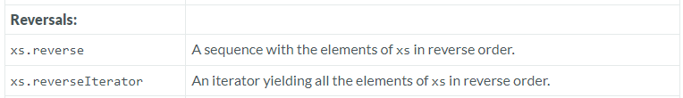

---

### Reversals

### Reference: <https://docs.scala-lang.org/overviews/collections-2.13/seqs.html>

---

The reversal operations `reverse` and `reverseIterator` are common functionalities provided by the Scala `Seq` trait, allowing you to process sequence elements in the opposite order from which they are stored. Understanding these operations and their implications is essential for effective use, especially in scenarios involving data manipulation or algorithm design.



### Real-World Examples and Use Cases

**1. Reverse**
- **Functionality**: Returns a new sequence containing the same elements in reverse order.

- **Common Use Case**: Useful in scenarios where the order of elements needs to be inverted, such as undo stacks in software, processing data in reverse chronological order, or simply reversing a list of items for display purposes.

**Example**:
```scala
val nums = Seq(1, 2, 3, 4, 5)
val reversedNums = nums.reverse
println(reversedNums)  // Output: List(5, 4, 3, 2, 1)
```

**2. ReverseIterator**
- **Functionality**: Provides an iterator that traverses the sequence from the last element to the first.

- **Common Use Case**: Efficient when you need to iterate over elements in reverse without actually creating a reversed collection, which can save memory and time in large sequences.

**Example**:
```scala
val greeting = Seq('H', 'e', 'l', 'l', 'o')
val reverseIter = greeting.reverseIterator
reverseIter.foreach(print)  // Output: olleH
```

### Considerations and Nuances When Using "Reversal Operations"

- **Immutable vs Mutable Sequences**: For immutable sequences, `reverse` returns a new sequence, while mutable sequences can either modify the sequence in-place or return a new one depending on the implementation.

- **Efficiency**: Using `reverse` creates a new collection, which means it consumes memory proportional to the size of the original collection and requires time to copy elements. In contrast, `reverseIterator` does not create a new collection but provides a way to iterate over existing elements in reverse order, which can be more efficient if you don't need the reversed collection for further operations.

### Performance Comparison

- **Memory Usage**: `reverse` creates a new sequence, using additional memory equal to the size of the original sequence. `reverseIterator` uses negligible extra memory since it merely changes the order of iteration.

- **Time Complexity**: Both operations are O(n), where n is the number of elements in the sequence. However, `reverseIterator` can be faster in practice since it avoids the overhead of creating a new sequence.

### Additional Considerations

- **Method Chaining**: Both `reverse` and `reverseIterator` can be used in method chains, but the iterator should be used with care to avoid exhausting it accidentally in mid-chain.

- **Thread Safety**: Neither operation inherently provides thread safety. If the sequence is being modified concurrently, external synchronization is necessary.

- **Practical Application**: For tasks like text processing (reversing a string or checking palindromes) or handling user actions (like undo mechanisms in applications where actions are stored in a sequence), reversal operations are straightforward and practical solutions.

### Summary

The `reverse` and `reverseIterator` operations in Scala's `Seq` trait are powerful tools for working with sequences in reverse order. The choice between using `reverse` or `reverseIterator` should be guided by the need for a new reversed collection versus the efficiency of traversing elements in reverse order. Understanding these methods and their implications helps in optimizing performance and resource usage in Scala applications, making them better suited to handle a variety of real-world programming scenarios.

---
