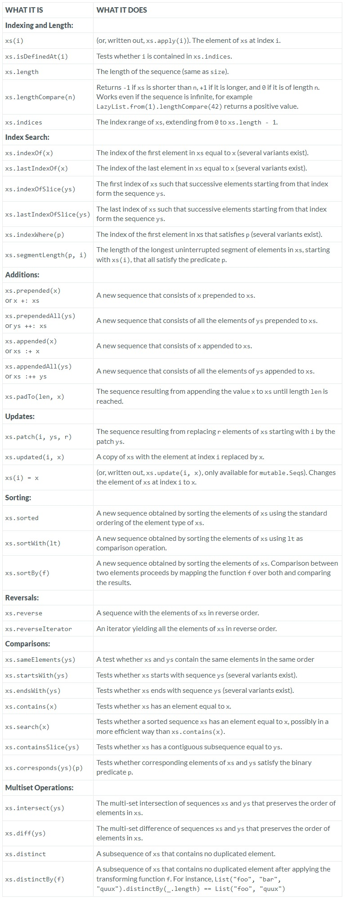
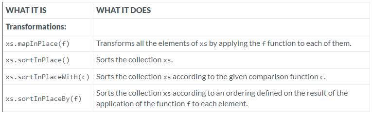
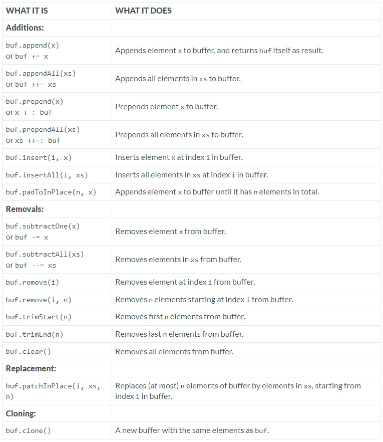

---

### Sequence

### Reference: <https://docs.scala-lang.org/overviews/collections-2.13/seqs.html>

---

The [Seq](https://www.scala-lang.org/api/current/scala/collection/Seq.html "Visit Seq") trait represents sequences. A sequence is a kind of iterable that has a `length` and whose elements have fixed index positions, starting from` 0`.

The operations on sequences, summarized in the table below, fall into the following categories:

• **[Indexing and length operations](./INDEXING_AND_LENGTH.md "Visit INDEXING_AND_LENGTH.md")**:
`apply`,  `isDefinedAt`,  `length`,  `indices`,  and  `lengthCompare`.
For a `Seq`,  the `apply` operation means indexing; hence a sequence of type `Seq[T]` is a partial function that takes an `Int` argument (an index) and which yields a sequence element of type `T`.  In other words `Seq[T]` extends `PartialFunction[Int, T]`.
The elements of a sequence are indexed from zero up to the `length` of the sequence minus one.
The `length` method on sequences is an alias of the `size` method of general collections.
The `lengthCompare` method allows you to compare the lengths of a sequences with an Int or with an `Iterable` even if the sequences has infinite length.

• **[Index search operations](./INDEX_SEARCH.md "Visit INDEX_SEARCH.md")**:
`indexOf`, `lastIndexOf`,  `indexOfSlice`,  `lastIndexOfSlice`,  `indexWhere`,  `lastIndexWhere`,  `segmentLength`, which return the index of an element equal to a given value or matching some predicate.

• **[Addition operations](./ADDITIONS.md "Visit ADDITIONS.md")**:
`prepended`, `prependedAll`, `appended`, `appendedAll`, `padTo`, which return new sequences obtained by adding elements at the front or the end of a sequence.

• **[Update operations](./UPDATES.md "Visit UPDATES.md")**:
`updated`, `patch`, which return a new sequence obtained by replacing some elements of the original sequence.

• **[Sorting operations](./SORTING.md "Visit SORTING.md")**:
`sorted`, `sortWith`, `sortBy`, which sort sequence elements according to various criteria.

• **[Reversal operations](./REVERSALS.md "Visit REVERSALS.md")**:
`reverse`, `reverseIterator`, which yield or process sequence elements in reverse order.

• **[Comparisons operations](./COMPARISONS.md "Visit COMPARISONS.md")**:
`startsWith`,` endsWith`, `contains`, `containsSlice`, `corresponds`, `search`, which relate two sequences or search an element in a sequence.

• **[Multiset operations](./MULTISET_OPERATIONS.md "Visit MULTISET_OPERATIONS.md")**:
`intersect`, `diff`, `distinct`, `distinctBy`, which perform set-like operations on the elements of two sequences or remove duplicates. 

If a sequence is mutable, it offers in addition a side-effecting `update` method, which lets sequence elements be updated.

As always in Scala, syntax like `seq(idx) = elem` is just a shorthand for `seq.update(idx, elem)`, so `update` gives convenient assignment syntax for free.

Note the difference between `update` and `updated`.
`update` changes a sequence element in place, and is only available for mutable sequences.
`updated` is available for all sequences and always returns a new sequence instead of modifying the original.

### **Operations in Class Seq**

Trait [Seq](https://www.scala-lang.org/api/current/scala/collection/Seq.html "Visit Seq") has two subtraits [LinearSeq](https://www.scala-lang.org/api/current/scala/collection/LinearSeq.html "Visit Linear Sequence"), and [IndexedSeq](https://www.scala-lang.org/api/current/scala/collection/IndexedSeq.html "Visit Indexed Sequence"). These do not add any new operations to the immutable branch, but each offers different performance characteristics:

A linear sequence has efficient `head` and `tail` operations, whereas an indexed sequence has efficient `apply`, `length`, and (if mutable) `update` operations.

Frequently used linear sequences are `scala.collection.immutable.List` and `scala.collection.immutable.LazyList`.

Frequently used indexed sequences are `scala.Array` and `scala.collection.mutable.ArrayBuffer`.

The `Vector` class provides an interesting compromise between indexed and linear access. It has both effectively constant time indexing overhead and constant time linear access overhead. Because of this, vectors are a good foundation for mixed access patterns where both indexed and linear accesses are used. You’ll learn more on vectors [later](https://docs.scala-lang.org/overviews/collections-2.13/concrete-immutable-collection-classes.html "Visit Immutable Collection").

On the mutable branch, `IndexedSeq` adds operations for transforming its elements in place (by contrast with transformation operations such as `map` and `sort`, available on the root `Seq`, which return a new collection instance).

### Operations in Class **[mutable.IndexedSeq](./MUTABLE_INDEX_SEQUENCE.md "Visit MUTABLE_INDEX_SEQUENCE.md")**

#### **[Buffer](./BUFFERS.md "Visit BUFFERS.md")**

An important sub-category of mutable sequences is `Buffers`. They allow not only updates of existing elements but also element additions, insertions and removals. The principal new methods supported by a buffer are `append` and `appendAll` for element addition at the end, `prepend` and `prependAll` for addition at the front, `insert` and `insertAll` for element insertions, as well as `remove`, `subtractOne` and `subtractAll` for element removal. These operations are summarized in the following table.

Two often used implementations of buffers are `ListBuffer` and `ArrayBuffer`. As the name implies, a `ListBuffer` is backed by a `List`, and supports efficient conversion of its elements to a `List`, whereas an `ArrayBuffer` is backed by an array, and can be quickly converted into one.

#### Operations in Class Buffer

### Resources:
- Iterable: https://www.analyticsvidhya.com/blog/2021/07/everything-you-should-know-about-iterables-and-iterators-in-python-as-a-data-scientist/#:~:text=Iterable%20is%20an%20object%20which,that%20you%20can%20loop%20over.

---
