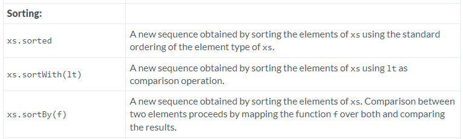

---

### Sorting

### Reference: <https://docs.scala-lang.org/overviews/collections-2.13/seqs.html>

---

In Scala, the `Seq` trait provides several methods for sorting sequences. These methods are `sorted`, `sortWith`, and `sortBy`. Each offers a way to sort the elements of the sequence based on different criteria or custom rules. These sorting operations help you manipulate and prepare data for processing or display, making them essential for any situation where order matters.



### 1. `sorted`

- **Functionality**: Sorts the elements of the sequence into their natural ordering, which requires that the elements are instances of `Ordered`, or there is an implicit `Ordering[T]` available.
- **Usage**:
  ```scala
  val numbers = Seq(3, 1, 4, 1, 5, 9, 2, 6, 5, 3, 5)
  val sortedNumbers = numbers.sorted
  println(sortedNumbers)  // Output: List(1, 1, 2, 3, 3, 4, 5, 5, 5, 6, 9)
  ```

### 2. `sortWith`

- **Functionality**: Sorts the elements of the sequence based on a comparison function provided by the user. This method allows for more control over the sort order.
- **Usage**:
  ```scala
  val numbers = Seq(3, 1, 4, 1, 5, 9, 2, 6, 5, 3, 5)
  val sortedWith = numbers.sortWith((a, b) => a < b)  // Ascending order
  println(sortedWith)  // Output: List(1, 1, 2, 3, 3, 4, 5, 5, 5, 6, 9)

  val sortedDescending = numbers.sortWith((a, b) => a > b)  // Descending order
  println(sortedDescending)  // Output: List(9, 6, 5, 5, 5, 4, 3, 3, 2, 1, 1)
  ```

### 3. `sortBy`

- **Functionality**: Sorts the elements of the sequence based on a specific attribute or calculation as determined by a function you provide.
- **Usage**:
  ```scala
  case class Person(name: String, age: Int)
  val people = Seq(Person("Alice", 30), Person("Bob", 25), Person("Carol", 32))

  val sortedByAge = people.sortBy(_.age)
  println(sortedByAge)  // Output: List(Person(Bob,25), Person(Alice,30), Person(Carol,32))

  val sortedByName = people.sortBy(_.name)
  println(sortedByName)  // Output: List(Person(Alice,30), Person(Bob,25), Person(Carol,32))
  ```
  
### Examples and Use Cases

#### Natural Sorting with `sorted`

This method is typically used when elements have a natural order that you wish to apply, such as sorting numbers or characters:

```scala
val letters = Seq('b', 'a', 'e', 'c', 'd')
val sortedLetters = letters.sorted
println(sortedLetters) // Output: List(a, b, c, d, e)
```

#### Custom Comparison with `sortWith`

If you need more control over the sorting process, for instance, if you want to sort a list of tuples based on the second element:

```scala
val pairs = Seq((2, "b"), (1, "a"), (3, "c"))
val sortedPairs = pairs.sortWith(_._2 < _._2)
println(sortedPairs) // Output: List((1, "a"), (2, "b"), (3, "c"))
```

Consider a real-world scenario where you might need to sort a list of tasks by priority and due date:

```scala
case class Task(description: String, priority: Int, dueDate: java.time.LocalDate)

val tasks = Seq(
  Task("Wash the car", 3, java.time.LocalDate.of(2023, 7, 15)),
  Task("Pay bills", 1, java.time.LocalDate.of(2023, 7, 3)),
  Task("Schedule appointment", 2, java.time.LocalDate.of(2023, 7, 10))
)

// Sort by priority (ascending), then by due date (ascending)
val sortedTasks = tasks.sortWith((a, b) =>
  (a.priority < b.priority) || (a.priority == b.priority && a.dueDate.isBefore(b.dueDate))
)

println(sortedTasks)
// Output: Task(Pay bills, 1, 2023-07-03), Task(Schedule appointment, 2, 2023-07-10), Task(Wash the car, 3, 2023-07-15)
```

#### Sorting by Derived Values with `sortBy`

`sortBy` is ideal when sorting by a derived attribute. For instance, if sorting a list of products by price:

```scala
case class Product(name: String, price: Double)
val inventory = Seq(Product("apple", 1.0), Product("pear", 0.75), Product("banana", 0.50))
val sortedInventory = inventory.sortBy(_.price)
sortedInventory.foreach(p => println(s"${p.name} costs ${p.price}"))
// Output:
// banana costs 0.5
// pear costs 0.75
// apple costs 1.0
```

### Summary

- **`sorted`**: Provides a simple way to sort sequences into their natural order or according to an implicit ordering.
- **`sortWith`**: Allows for complex sorting logic with a custom comparison function.
- **`sortBy`**: Facilitates sorting based on a specific attribute or derived value.

These sorting methods enable efficient and straightforward data organization within Scala collections, making them indispensable for data manipulation and analysis tasks. Understanding and using these methods effectively can greatly enhance the capability to handle and prepare data in your Scala applications.

### Resources

---
