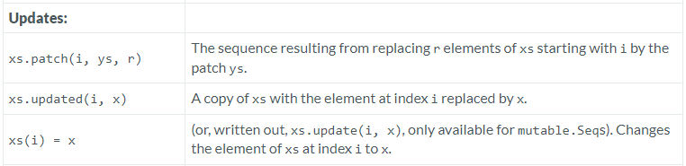

---

### Updates

### Reference: <https://docs.scala-lang.org/overviews/collections-2.13/seqs.html>

---

In Scala, sequences under the `Seq` trait provide methods such as `patch`, `updated`, and `update` that allow for creating modified versions of the sequence by replacing elements. These operations are particularly useful when working with immutable sequences, where direct element modification is not allowed and mutable sequence where direct element modification is allowed. 

Here's how each method works:



### 1. `patch`

- **Functionality**: Returns a new sequence obtained by replacing a specific slice of the sequence with another sequence. This method takes three arguments: the start index, the sequence to insert, and the number of elements to delete at the start index.
- **Usage**:
  ```scala
  val seq = Seq(1, 2, 3, 4, 5)
  val patchSeq = Seq(8, 9)
  val newSeq = seq.patch(2, patchSeq, 2)  // Start at index 2, replace 2 elements with patchSeq
  println(newSeq)  // Output: List(1, 2, 8, 9, 5)
  ```

- **Details**: The `patch` method is versatile, allowing you to specify how many elements to replace, which makes it more powerful than `updated` for certain scenarios. It's especially useful for larger, more complex modifications.

### 2. `updated`

- **Functionality**: Returns a new sequence by replacing the element at a specified index with a new element. If the index is out of bounds, it throws an `IndexOutOfBoundsException`.
- **Usage**:
  ```scala
  val seq = Seq(1, 2, 3, 4, 5)
  val newSeq = seq.updated(2, 10)  // Replace element at index 2 with 10
  println(newSeq)  // Output: List(1, 2, 10, 4, 5)
  ```

- **Details**: This method is a safe way to replace an element in an immutable sequence. It effectively creates a new sequence with the specified change and leaves the original sequence unmodified.

### Example Scenarios

#### Using `patch`

Imagine you need to update a list of scheduled tasks by replacing some tasks with new ones:

```scala
val tasks = Seq("Write report", "Meet with team", "Code review", "Client meeting")
val newTasks = Seq("Update project plan", "Team lunch")
val updatedTasks = tasks.patch(1, newTasks, 2)
println(updatedTasks)  // Output: List(Write report, Update project plan, Team lunch, Client meeting)
```

Here, `patch` replaces two tasks starting from index 1 with a new set of tasks, demonstrating its capability for handling more complex replacements.

#### Using `updated`

Suppose you have a list of monthly expenses and need to update the expense of a particular month:

```scala
val expenses = Seq(1200, 1300, 1250, 1400)
val updatedExpenses = expenses.updated(2, 1350)  // Increase March's expense
println(updatedExpenses)  // Output: List(1200, 1300, 1350, 1400)
```

This scenario shows how `updated` can be used to make a simple replacement in an immutable sequence.

### 3. `update`

In Scala, managing data structures effectively often involves understanding the distinction between mutable and immutable collections. Scala's `Seq` trait, which you can use to represent sequences, has both mutable and immutable variants. Let's explore how element update operations differ between these types.

### Updating Elements in Mutable Sequences

For mutable sequences, Scala provides direct methods to update the elements. This is essential in scenarios where the sequence needs to change frequently, or where performance implications make immutability impractical.

#### Syntax and Method

- **Direct Assignment (`xs(i) = x`)**: This is the conventional way to update an element in a mutable sequence. It is straightforward and similar to array manipulation in languages like Java and C#.
- **`update` Method (`xs.update(i, x)`)**: This method achieves the same result as the direct assignment. It's more explicit and can make the code clearer in some contexts.

Here is how you can use these methods:

```scala
import scala.collection.mutable.ArrayBuffer

val xs = ArrayBuffer(1, 2, 3, 4, 5)

// Using direct assignment
xs(2) = 10
println(xs)  // Output: ArrayBuffer(1, 2, 10, 4, 5)

// Using update method
xs.update(2, 20)
println(xs)  // Output: ArrayBuffer(1, 2, 20, 4, 5)
```

### Immutable Sequences

Immutable sequences, such as those derived from `immutable.Seq`, do not allow direct modification of elements because immutability is a core principle in functional programming and Scala. However, you can achieve a similar result by creating a new sequence where the specific element is replaced, without modifying the original sequence.

```scala
val ys = Seq(1, 2, 3, 4, 5)

// Attempting to change directly will cause a compile-time error:
// ys(2) = 10  // This line would not compile if uncommented.

// Instead, create a new sequence with the change:
val newSeq = ys.updated(2, 10)
println(newSeq)  // Output: List(1, 2, 10, 4, 5)
```

This approach maintains the immutability of `ys` while providing an updated sequence in `newSeq`.

### Example with a Real-Time Scenario

Consider a scenario where you need to update a sequence of temperatures recorded hourly with a correction factor:

```scala
val temperatures = ArrayBuffer(72, 68, 71, 70, 73)  // Temperatures in Fahrenheit
val correctionFactor = -2  // Correction factor

for (i <- temperatures.indices) {
  temperatures(i) += correctionFactor  // Adjust each temperature
}

println(temperatures)  // Output: ArrayBuffer(70, 66, 69, 68, 71)
```

In this example, each temperature in the sequence is reduced by two degrees, demonstrating how the `update` method can be effectively used to handle in-place modifications.

### Practical Considerations

- **Index Bounds**: You must ensure that the index `i` is within the bounds of the collection to avoid `IndexOutOfBoundsException`. This is a runtime check, and exceeding bounds will result in an error.
- **Performance**: Mutations in mutable collections are generally faster and use less memory than creating a new collection, as is required with immutable collections.
- **Concurrency**: Immutable collections are inherently thread-safe and do not require additional synchronization. Mutable collections, however, can introduce concurrency issues if not handled properly.
- **Functional Programming**: Using immutable collections encourages a functional style of programming, which leads to fewer side effects and more predictable code.

### Conclusion

In Scala, choosing between mutable and immutable sequences depends on the specific requirements of your application, including considerations of performance, concurrency, and programming style. Mutable sequences allow direct updates, while immutable sequences promote functional programming principles by preventing direct modifications and encouraging transformations that result in new sequences.

- **`patch`**:
    - Replaces a slice of the sequence with another sequence, with control over how many elements to replace.
    - Ideal for more extensive modifications or updates involving multiple elements.


- **`updated`**:
    - Replaces a single element at a specified index.
    - Useful for minor, precise modifications in a sequence.

Above methods `patch` and `updated` are essential in Scala for working with immutable sequences, as they respect immutability while allowing flexible and efficient modifications. They help maintain the functional programming paradigm of immutability, ensuring that original data structures are not altered.

- **`update`**:
    - Using the `update` method in mutable sequences allows for efficient, in-place modifications of data structures in Scala.
    - It's a powerful feature when you need to manage state changes dynamically within your Scala applications, particularly in performance-critical contexts where immutability would introduce excessive overhead or complexity.

### Resources:

---