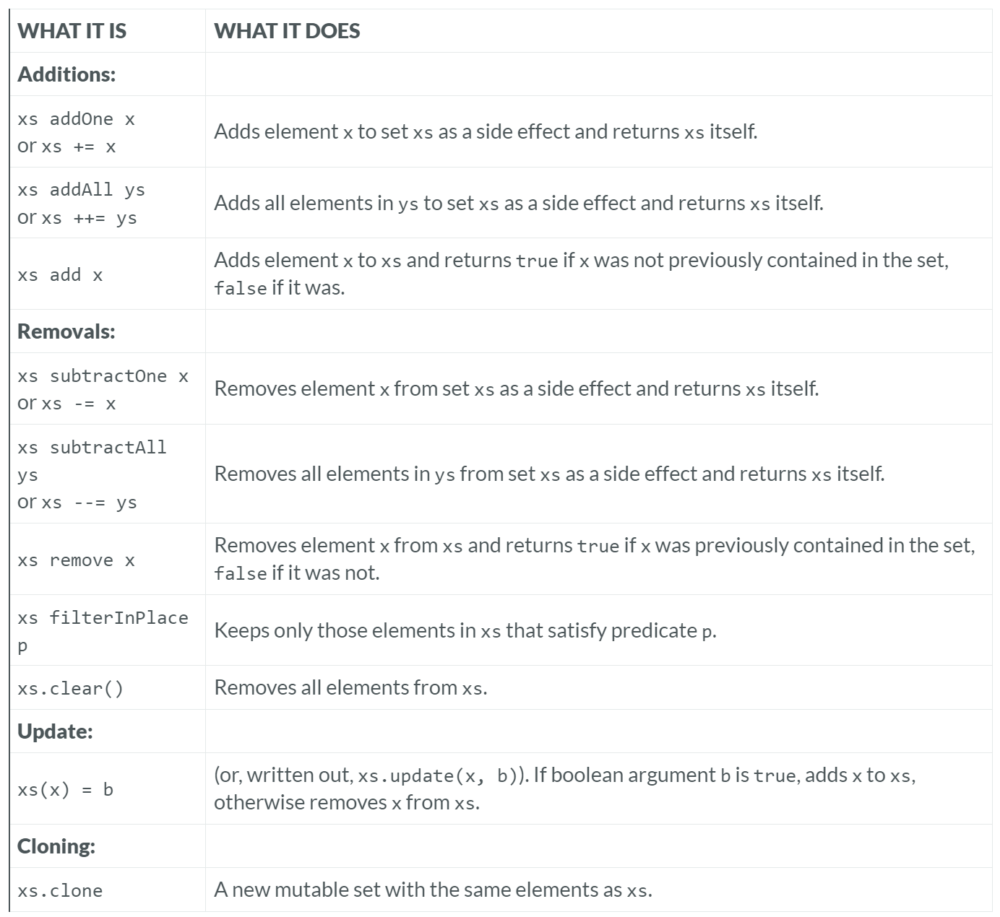

---

### Mutable Set

### Reference: <https://docs.scala-lang.org/overviews/collections-2.13/sets.html>

---

### Operations in Class `mutable.Set`

Scala's `mutable.Set` provides a set of operations that allow you to modify the set in place. This mutability can lead to more efficient updates and lower memory usage compared to immutable sets but requires careful handling to avoid unintended side effects.

Here’s an in-depth look at these operations with real-world examples, code snippets, and different use cases.



### Additions

#### `xs addOne x` or `xs += x`
- **Purpose**: Adds an element `x` to the set `xs`.
- **Example**:
  ```scala
  import scala.collection.mutable

  val set = mutable.Set(1, 2, 3)
  set.addOne(4) // or set += 4
  println(set)  // Output: Set(1, 2, 3, 4)
  ```

- **Real-World Use Case**: Adding a new user ID to a set of active user IDs.
  ```scala
  val activeUsers = mutable.Set("user1", "user2", "user3")
  activeUsers += "user4"
  println(activeUsers)  // Output: Set(user1, user2, user3, user4)
  ```

#### `xs addAll ys` or `xs ++= ys`
- **Purpose**: Adds all elements in the collection `ys` to the set `xs`.
- **Example**:
  ```scala
  val set = mutable.Set(1, 2, 3)
  set.addAll(Set(4, 5)) // or set ++= Set(4, 5)
  println(set)  // Output: Set(1, 2, 3, 4, 5)
  ```

- **Real-World Use Case**: Adding a set of new features to an existing set of product features.
  ```scala
  val productFeatures = mutable.Set("feature1", "feature2")
  val newFeatures = Set("feature3", "feature4")
  productFeatures ++= newFeatures
  println(productFeatures)  // Output: Set(feature1, feature2, feature3, feature4)
  ```

#### `xs add x`
- **Purpose**: Adds an element `x` to the set `xs` if it is not already present.
- **Example**:
  ```scala
  val set = mutable.Set(1, 2, 3)
  set.add(4)
  println(set)  // Output: Set(1, 2, 3, 4)
  ```

- **Real-World Use Case**: Adding a new tag to a set of tags if it does not already exist.
  ```scala
  val tags = mutable.Set("Scala", "Programming")
  tags.add("Functional")
  println(tags)  // Output: Set(Scala, Programming, Functional)
  ```

### Removals

#### `xs subtractOne x` or `xs -= x`
- **Purpose**: Removes an element `x` from the set `xs`.
- **Example**:
  ```scala
  val set = mutable.Set(1, 2, 3, 4)
  set.subtractOne(3) // or set -= 3
  println(set)  // Output: Set(1, 2, 4)
  ```

- **Real-World Use Case**: Removing a user ID from a set of active user IDs when the user logs out.
  ```scala
  val activeUsers = mutable.Set("user1", "user2", "user3")
  activeUsers -= "user2"
  println(activeUsers)  // Output: Set(user1, user3)
  ```

#### `xs subtractAll ys` or `xs --= ys`
- **Purpose**: Removes all elements in the collection `ys` from the set `xs`.
- **Example**:
  ```scala
  val set = mutable.Set(1, 2, 3, 4, 5)
  set.subtractAll(Set(2, 4)) // or set --= Set(2, 4)
  println(set)  // Output: Set(1, 3, 5)
  ```

- **Real-World Use Case**: Removing a set of discontinued product IDs from a set of active product IDs.
  ```scala
  val activeProducts = mutable.Set("prod1", "prod2", "prod3", "prod4")
  val discontinuedProducts = Set("prod2", "prod4")
  activeProducts --= discontinuedProducts
  println(activeProducts)  // Output: Set(prod1, prod3)
  ```

#### `xs remove x`
- **Purpose**: Removes an element `x` from the set `xs` and returns `true` if the element was present.
- **Example**:
  ```scala
  val set = mutable.Set(1, 2, 3)
  set.remove(2)
  println(set)  // Output: Set(1, 3)
  ```

- **Real-World Use Case**: Removing a permission from a set of user permissions.
  ```scala
  val permissions = mutable.Set("read", "write", "execute")
  permissions.remove("write")
  println(permissions)  // Output: Set(read, execute)
  ```

#### `xs filterInPlace p`
- **Purpose**: Retains only those elements in the set `xs` that satisfy the predicate `p`.
- **Example**:
  ```scala
  val set = mutable.Set(1, 2, 3, 4, 5)
  set.filterInPlace(_ % 2 == 0)
  println(set)  // Output: Set(2, 4)
  ```

- **Real-World Use Case**: Keeping only even numbers in a set of integers.
  ```scala
  val numbers = mutable.Set(1, 2, 3, 4, 5)
  numbers.filterInPlace(_ % 2 == 0)
  println(numbers)  // Output: Set(2, 4)
  ```

#### `xs.clear()`
- **Purpose**: Removes all elements from the set `xs`.
- **Example**:
  ```scala
  val set = mutable.Set(1, 2, 3)
  set.clear()
  println(set)  // Output: Set()
  ```

- **Real-World Use Case**: Clearing a set of temporary files after processing.
  ```scala
  val tempFiles = mutable.Set("temp1", "temp2", "temp3")
  tempFiles.clear()
  println(tempFiles)  // Output: Set()
  ```

### Update

#### `xs(x) = b`
- **Purpose**: Adds or removes the element `x` from the set `xs` depending on the boolean value `b`.
- **Example**:
  ```scala
  val set = mutable.Set(1, 2, 3)
  set(4) = true  // Adds 4
  set(2) = false // Removes 2
  println(set)  // Output: Set(1, 3, 4)
  ```

- **Real-World Use Case**: Dynamically updating a set of feature flags.
  ```scala
  val featureFlags = mutable.Set("feature1", "feature2")
  featureFlags("feature3") = true  // Enable feature3
  featureFlags("feature2") = false // Disable feature2
  println(featureFlags)  // Output: Set(feature1, feature3)
  ```

### Cloning

#### `xs.clone`
- **Purpose**: Creates a shallow copy of the set `xs`.
- **Example**:
  ```scala
  val set = mutable.Set(1, 2, 3)
  val clonedSet = set.clone()
  println(clonedSet)  // Output: Set(1, 2, 3)
  ```

- **Real-World Use Case**: Creating a copy of a set before performing operations that might modify the original set.
  ```scala
  val originalSet = mutable.Set("a", "b", "c")
  val backupSet = originalSet.clone()
  originalSet += "d"
  println(originalSet)  // Output: Set(a, b, c, d)
  println(backupSet)    // Output: Set(a, b, c)
  ```

### Considerations and Nuances

1. **Mutability**: Mutable sets allow in-place modifications, which can improve performance and reduce memory usage but can also introduce potential side effects and concurrency issues if not handled carefully.

2. **Thread Safety**: Mutable sets are not thread-safe by default. If you need to use them in a concurrent environment, consider synchronizing access or using concurrent collections like `ConcurrentHashMap`.

3. **Memory Management**: While mutable sets can reduce the overhead of creating new collections, they must be managed carefully to avoid unintended modifications and memory leaks.

### Performance Comparison

- **Additions and Removals**: Mutable sets generally offer O(1) time complexity for `add`, `remove`, and `contains` operations when implemented as hash sets. Tree-based implementations (like `TreeSet`) offer O(log n) complexity but maintain sorted order.

- **Batch Operations**: Batch operations (`addAll`, `subtractAll`) can be more efficient than performing multiple single operations due to reduced overhead.

### Additional Considerations

1. **Use Case Suitability**: Mutable sets are ideal for scenarios where performance and memory efficiency are critical, and the potential side effects of mutability can be managed.

2. **Error Handling**: Ensure proper error handling when performing operations that might fail, such as removing elements that may not exist in the set.

3. **API Consistency**: Scala's mutable sets provide a rich API that aligns closely with the immutable set API, making it easier to switch between mutable and immutable collections as needed.

By understanding and utilizing these operations, developers can effectively manage and manipulate mutable sets in Scala, leveraging their performance benefits while being mindful of the considerations and potential pitfalls associated with mutability.

---

### **Using `+=` and `-=` with Sets: Layman Explanation**

Imagine you have a box of fruits (a set of fruits). There are two types of boxes: one that you can change the contents inside (mutable) and one that you can't change, but you can replace the entire box (immutable).

1. **Immutable Box (Set)**:
  - You can’t change what’s inside, but you can replace the whole box with a new one.
  - When you add or remove a fruit, you get a new box with the updated contents.
  - Example:
    ```scala
    var fruits = Set("apple", "banana", "cherry")
    fruits += "date"  // Creates a new box with "date" added
    fruits -= "banana"  // Creates a new box without "banana"
    ```

2. **Mutable Box (Set)**:
  - You can directly change what’s inside without getting a new box.
  - Adding or removing a fruit changes the contents of the same box.
  - Example:
    ```scala
    val fruits = collection.mutable.Set("apple", "banana", "cherry")
    fruits += "date"  // Adds "date" to the same box
    fruits -= "banana"  // Removes "banana" from the same box
    ```

**Key Insight:**
- The `+=` and `-=` operations can be used with both mutable and immutable sets.
- For immutable sets, these operations replace the set with a new one (you need to use `var`).
- For mutable sets, these operations modify the set directly (you use `val`).

### Detailed Explanation

#### Immutable Sets

**Immutable Set in Depth:**

- **Definition**: Immutable sets do not allow modification of their elements. Any operation that seems to modify the set actually returns a new set with the changes, leaving the original set unchanged.
- **Syntax**:
  - `var s = Set(1, 2, 3)`: Creates an immutable set `s`.
  - `s += 4`: This operation does not modify `s` in place. Instead, it is shorthand for `s = s + 4`, which creates a new set including the element `4` and assigns it back to `s`.
  - `s -= 2`: Similarly, this is shorthand for `s = s - 2`, creating a new set excluding the element `2` and assigning it back to `s`.

**Example**:
```scala
var s = Set(1, 2, 3)
s += 4  // s is now Set(1, 2, 3, 4)
s -= 2  // s is now Set(1, 3, 4)
```

**Mechanism**:
- **Addition (`+=`)**:
  - `s += 4` translates to `s = s + 4`.
  - The `+` method on an immutable set returns a new set with the added element.
  - The original set remains unchanged; `s` now references the new set.
- **Removal (`-=`)**:
  - `s -= 2` translates to `s = s - 2`.
  - The `-` method on an immutable set returns a new set with the specified element removed.
  - The original set remains unchanged; `s` now references the new set.

**Benefits**:
- **Immutability**: Ensures that sets are not changed inadvertently, which is useful in concurrent programming where shared data structures are common.
- **Functional Programming**: Aligns with the principles of functional programming, promoting immutability and pure functions.

#### Mutable Sets

**Mutable Set in Depth:**

- **Definition**: Mutable sets allow direct modification of their elements. Operations that modify the set do so in place, changing the original set without creating a new one.
- **Syntax**:
  - `val s = collection.mutable.Set(1, 2, 3)`: Creates a mutable set `s`.
  - `s += 4`: This operation modifies `s` in place, adding the element `4` to the set.
  - `s -= 2`: This operation modifies `s` in place, removing the element `2` from the set.

**Example**:
```scala
val s = collection.mutable.Set(1, 2, 3)
s += 4  // s is now Set(1, 2, 3, 4)
s -= 2  // s is now Set(1, 3, 4)
```

**Mechanism**:
- **Addition (`+=`)**:
  - `s += 4` invokes the `+=` method on the mutable set, adding `4` directly to the set.
  - The set `s` is modified in place.
- **Removal (`-=`)**:
  - `s -= 2` invokes the `-=` method on the mutable set, removing `2` directly from the set.
  - The set `s` is modified in place.

**Benefits**:
- **Efficiency**: Modifying elements in place is generally more efficient than creating new sets, especially for large sets or frequent updates.
- **Use Case Fit**: Suitable for scenarios where the set needs to be updated frequently, and immutability is not a concern.

### Comparing Immutable and Mutable Sets

**Similarity in Code**:
- The operations look similar (`+=` and `-=`) for both immutable and mutable sets.
- This similarity allows you to switch between mutable and immutable sets with minimal code changes, provided the context (mutability vs. immutability) is handled correctly.

**Differences in Behavior**:
- **Immutable Set**: Operations result in a new set being created and assigned to the variable. Original set remains unchanged.
- **Mutable Set**: Operations modify the original set in place. No new set is created.

**Example Comparison**:

*Immutable Set*:
```scala
var s = Set(1, 2, 3)  // Immutable set
s += 4  // Creates a new set: Set(1, 2, 3, 4)
s -= 2  // Creates a new set: Set(1, 3, 4)
println(s)  // Output: Set(1, 3, 4)
```

*Mutable Set*:
```scala
val s = collection.mutable.Set(1, 2, 3)  // Mutable set
s += 4  // Modifies the set in place: Set(1, 2, 3, 4)
s -= 2  // Modifies the set in place: Set(1, 3, 4)
println(s)  // Output: Set(1, 3, 4)
```

**Key Principle**:
- **Interchangeability**: You can replace a mutable collection stored in a `val` by an immutable collection stored in a `var`, and vice versa, as long as there are no alias references to the collection. This flexibility allows you to choose the appropriate set type based on the specific requirements of your application (e.g., performance, mutability constraints).

By understanding these operations and their implications, you can make informed decisions about whether to use mutable or immutable sets in Scala, ensuring that your code is both efficient and easy to maintain.

---

### Practical Example

Let's explore a practical example that demonstrates how to switch between using an immutable set for safety and a mutable set for performance, and vice versa, while maintaining the overall structure of the code.

### Initial Scenario: Immutable Set for Safety

Suppose you have a web application where you need to keep track of active user sessions. For safety, you start with an immutable set to ensure that the session data is not accidentally modified by other parts of the code.

**Step 1: Using Immutable Set**

```scala
object SessionManager {
  private var activeSessions = Set[String]()

  def addSession(sessionId: String): Unit = {
    activeSessions += sessionId
  }

  def removeSession(sessionId: String): Unit = {
    activeSessions -= sessionId
  }

  def getSessions: Set[String] = activeSessions
}

object Main extends App {
  SessionManager.addSession("session1")
  SessionManager.addSession("session2")
  println(SessionManager.getSessions)  // Output: Set(session1, session2)
  SessionManager.removeSession("session1")
  println(SessionManager.getSessions)  // Output: Set(session2)
}
```

### Changing Requirements: Need for Performance

Later, you realize that the application needs to handle a high volume of session updates, and the performance of immutable sets (due to frequent copying) is becoming a bottleneck. You decide to switch to a mutable set to improve performance.

**Step 2: Switching to Mutable Set**

To switch to a mutable set, you can update the `SessionManager` implementation. The overall structure of the code remains the same, but the internal representation changes from immutable to mutable.

```scala
import scala.collection.mutable

object SessionManager {
  private val activeSessions = mutable.Set[String]()

  def addSession(sessionId: String): Unit = {
    activeSessions += sessionId
  }

  def removeSession(sessionId: String): Unit = {
    activeSessions -= sessionId
  }

  def getSessions: Set[String] = activeSessions.toSet
}

object Main extends App {
  SessionManager.addSession("session1")
  SessionManager.addSession("session2")
  println(SessionManager.getSessions)  // Output: Set(session1, session2)
  SessionManager.removeSession("session1")
  println(SessionManager.getSessions)  // Output: Set(session2)
}
```

### Reverting to Immutable Set for Safety

If the requirements change again, and you need to revert to an immutable set for safety (e.g., due to new multi-threading concerns), you can do so easily by changing the internal implementation back to using an immutable set, while keeping the interface the same.

**Step 3: Reverting to Immutable Set**

```scala
object SessionManager {
  private var activeSessions = Set[String]()

  def addSession(sessionId: String): Unit = {
    activeSessions += sessionId
  }

  def removeSession(sessionId: String): Unit = {
    activeSessions -= sessionId
  }

  def getSessions: Set[String] = activeSessions
}

object Main extends App {
  SessionManager.addSession("session1")
  SessionManager.addSession("session2")
  println(SessionManager.getSessions)  // Output: Set(session1, session2)
  SessionManager.removeSession("session1")
  println(SessionManager.getSessions)  // Output: Set(session2)
}
```

### Summary

1. **Initial Approach**: Start with an immutable set for safety, ensuring that session data is not accidentally modified.
2. **Performance Optimization**: Switch to a mutable set to handle high-volume updates more efficiently, while keeping the code structure largely unchanged.
3. **Reverting Back**: If needed, revert back to an immutable set for added safety, especially in multi-threaded environments.

By encapsulating the set operations within the `SessionManager` object and using method interfaces (`addSession`, `removeSession`, `getSessions`), you maintain flexibility in switching between immutable and mutable sets based on changing requirements, without significant changes to the overall code structure.

---

### **Advanced Concept: Mutable Sets vs Immutable Set**

### Layman's Explanation

Imagine you have two types of containers to store your toys:

1. **Mutable Container**: This is like a big box with many compartments (a hashtable). Each compartment can hold one toy, and the box is designed to quickly find which compartment a toy is in. This is good for large collections of toys but might be a bit bulky for just a few toys.

2. **Immutable Container**: This container changes its shape depending on how many toys you have:
- **No Toys**: It’s just a tiny box.
- **Few Toys (up to 4)**: It’s a small box with special slots for each toy.
- **Many Toys**: It becomes a more complex, but still efficient, structure that can hold a lot of toys in a compact way.

For small collections of toys (say up to 4), the immutable container is smaller and quicker to use than the mutable container. So, if you know you won’t have many toys, it’s better to use the immutable container.

### Detailed Explanation

#### Mutable Set Implementation

The current default implementation of a **mutable set** in Scala uses a **hashtable**. Here’s how it works:

- **Hashtable**: This is a data structure that uses an array of buckets to store elements. Each element is placed into a bucket based on its hash code. This allows for efficient average-time complexity of O(1) for common operations like adding, removing, and checking for the presence of elements.

**Advantages**:
- Efficient for large sets due to constant time complexity for operations.
- Dynamically resizes as the number of elements grows.

**Disadvantages**:
- Memory overhead due to the array and possible collisions (where multiple elements end up in the same bucket).
- Not as compact for small sets because of the fixed overhead of the hashtable structure.

#### Immutable Set Implementation

The default implementation of an **immutable set** in Scala adapts to the number of elements it contains:

1. **Empty Set**:
- Represented by a singleton object. This means that all empty sets share the same instance, saving memory.

2. **Small Sets (up to 4 elements)**:
- Represented by a single object with fields for each element. This avoids the overhead of a hashtable and makes operations very fast (O(1) for most operations) and memory-efficient for small sets.

3. **Larger Sets**:
- Implemented as a **Compressed Hash-Array Mapped Prefix-tree (CHAMP)**. This is a sophisticated data structure that combines the advantages of hash tables and tries (prefix trees). It provides efficient lookups, additions, and deletions while being more memory-efficient than a simple hashtable for large collections.

**Advantages**:
- Very compact and efficient for small sets (up to 4 elements).
- Scales well with larger sets using the CHAMP structure.

**Disadvantages**:
- More complex structure for large sets compared to simple hashtables.
- Slightly more overhead for operations compared to mutable sets with large sizes.

### Practical Implications

#### Small Sets
For sets with a small number of elements (say up to 4), immutable sets are typically:
- **More Compact**: They use less memory because they don’t need the overhead of a hashtable.
- **More Efficient**: Operations can be faster because they don’t have the overhead of dealing with a hash table.

**Example**:
```scala
// Immutable set with a small number of elements
val smallImmutableSet = Set(1, 2, 3, 4)
println(smallImmutableSet) // Output: Set(1, 2, 3, 4)

// Mutable set with a small number of elements
val smallMutableSet = scala.collection.mutable.Set(1, 2, 3, 4)
println(smallMutableSet) // Output: Set(1, 2, 3, 4)
```

#### Large Sets
For larger sets, mutable sets might be more efficient due to their simple and fast hashtable structure, while immutable sets provide a good balance of efficiency and memory usage with their CHAMP implementation.

### Summary

1. **Mutable Sets**:
- Use a hashtable for storage.
- Efficient for large sets.
- Have a higher memory overhead for small sets.

2. **Immutable Sets**:
- Adapt their representation based on the number of elements.
- Use a singleton for empty sets, a single object for small sets, and CHAMP for larger sets.
- More compact and efficient for small sets.
- Efficient and memory-balanced for larger sets.

By understanding these implementation details, you can choose the most appropriate set type based on the expected size and performance requirements of your application. For small sets, immutable sets offer significant advantages, while for larger sets, mutable sets can provide better performance.

---

### Compressed Hash-Array Mapped Prefix-tree (CHAMP)

The Compressed Hash-Array Mapped Prefix-tree (CHAMP) is an advanced data structure used for implementing immutable sets and maps efficiently. It combines the benefits of hash tables and prefix trees to provide both fast lookups and efficient memory usage.

#### Layman's Explanation

Imagine a giant bookshelf where each shelf can hold many books. Instead of placing every book on a single shelf, we use multiple shelves, and each shelf has sections labeled with letters. To find a book, you look at the first letter, go to the corresponding shelf, and then look at the second letter to find the exact section within that shelf. This way, you quickly narrow down where the book might be.

CHAMP works similarly:
- **Hashing**: Each element has a unique identifier (like the first letter of the book).
- **Prefix Tree**: Instead of putting everything in one place, it organizes them in layers (like shelves and sections).

### Detailed Explanation

#### Structure of CHAMP

1. **Trie-based Structure**:
- CHAMP is a trie (prefix tree) where each level of the tree corresponds to a part of the hash code of the elements stored.
- Each node in the trie represents a level and contains a fixed-size array (called a bitmap index node) which is used to store child nodes.

2. **Compressed Representation**:
- Nodes in the CHAMP are compressed using bitmaps to reduce memory usage. Only non-empty slots in the array are stored, which makes it more memory-efficient than a regular trie.
- This compression also allows for efficient navigation and modification operations.

3. **Hashing**:
- Elements are hashed to produce a bit pattern. This pattern determines the path through the trie from the root to the leaf node where the element is stored.
- The hash is divided into segments, with each segment directing which child node to follow at each level of the trie.

#### Operations

**1. Lookup (`contains`)**:
- Start at the root and use segments of the hash to navigate through the levels of the trie.
- At each level, use the bitmap to quickly find the relevant child node.
- If a leaf node is reached and it matches the element, return true. Otherwise, return false.

**2. Insert (`+`)**:
- Navigate through the trie using the hash segments.
- If the path exists, follow it and insert the element in the corresponding leaf node.
- If the path does not exist, create the necessary nodes along the path and insert the element.
- Each modification creates a new path, but the existing structure is reused as much as possible (structural sharing).

**3. Remove (`-`)**:
- Navigate to the leaf node containing the element using the hash segments.
- Remove the element and potentially compress the trie by removing empty nodes.
- As with insertion, modifications result in a new structure, but shared parts of the trie are reused.

#### Advantages

1. **Efficiency**:
- CHAMP provides O(log32 N) complexity for lookup, insert, and remove operations. This is because each level of the trie processes 32 bits of the hash, leading to a shallow tree (logarithmic depth).
- The use of bitmaps allows for quick navigation and minimizes memory usage.

2. **Immutability and Structural Sharing**:
- Immutable by design, CHAMP allows for efficient structural sharing. When modifications are made, only the affected parts of the structure are copied, while the rest is shared between the old and new versions.
- This ensures that operations are both memory efficient and thread-safe.

3. **Memory Efficiency**:
- The compressed nature of the nodes reduces memory overhead compared to other hash-based data structures.

### Practical Example

Let's look at a simplified example in Scala to understand how CHAMP might be used in practice:

```scala
object ChampExample extends App {
  // Immutable set using CHAMP
  var immutableSet = Set[Int]()
  
  // Adding elements
  immutableSet += 1
  immutableSet += 2
  immutableSet += 3
  
  // Removing an element
  immutableSet -= 2
  
  // Checking if an element exists
  println(immutableSet.contains(1))  // Output: true
  println(immutableSet.contains(2))  // Output: false
  
  // Iterating over the set
  immutableSet.foreach(println)  // Output: 1 3 (order may vary)
}
```

In this example:
- The `Set` operations use the CHAMP data structure internally.
- Elements are added and removed efficiently.
- Structural sharing ensures that each modification does not require copying the entire set.

### Conclusion

The Compressed Hash-Array Mapped Prefix-tree (CHAMP) is a sophisticated data structure that combines the benefits of hash tables and tries. It provides efficient and memory-optimized operations for immutable sets and maps. By understanding CHAMP, you can appreciate the advanced mechanisms that make Scala's immutable collections both performant and memory efficient, especially for larger datasets.

---

### Resources:

---
