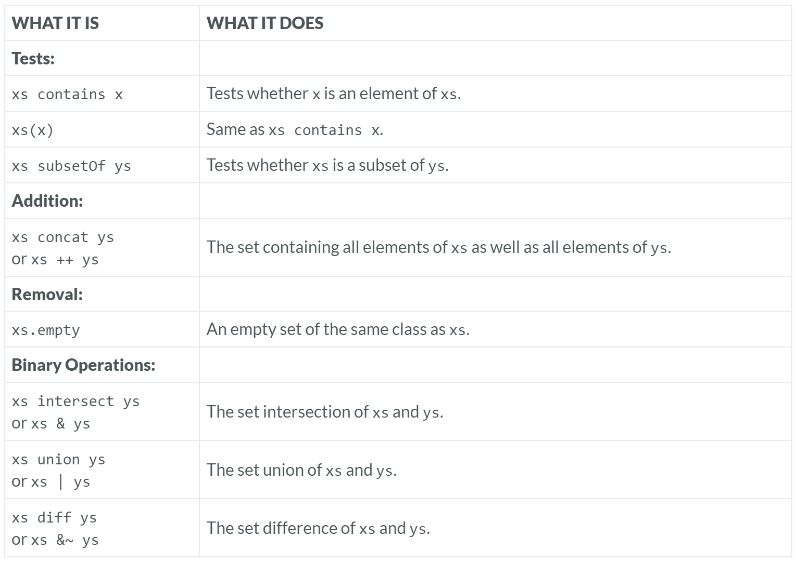

---

### Set

### Reference: <https://docs.scala-lang.org/overviews/collections-2.13/sets.html>

---

Sets in Scala are collections that contain no duplicate elements. This property makes sets particularly useful for membership tests and for performing mathematical set operations.

Let's explore various operations on sets, including tests, additions, removals, and set operations, with real-world examples, considerations, performance comparisons, and additional insights.



### 1. Tests

#### `contains` and `apply`
- **Purpose**: Check if an element is part of the set.
  Both `xs(x)` and `xs contains x` check if the element `x` is a member of the set `xs`.
  In Scala, the `apply` method for sets is synonymous with `contains`, so using `xs(x)` is exactly the same as calling `xs contains x`.

- **Example**:
```scala
val set = Set(1, 2, 3, 4, 5)
println(set(3))       // Output: true
println(set contains 3)  // Output: true
println(set(6))       // Output: false
```

- **Real-World Use Case**: Checking if a user ID exists in a set of active users.
  ```scala
  val activeUsers = Set("user1", "user2", "user3")
  if (activeUsers("user2")) {
    println("User is active.")
  }
  ```

#### Subset Testing: `xs subsetOf ys`
- **Purpose**: The `subsetOf` method checks if all elements of the set `xs` are contained within another set `ys`. This operation is essential for verifying whether one set is a subset of another.

- **Example**:
```scala
val a = Set(1, 2)
val b = Set(1, 2, 3, 4, 5)
println(a subsetOf b)  // Output: true

val c = Set(1, 6)
println(c subsetOf b)  // Output: false
```

- **Real-World Use Case**: Determining if a smaller set of required features (subset) is included in a larger set of available features (superset) in a software application.

### 2. Additions

#### `incl` and `concat` (or `+` and `++`)
- **Purpose**: Add one or more elements to a set, yielding a new set.

- **Example**:
  ```scala
  val set1 = Set(1, 2, 3)
  val set2 = set1 + 4           // Output: Set(1, 2, 3, 4)
  val set3 = set1 ++ Set(5, 6)  // Output: Set(1, 2, 3, 5, 6)
  ```

- **Real-World Use Case**: Adding new products to a set of product IDs.
  ```scala
  var productIDs = Set("prod1", "prod2", "prod3")
  productIDs += "prod4"
  productIDs ++= Set("prod5", "prod6")
  ```

### 3. Removals

#### Creating an Empty Set: `xs.empty`

- **Purpose**: The `empty` method returns a new empty set of the same type as `xs`. This is particularly useful for initializing a new set with the same characteristics (such as ordering or hash function) as an existing set.

- **Example**:
```scala
val numbers = Set(1, 2, 3)
val emptyNumbers = numbers.empty
println(emptyNumbers)  // Output: Set()
```

- **Real-World Use Case**: Resetting a collection to start a new set of operations or clearing data while preserving the set type for consistency in subsequent operations.

#### `excl` and `removedAll` (or `-` and `--`)
- **Purpose**: Remove one or more elements from a set, yielding a new set.

- **Example**:
  ```scala
  val set1 = Set(1, 2, 3, 4)
  val set2 = set1 - 2          // Output: Set(1, 3, 4)
  val set3 = set1 -- Set(1, 3) // Output: Set(2, 4)
  ```

- **Real-World Use Case**: Removing inactive users from a set of active users.
  ```scala
  var activeUsers = Set("user1", "user2", "user3", "user4")
  activeUsers -= "user2"
  activeUsers --= Set("user3", "user4")
  ```

### 4. Set Operations

#### Union, Intersection, and Set Difference

##### `union` and `|`
- **Purpose**: Combine two sets to include all elements from both sets.

- **Example**:
  ```scala
  val set1 = Set(1, 2, 3)
  val set2 = Set(3, 4, 5)
  val unionSet = set1 union set2  // Output: Set(1, 2, 3, 4, 5)
  val unionSetSym = set1 | set2   // Output: Set(1, 2, 3, 4, 5)
  ```

##### `intersect` and `&`
- **Purpose**: Find the common elements between two sets.

- **Example**:
  ```scala
  val intersectSet = set1 intersect set2  // Output: Set(3)
  val intersectSetSym = set1 & set2       // Output: Set(3)
  ```

##### `diff` and `&~`
- **Purpose**: Find the elements present in the first set but not in the second.

- **Example**:
  ```scala
  val diffSet = set1 diff set2  // Output: Set(1, 2)
  val diffSetSym = set1 &~ set2 // Output: Set(1, 2)
  ```

### Real-World Examples and Use Cases

#### Union
- **Use Case**: Merging two sets of tags from different articles.
  ```scala
  val tags1 = Set("Scala", "Programming")
  val tags2 = Set("Functional", "Programming")
  val allTags = tags1 | tags2  // Output: Set(Scala, Programming, Functional)
  ```

#### Intersection
- **Use Case**: Finding common friends between two users in a social network.
  ```scala
  val friendsUser1 = Set("Alice", "Bob", "Charlie")
  val friendsUser2 = Set("Bob", "David", "Charlie")
  val commonFriends = friendsUser1 & friendsUser2  // Output: Set(Bob, Charlie)
  ```

#### Set Difference
- **Use Case**: Identifying features that are in the base package but not in the premium package.
  ```scala
  val baseFeatures = Set("Login", "Search", "View")
  val premiumFeatures = Set("Login", "Search", "View", "Edit", "Delete")
  val missingFeatures = premiumFeatures &~ baseFeatures  // Output: Set(Edit, Delete)
  ```

### Considerations and Nuances

- **Immutability**: Immutable sets return new instances upon modification, ensuring that the original set remains unchanged. This is crucial for maintaining state consistency in functional programming.

- **Mutable Sets**: Mutable sets allow in-place modifications, which can be more efficient but require careful handling to avoid side effects, especially in concurrent environments.

- **Order Preservation**: `Set` in Scala does not guarantee element order. If order matters, consider using `LinkedHashSet` or another ordered set implementation.

- **Equality and Hashing**: Sets rely on proper implementations of `equals` and `hashCode` for custom objects to ensure correct behavior in operations like `contains`, `union`, and `intersect`.

### Performance Comparison

- **Subset Checks**: The efficiency of `subsetOf` depends on the size of the sets involved. For large sets, especially with `TreeSet`, operations can be more efficient than with `HashSet` due to sorted characteristics, which allow early termination of checks.

- **HashSet**: Provides average O(1) complexity for basic operations like `add`, `remove`, and `contains`.

- **TreeSet**: Maintains sorted order and provides O(log n) complexity for operations but may have higher overhead compared to `HashSet`.

### Additional Considerations

- **Thread Safety**: For concurrent modifications, use thread-safe collections like `ConcurrentHashMap` in Java or synchronization mechanisms.

- **Memory Usage**: Be mindful of memory usage when working with large sets, especially in memory-constrained environments. Consider using specialized libraries or data structures optimized for space efficiency.

By understanding these operations and their implications, you can effectively leverage Scala's `Set` trait to perform efficient and expressive data manipulations in your applications.

### Resources:

---
